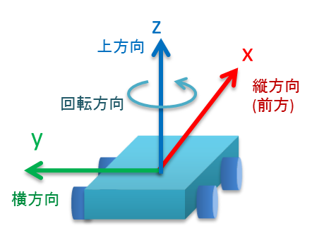

base_local_planner
==================

目次

| 　1. :ref:`概要<Summary_BaseLocalPlanner>`
| 　2. :ref:`パッケージの構成<PackageComponent_BaseLocalPlanner>`
| 　3. :ref:`アルゴリズム<Overview_BaseLocalPlanner>`
| 　　3.1 :ref:`パッケージの目的<Purpose_BaseLocalPlanner>`
| 　　3.2 :ref:`ローカルプランニングの処理概要<Procesure_BaseLocalPlanner>`
| 　　3.3 :ref:`速度空間のサンプリング<VelocitySampling_BaseLocalPlanner>`
| 　　　3.3.1 :ref:`DWA, Trajectory Rollout の速度サンプリング<DWAVel_BaseLocalPlanner>`
| 　　　3.3.2 :ref:`斜め移動の速度サンプリング<MoveForwardAndStrefeVel_BaseLocalPlanner>`
| 　　　3.3.3 :ref:`その場回転の速度サンプリング<RotateInPlaceVel_BaseLocalPlanner>`
| 　　　3.3.4 :ref:`横移動の速度サンプリング<StrefeVel_BaseLocalPlanner>`
| 　　　3.3.5 :ref:`脱出の速度サンプリング<EscapeVel_BaseLocalPlanner>`
| 　　3.4 :ref:`軌道の計算<TrajectorySimulation_BaseLocalPlanner>`
| 　　3.5 :ref:`軌道のコスト<CostFuntions_BaseLocalPlanner>`
| 　　　3.5.1 :ref:`障害物コスト<LocalCostMap_Grid_BaseLocalPlanner>`
| 　　　3.5.2 :ref:`マップグリッドコスト<Map_Grid_BaseLocalPlanner>`
| 　　3.6 :ref:`軌道の評価<EvalTrajectory_BaseLocalPlanner>`
| 　　3.7 :ref:`その場回転の軌道の追加評価<RotateInPlaceCost_BaseLocalPlanner>`
| 　　3.8 :ref:`振動抑制<Oscillation_Suppression_BaseLocalPlanner>`
| 　　3.9 :ref:`ゴール地点到達時の処理<GoalReaching_BaseLocalPlanner>`
| 　4. :ref:`ローカルプランナークラス TrajectoryPlannerROS<TrajectoryPlannerROS_BaseLocalPlanner>`
| 　　4.1 :ref:`Subscribe トピック<Subscribed_Topics_BaseLocalPlanner>`
| 　　4.2 :ref:`Publish トピック<Published_Topics_BaseLocalPlanner>`
| 　　4.3 :ref:`パラメーター<Parameters_BaseLocalPlanner>`
| 　　　4.3.1 :ref:`ロボット構成パラメーター<Robot_Configuration_Parameters_BaseLocalPlanner>`
| 　　　4.3.2 :ref:`ゴール許容誤差パラメーター<Goal_Tolerance_Parameters_BaseLocalPlanner>`
| 　　　4.3.3 :ref:`フォワードシミュレーションパラメーター<Forward_Simulation_Parameters_BaseLocalPlanner>`
| 　　　4.3.4 :ref:`軌道スコアリングパラメーター<Trajectory_Scoring_Parameters_BaseLocalPlanner>`
| 　　　4.3.5 :ref:`振動防止パラメーター<Oscillation_Prevention_Parameters_BaseLocalPlanner>`
| 　　　4.3.6 :ref:`グローバルプランパラメーター<Global_Plan_Parameters_BaseLocalPlanner>`
| 　　4.4 :ref:`下位クラス<InternalClasses_BaseLocalPlanner>`
| 　  　4.4.1 :ref:`トラジェクトリプランナークラス<TrajectoryPlanner_BaseLocalPlanner>`
| 　5. :ref:`内部処理手順<Sequence_BaseLocalPlanner>`
| 　　5.1 :ref:`メソッドコールシーケンスの概要<MethodCallSequence_BaseLocalPlanner>`
| 　　5.2 :ref:`各メソッドの処理概要<Method_Frame_BaseLocalPlanner>`
| 　6 :ref:`ライブラリ (一般的なローカルプランニングを行うためのクラス)<Generic_Local_Planning_BaseLocalPlanner>`
| 　　6.1 :ref:`TrajectorySampleGenerator クラス<TrajectorySampleGenerator_BaseLocalPlanner>`
| 　　　6.1.1 :ref:`SimpleTrajectoryGenerator クラス<SimpleTrajectoryGenerator_BaseLocalPlanner>`
| 　　6.2 :ref:`TrajectoryCostFunction クラス<TrajectoryCostFunction_BaseLocalPlanner>`
| 　　6.3 :ref:`SimpleScoredSamplingPlanner クラス<SimpleScoredSamplingPlanner_BaseLocalPlanner>`
| 　　6.4 :ref:`ヘルパークラス<Helper_classes_BaseLocalPlanner>`
| 　　　6.4.1 :ref:`LocalPlannerUtil クラス<LocalPlannerUtil_BaseLocalPlanner>`
| 　　　6.4.2 :ref:`OdometryHelperRos クラス<OdometryHelperRos_BaseLocalPlanner>`
| 　　　6.4.3 :ref:`LatchedStopRotateController クラス<LatchedStopRotateController_BaseLocalPlanner>`
| 　　6.5 :ref:`コスト関数クラス<Cost_Functions_BaseLocalPlanner>`
| 　　　6.5.1 :ref:`ObstacleCostFunction クラス<ObstacleCostFunction_BaseLocalPlanner>`
| 　　　6.5.2 :ref:`MapGridCostFunction クラス<MapGridCostFunction_BaseLocalPlanner>`
| 　　　6.5.3 :ref:`OscillationCostFunction クラス<OscillationCostFunction_BaseLocalPlanner>`
| 　　　6.5.4 :ref:`PreferForwardCostFunction クラス<PreferForwardCostFunction_BaseLocalPlanner>`
| 　　　6.5.5 :ref:`TwirlingCostFunction クラス<TwirlingCostFunction_BaseLocalPlanner>`
| 　7. :ref:`補足<Additional_Explanation_BaseLocalPlanner>`
| 　　7.1 :ref:`dwa_local_planner パッケージとの比較<VS_DWAPlanner_BaseLocalPlanner>`
| 　　7.2 :ref:`座標系<Coord_BaseLocalPlanner>`
| 　　7.3 :ref:`用語<Dic_BaseLocalPlanner>`

|

.. _Summary_BaseLocalPlanner:

1　概要
--------
このパッケージは、平面上のローカルロボットナビゲーションを行うもので、Trajectory Rollout および Dynamic Window Approach の方式で実装しています。 従うべきグローバルプランとコストマップが与えられると、コントローラーは速度ベースのコマンドを生成して :ref:`モバイルベース<Dic_MobileBase_BaseLocalPlanner>` に送信します。 このパッケージは、:ref:`ホロノミックロボットと非ホロノミックロボット<Dic_Holonomic_BaseLocalPlanner>` の両方をサポートし、凸多角形または円として表現できる任意のロボットの :ref:`footprint (接触範囲)<Dic_FootPrint_BaseLocalPlanner>` をサポートします。設定項目はROSパラメーターとして公開されており、起動ファイルで設定できます。 このパッケージのROSラッパーは、`nav_core <http://wiki.ros.org/nav_core>`__ パッケージで指定されたBaseLocalPlannerインターフェースに準拠しています。

* 管理状態：管理済み 
* 管理者：Michael Ferguson <mfergs7 AT gmail DOT com>, David V. Lu!! <davidvlu AT gmail DOT com>, Aaron Hoy <ahoy AT fetchrobotics DOT com>
* 著者： Eitan Marder-Eppstein, Eric Perko, contradict@gmail.com
* ライセンス： BSD
* ソース： git https://github.com/ros-planning/navigation.git （ブランチ：melodic-devel） 

|

.. _PackageComponent_BaseLocalPlanner:

2 パッケージの構成
------------------

このパッケージは、move_base に組み込まれるローカルプランナー部分(TrajectoryPlannerROS)と、カスタムのローカルプランナーをつくるためのライブラリ部分に分かれます。
ライブラリ部分は主に :ref:`dwa_local_planner<Summary_DWALocalPlanner>` パッケージから使われていますが、TrajectoryPlannerROS からは一部しか使われておらず、
TrajectoryPlannerROS と ライブラリ部分とで主要な機能の実装が重複しています。
このようになっているのは、ローカルプランナー部分が最初にあり、それをリファクタリングして、dwa_local_plannerとライブラリ部分を作ったためです。

.. image:: images/base_local_planner_component.png
   :width: 100%
   :align: center

コンポーネント図

|

.. _Overview_BaseLocalPlanner:

3　アルゴリズム
----------------

.. _Purpose_BaseLocalPlanner:

3.1 パッケージの目的
~~~~~~~~~~~~~~~~~~~~~~

base\_local\_plannerパッケージは、モバイルベースを平面上で運転するコントローラーを提供します。
このコントローラーは、パスプランナーをロボットに接続します。
プランナーはマップを使い、ロボットがスタートからゴール位置に到達するまでの運動の軌道を作成します。
その過程で、プランナーはロボットの周囲にグリッドマップとして表される価値関数を作成します。
この価値関数は、グリッドセルを通過するコストを表現します。
コントローラーの仕事は、この価値関数を使用して、ロボットに送信する速度 (縦方向速度, 横方向速度, 回転速度) を決定することです。
(移動方向の定義については :ref:`座標系<Coord_BaseLocalPlanner>` 参照。)

.. image:: images/local_plan.png
   :width: 70%
   :align: center

出典: http://wiki.ros.org/base_local_planner

|

.. _Procesure_BaseLocalPlanner:

3.2 ローカルプランニングの処理概要
~~~~~~~~~~~~~~~~~~~~~~~~~~~~~~~~~~

Trajectory Rollout と Dynamic Window Approach (DWA) アルゴリズムの基本的な考え方は次のとおりです。

   #. ロボットの速度空間 (縦方向速度, 横方向速度, 回転速度) を離散的にサンプリングします。

   #. サンプリング速度ごとに、ロボットの現在の状態から :ref:`フォワードシミュレーション<Dic_ForwardSimulation_BaseLocalPlanner>` を実行して、サンプリング速度を一定（短い）時間適用した場合にどう動くかを予測します。(軌道の予測)
   #. フォワードシミュレーションから得られた各軌道を評価 (スコア) します。評価には、障害物への近さ、ゴール地点への近さ、グローバルパスへの近さ、速度などの特性をとりこんだ尺度を使用します。 不正な軌道（障害物と衝突する軌道）は破棄します。
   #. 最高得点の軌道を見つけだし、その速度をロボットに送信します。
   #. 以上の手順を繰り返します。

DWAと Trajectory Rollout とでは、ロボットの速度空間のサンプリング方法が異なります。 
Trajectory Rollout では、フォワードシミュレーションの全期間でロボットの加速度制限から到達可能な速度セットをサンプリングするのに対し、
DWAでは、コントローラー呼び出し周期の期間のみでロボットの加速度制限から到達可能な速度セットをサンプリングします。
つまり、DWAはより小さな速度空間をサンプリングするため、より効率的なアルゴリズムですが、加速度制限が低いロボットでは Trajectory Rollout の方が性能がよくなるかもしれません。なぜならDWAは一定加速度をフォワードシミュレートしないためです。 ただし、我々の実際のすべてのテストでは、DWAと Trajectory Rollout は同等の性能を発揮しており、性能効率からみてDWAの使用を推奨します。

便利なリファレンス：

* `Brian P. Gerkey and Kurt Konolige. "Planning and Control in Unstructured Terrain" <https://pdfs.semanticscholar.org/dabd/bb636f02d3cff3d546bd1bdae96a058ba4bc.pdf?_ga=2.75374935.412017123.1520536154-80785446.1520536154>`__. LAGRロボットで使用される Trajectory Rollout アルゴリズムの説明。 

* `D. Fox, W. Burgard, and S. Thrun. "The dynamic window approach to collision avoidance" <https://pdfs.semanticscholar.org/dabd/bb636f02d3cff3d546bd1bdae96a058ba4bc.pdf?_ga=2.75374935.412017123.1520536154-80785446.1520536154>`__. ローカルコントロールへの Dynamic Window Approach。 

* `Alonzo Kelly. "An Intelligent Predictive Controller for Autonomous Vehicles" <http://www.ri.cmu.edu/pub_files/pub1/kelly_alonzo_1994_7/kelly_alonzo_1994_7.pdf>`__. 過去の同様のアプローチで制御するシステム。 

|

.. _VelocitySampling_BaseLocalPlanner:

3.3　速度空間のサンプリング
~~~~~~~~~~~~~~~~~~~~~~~~~~~~

ロボットの速度空間 (縦方向速度, 横方向速度, 回転速度) のサンプリングを次の各アルゴリズムで行います。

|

.. _DWAVel_BaseLocalPlanner:

3.3.1　DWA, Trajectory Rollout の速度サンプリング
^^^^^^^^^^^^^^^^^^^^^^^^^^^^^^^^^^^^^^^^^^^^^^^^^^^^

ロボットの速度空間（縦方向速度、回転速度）を離散的にサンプリングします。
まずサンプリングする範囲を求めます。DWAの場合、

* 縦方向速度のサンプリング上限速度 = 現在の縦方向速度 + :ref:`縦方向加速度の上限<Robot_Configuration_Parameters_BaseLocalPlanner>` * コントローラー呼び出し周期
    ただし最大で :ref:`縦方向速度の上限(max_vel_x)<Robot_Configuration_Parameters_BaseLocalPlanner>`

* 縦方向速度のサンプリング下限速度 = 現在の縦方向速度 - :ref:`縦方向加速度の上限<Robot_Configuration_Parameters_BaseLocalPlanner>` * コントローラー呼び出し周期
    ただし最小で :ref:`縦方向速度の下限(min_vel_x)<Robot_Configuration_Parameters_BaseLocalPlanner>`

* 回転速度のサンプリング上限速度 = 現在の回転速度 + :ref:`回転加速度の上限<Robot_Configuration_Parameters_BaseLocalPlanner>` * コントローラー呼び出し周期
    ただし最大で :ref:`回転速度の上限(max_vel_theta)<Robot_Configuration_Parameters_BaseLocalPlanner>`

* 回転速度のサンプリング下限速度 = 現在の回転速度 - :ref:`回転加速度の上限<Robot_Configuration_Parameters_BaseLocalPlanner>` * コントローラー呼び出し周期
    ただし最小で :ref:`回転速度の下限(min_vel_theta)<Robot_Configuration_Parameters_BaseLocalPlanner>`

    (コントローラー呼び出し周期は、:ref:`controller_frequency<Forward_Simulation_Parameters_BaseLocalPlanner>` パラメーターの逆数であり、既定値は 0.05s です)

Trajectory Rollout の場合、

* 縦方向速度のサンプリング上限速度 = 現在の縦方向速度 + :ref:`縦方向加速度の上限<Robot_Configuration_Parameters_BaseLocalPlanner>` * フォワードシミュレーション時間
    ただし最大で :ref:`縦方向速度の上限(max_vel_x)<Robot_Configuration_Parameters_BaseLocalPlanner>`

* 縦方向速度のサンプリング下限速度 = 現在の縦方向速度 - :ref:`縦方向加速度の上限<Robot_Configuration_Parameters_BaseLocalPlanner>` * フォワードシミュレーション時間
    ただし最小で :ref:`縦方向速度の下限(min_vel_x)<Robot_Configuration_Parameters_BaseLocalPlanner>`

* 回転速度のサンプリング上限速度 = 現在の回転速度 + :ref:`回転加速度の上限<Robot_Configuration_Parameters_BaseLocalPlanner>` * フォワードシミュレーション時間
    ただし最大で :ref:`回転速度の上限(max_vel_theta)<Robot_Configuration_Parameters_BaseLocalPlanner>`

* 回転速度のサンプリング下限速度 = 現在の回転速度 - :ref:`回転加速度の上限<Robot_Configuration_Parameters_BaseLocalPlanner>` * フォワードシミュレーション時間
    ただし最小で :ref:`回転速度の下限(min_vel_theta)<Robot_Configuration_Parameters_BaseLocalPlanner>`

    (フォワードシミュレーション時間は、:ref:`sim_time<Forward_Simulation_Parameters_BaseLocalPlanner>` パラメーターであり、既定値は 1s です)

です。
この速度制限のため、フォワードシミュレーションの際、 DWA は、コントローラー呼び出し周期を超えて加速しませんが、Trajectory Rollout はフォワードシミュレーションの期間にわたって加速します。

求めたサンプリング範囲を等分割し、":ref:`サンプリング数(vx_samples, vtheta_samples)<Forward_Simulation_Parameters_BaseLocalPlanner>` "個のサンプル値を抽出します。
なお横方向速度は0です。

|

.. _MoveForwardAndStrefeVel_BaseLocalPlanner:

3.3.2　斜め移動の速度サンプリング
^^^^^^^^^^^^^^^^^^^^^^^^^^^^^^^^^^^^

ホロノミックロボットの場合、向きを保ったまま左斜め前方 or 右斜め前方への移動を試みます。速度は 縦方向0.1, 横方向±0.1(m/s)の固定値です。

|

.. _RotateInPlaceVel_BaseLocalPlanner:

3.3.3　その場回転の速度サンプリング
^^^^^^^^^^^^^^^^^^^^^^^^^^^^^^^^^^^^

縦方向速度を0固定にして、回転速度のバリエーション（その場での回転）を試みます。

ただし最低 :ref:`min_in_place_vel_theta<Robot_Configuration_Parameters_BaseLocalPlanner>` の回転速度はもつようにします。

(:ref:`その場回転の軌道の追加評価<RotateInPlaceCost_BaseLocalPlanner>` も参照。)

|

.. _StrefeVel_BaseLocalPlanner:

3.3.4　横移動の速度サンプリング
^^^^^^^^^^^^^^^^^^^^^^^^^^^^^^^^

上記3点で有効な組み合わせがない＆ホロノミックロボットの場合、横移動を試みます。横方向速度のバリエーションは、:ref:`y_vels<Robot_Configuration_Parameters_BaseLocalPlanner>` のリストです。縦方向速度と回転速度のサンプリング値は0とします。

|

.. _EscapeVel_BaseLocalPlanner:

3.3.5　脱出の速度サンプリング
^^^^^^^^^^^^^^^^^^^^^^^^^^^^^^^^
上記のサンプリング速度に有効な組み合わせがなかった場合は、脱出(少しの後退)を試みます。
脱出時の速度には、:ref:`escape_vel<Robot_Configuration_Parameters_BaseLocalPlanner>` を使用します。

.. ソース：TrajectoryPlanner::createTrajectories()

|

.. _TrajectorySimulation_BaseLocalPlanner:

3.4 軌道の計算
~~~~~~~~~~~~~~~~

サンプリング速度ごとに、ロボットの現在の状態からフォワードシミュレーションを実行して、サンプリング速度を一定（短い）時間適用した場合にどう動くかを予測します。

フォワードシミュレーションでは、次のサイクルを繰り返します。

  #. 現在ステップ(時刻)でのロボットの位置・向きを軌道に追加します

  #. ロボットの次ステップの速度を計算します。

     サンプリング速度を目標として、それに近づくように現在速度を毎ステップ加速・減速します。(ただしDWAの場合はすぐに目標速度に達します。)

  #. ロボットの次ステップの位置・向きを、次ステップの速度から計算します。

  #. 現在ステップを1つ進めます。

|

フォワードシミュレーション時間は、:ref:`sim_time<Forward_Simulation_Parameters_BaseLocalPlanner>` パラメータで設定されます。

フォワードシミュレーションの1ステップの時間は、:ref:`速度サンプリング<DWAVel_BaseLocalPlanner>` で出てくるコントローラー呼び出し周期とは少し異なり、「フォワードシミュレーション時間 / ステップ数」です。
ステップ数は、

「 縦横方向サンプリング速度の合成値 * フォワードシミュレーション時間 / :ref:`距離ステップサイズ(sim_granularity)<Forward_Simulation_Parameters_BaseLocalPlanner>` 」 

または 

「サンプリング回転速度の絶対値 / :ref:`角度ステップサイズ(angular_sim_granularity)<Forward_Simulation_Parameters_BaseLocalPlanner>`  」  (注：フォワードシミュレーション時間は掛けません)

のどちらか大きい方で決まりますが、
ロボットの経路への向きに基づくスコアリングを行う場合(:ref:`heading_scoring<Trajectory_Scoring_Parameters_BaseLocalPlanner>` が trueの場合)は

「フォワードシミュレーション時間/ :ref:`距離ステップサイズ(sim_granularity)<Forward_Simulation_Parameters_BaseLocalPlanner>` 」 (注：式はソースのママ)

となります。

|

.. _CostFuntions_BaseLocalPlanner:

3.5　軌道のコスト
~~~~~~~~~~~~~~~~~~~~~~~~~~

ロボットの辿る軌道をスコアリングするため、次のようなコストを使います。

|

.. _LocalCostMap_Grid_BaseLocalPlanner:

3.5.1　障害物コスト
^^^^^^^^^^^^^^^^^^^^

ローカルコストマップは、2D平面上の障害物のコスト分布を表したマップです。これを用いて、次のように軌道をスコアリングします。

ローカルコストマップにロボットを当てはめて、ロボットの footprint を形成する線が含まれているセルの中で、コストが最大のものを採用し、これを footprint cost と呼びます。
footprint形成線 が障害物セル(値254のセル)にかかる軌道は footprint costを-1.0とします。

occ_cost は、footprint cost とロボットの中心点が含まれるセルのコストで、大きい方を採用します。

.. ソース：TrajectoryPlanner::generateTrajectories()

.. image:: images/occ_cost.png
   :width: 30%
   :align: center

図の例では、occ_cost は128となります。

|

.. _Map_Grid_BaseLocalPlanner:

3.5.2　マップグリッドコスト
^^^^^^^^^^^^^^^^^^^^^^^^^^^^

軌道を効率的にスコアリングするために、マップグリッドを使用します。 マップグリッドは、ロボットの周りのグリッドの各セルに path_dist と goal_distの2種類の評価値(コスト)を付与したものです。

マップグリッドは制御サイクルごとに次の手順で構築します。

  #. ロボットの周りにグリッド（ローカルコストマップと同サイズ）を作成します。

  #. グローバルパスをグリッドの領域にマッピングします。 

  #. path_distの指標については、グローバルパスの通るセルを経路点までの距離0でマークし、また goal_dist の指標についてはローカルゴールのセルをゴール地点までの距離0でマークします。

  #. 伝播アルゴリズムによって、他のすべてのセルを、ゼロでマークされた最も近い点までのマンハッタン距離で効率的にマークします。

このマップグリッドを使って、軌道をスコアリングします。

グローバルパスのゴール地点は、多くの場合、マップグリッドでカバーされる小さな領域の外側にあります。ゴール地点への近さで軌道をスコアリングする場合、考えるのは「ローカルゴール」となります。それは、領域外へ続いている経路上の領域外縁の点です。領域のサイズはmove_baseによって決定されます。

|

.. list-table::
  :widths: 10 10
  :header-rows: 0

  * - .. image:: images/path_dist.png
         :width: 100%
    - .. image:: images/goal_dist.png
         :width: 100%
  * - path_dist
        経路上のセルをコスト0として、経路からどれだけ離れているかをコストとして表したもの
    - goal_dist
        ローカルゴールをコスト0として、ゴール地点からどれだけ離れているかをコストとして表したもの

|

|

.. _EvalTrajectory_BaseLocalPlanner:

3.6　軌道の評価
~~~~~~~~~~~~~~~~~~~~

コスト分布を表すマップ(:ref:`path_distマップ<Map_Grid_BaseLocalPlanner>` , :ref:`goal_distマップ<Map_Grid_BaseLocalPlanner>` , :ref:`ローカルコストマップ<LocalCostMap_Grid_BaseLocalPlanner>` ) より、軌道のコストを算出し、どの軌道がよいか評価します。

|

.. image:: images/base_local_planner_EvalTrajectory.png
   :width: 70%
   :align: center

出典: http://wiki.ros.org/base_local_planner の画像を加工

|

軌道のコストには下表のものがあります。

.. csv-table:: 
   :header: "コスト名", "内容", "算出方法", "重みパラメーター"
   :widths: 5, 10, 30, 5

   "occ_cost", "障害物コスト", "フォワードシミュレーション時間中で、最大の occ_cost を使います。", ":ref:`occdist_scale<Trajectory_Scoring_Parameters_BaseLocalPlanner>` "
   "path_dist", "グローバルパスからの距離", "フォワードシミュレーション軌道の最終地点の path_dist を使います。", ":ref:`pdist_scale<Trajectory_Scoring_Parameters_BaseLocalPlanner>` "
   "goal_dist", "ローカルゴールからの距離", "フォワードシミュレーション軌道の最終地点の goal_dist を使います。", ":ref:`gdist_scale<Trajectory_Scoring_Parameters_BaseLocalPlanner>` "
   "heading_diff", "ロボットの経路への向きのスコア(option)", "シミュレーション時間内のある瞬間（パラメータ :ref:`heading_scoring_timestep<Trajectory_Scoring_Parameters_BaseLocalPlanner>` 秒後）のロボットの向きと、ローカルパス上で直線で到達できる最遠の地点までとの向きを比較して、角度の差をコストとして採用するものです。heading_diffを使用する場合は、path_distとgoal_distも、最終地点でなくその瞬間のものが採用されます。", "0.3"

|

3つ（または4つ）のコストを、:ref:`所定の重み付け（カスタマイズ可能）<Trajectory_Scoring_Parameters_BaseLocalPlanner>` を掛け合わせて合算し、与えられた軌道のコストとします。
各軌道ごとにコストを算出し、最も低コストの軌道を結果の軌道とします。

軌道上のいずれかの点で、occ_costが負値になる(衝突する)場合や、impossible_costのセルに入る場合は、その軌道を破棄します。

|
|

.. _RotateInPlaceCost_BaseLocalPlanner:

3.7　その場回転の軌道の追加評価
~~~~~~~~~~~~~~~~~~~~~~~~~~~~~~~~

その場での回転は、縦方向速度を0固定とし、回転速度のバリエーションで評価します。
その際、その場回転ではロボットの位置は変わらないため、左右どちらのどのような速度の回転でも、path_distおよびgoal_distには差異が生じません。
occ_costについては、ロボットが障害物に近い位置にいる場合は、footprintの変化により差が出る可能性がありますが、開けた場所であれば差が生じません。

そのため、その場回転同士の比較には、追加の評価軸が用いられます。
回転後に、ロボットがその方向に少し前進（:ref:`heading_lookahead パラメータ<Trajectory_Scoring_Parameters_BaseLocalPlanner>` ）したと仮定して、前進後の位置のgoal_distがより小さい方を採用します。下図の例では、右回転より左回転の方が有利となります。

ただし、ロボットが既にその場回転を始めていた場合は、現在の回転方向が優先されます。（ロボットが首を左右に振り続けてスタックするような挙動を回避するため。:ref:`振動抑制<Oscillation_Suppression_BaseLocalPlanner>` 参照。）

.. image:: images/goal_dist_roll.png
   :width: 50%
   :align: center

|

.. _Oscillation_Suppression_BaseLocalPlanner:

3.8　振動抑制
~~~~~~~~~~~~~~~~~~~~

振動は、(縦, 横, 回転) のいずれかの次元で正と負の値が連続して選択されたときに発生します。 振動を防ぐため、ロボットがある方向に移動すると、次のサイクルでは反対方向への移動を不正と設定し、それをフラグが設定された位置からの移動距離が特定の値 :ref:`(oscillation_reset_dist)<Oscillation_Prevention_Parameters_BaseLocalPlanner>` を超えるまで続けます。

|

.. _GoalReaching_BaseLocalPlanner:

3.9　ゴール地点到達時の処理
~~~~~~~~~~~~~~~~~~~~~~~~~~~~

ローカルプランナーがロボットを停止すべき場所に正確に停止させるのが理想です。 しかし実際には、センサーのノイズとアクチュエータの不確実性によりロボットが目標地点を行き過ぎて、延々と切り返しを続けてしまうことがあります。
それを防ぐため、ロボットがゴール地点に十分近づくと走行を停止し、指示されたゴール方向へその場回転のみ行うようにします。 次に処理手順を示します。

#. コントローラーの各サイクルで、ロボットがグローバルゴールの近傍に到達したか判定します。

   * ロボットからゴール地点までの距離が、:ref:`xy_goal_tolerance<Goal_Tolerance_Parameters_BaseLocalPlanner>` 以下の場合、ゴール地点に到達済みと判定します。

   * ロボットがゴール地点に到達していれば以下の最終補正処理に移行します。

#. ロボットを停止させます。

   * ロボットを許される加速度の範囲内で減速し、停止させます。

   * ロボットが停止したかの判定には、オドメトリの縦方向速度、横方向速度、回転速度がしきい値(それぞれ 0.01m/s, 0.01m/s, 0.01rad/s)以下であるかを調べます。

#. ロボットが停止した後、ゴール方向にその場回転を行います。

   * ロボットの向きがゴール方向と合っているかを判定します。
     ロボットの現在の向きと指示されたゴール時の方向とのなす角が、:ref:`yaw_goal_tolerance<Goal_Tolerance_Parameters_BaseLocalPlanner>` 以下か判定します。

   * ロボットの向きが合っていない場合、ゴール方向へその場回転を行います。

   * ロボットの向きが合っていれば、ゴール地点に最終到達したとして、速度0を指令します。

最終補正処理の途中でゴール地点の許容範囲外に出た場合は、最終補正処理をやめて通常の DWA/Trajectory Rollout に戻ります。
ただし、:ref:`ゴール許容誤差ラッチフラグ<Goal_Tolerance_Parameters_BaseLocalPlanner>` が trueの場合は、ゴール地点から外れても DWA/Trajectory Rollout に戻らず最終補正処理を続行します。

|
|

.. _TrajectoryPlannerROS_BaseLocalPlanner:

4.　ローカルプランナークラス TrajectoryPlannerROS
----------------------------------------------------

base\_local\_planner::TrajectoryPlannerROS  オブジェクトは、base\_local\_planner::TrajectoryPlanner  オブジェクトの機能を公開する `C++ ROSラッパー <http://wiki.ros.org/navigation/ROS_Wrappers>`__ です。 このオブジェクトは、初期化時に指定されたROS名前空間（以降、\ *name*\ と仮表記）で動作します。 このオブジェクトは、`nav\_core <http://wiki.ros.org/nav_core>`__ パッケージにある nav\_core::BaseLocalPlanner インターフェースに準拠しています。

base\_local\_planner::TrajectoryPlannerROS オブジェクトの作成例::

   1 #include <tf/transform_listener.h>
   2 #include <costmap_2d/costmap_2d_ros.h>
   3 #include <base_local_planner/trajectory_planner_ros.h>
   4 
   5 ...
   6 
   7 tf::TransformListener tf(ros::Duration(10));
   8 costmap_2d::Costmap2DROS costmap("my_costmap", tf);
   9 
  10 base_local_planner::TrajectoryPlannerROS tp;
  11 tp.initialize("my_trajectory_planner", &tf, &costmap);

|

.. _Subscribed_Topics_BaseLocalPlanner:

4.1 Subscribe トピック
~~~~~~~~~~~~~~~~~~~~~~~

.. csv-table:: 
   :header: "トピック名", "型", "内容"
   :widths: 5, 10, 30

   "odom", "`nav_msgs/Odometry <http://docs.ros.org/api/nav_msgs/html/msg/Odometry.html>`__", "ローカルプランナーにロボットの現在の速度を与える走行距離情報。 このメッセージの速度情報は、 TrajectoryPlannerROSオブジェクトに含まれるコストマップのrobot_base_frameと同じ座標フレームにあると想定されます 。 robot_base_frameパラメーターについては、 `costmap_2d <http://wiki.ros.org/costmap_2d>`__ パッケージを参照してください。 "

|

.. _Published_Topics_BaseLocalPlanner:

4.2　Publish トピック
~~~~~~~~~~~~~~~~~~~~~~~~

.. csv-table:: 
   :header: "トピック名", "型", "内容"
   :widths: 5, 10, 30

   "~<name>/global_plan", "`nav_msgs/Path <http://docs.ros.org/api/nav_msgs/html/msg/Path.html>`__", "ローカルプランナーが現在従おうとしているグローバルプランの一部。 主に視覚化の目的で使用されます。"
   "~<name>/local_plan", "`nav_msgs/Path <http://docs.ros.org/api/nav_msgs/html/msg/Path.html>`__", "最後のサイクルで最高得点を獲得したローカルプランまたは軌道。 主に視覚化の目的で使用されます。"
   "~<name>/cost_cloud", "`sensor_msgs/PointCloud2 <http://docs.ros.org/api/nav_msgs/html/msg/Path.html>`__", "計画に使用されるコストグリッド。 視覚化の目的で使用されます。 この視覚化の有効化/無効化については、 :ref:`publish_cost_grid_pc<Trajectory_Scoring_Parameters_BaseLocalPlanner>` パラメーターを参照してください。 **Navigation 1.4.0の新機能**"

|

.. _Parameters_BaseLocalPlanner:

4.3　パラメーター
~~~~~~~~~~~~~~~~~~~~

base\_local\_planner::TrajectoryPlannerROS ラッパーの動作をカスタマイズするために設定可能なROS  `パラメーター <http://wiki.ros.org/Parameters>`__ が多数あります。 これらのパラメーターは、ロボット構成、目標許容誤差、フォワードシミュレーション、軌道スコアリング、振動防止、グローバルプランなど、いくつかのカテゴリに分類されます。

|

.. _Robot_Configuration_Parameters_BaseLocalPlanner:

4.3.1　ロボット構成パラメーター
^^^^^^^^^^^^^^^^^^^^^^^^^^^^^^^^^^

.. csv-table:: 
   :header: "パラメーター名", "内容", "型", "単位", "デフォルト"
   :widths: 5, 50, 5, 5, 8

   "~<name>/acc_lim_x", "ロボットの縦方向加速度の上限", "double", "m/s^2", "2.5"
   "~<name>/acc_lim_y", "ロボットの横方向加速度の上限", "double", "m/s^2", "2.5"
   "~<name>/acc_lim_theta",  "ロボットの回転加速度の上限", "double", "rad/s^2", "3.2"
   "~<name>/max_vel_x",  "ロボットの縦方向速度の上限", "double", "m/s", "0.5"
   "~<name>/min_vel_x",  "ロボットの縦方向速度の下限。これは、ロボットに摩擦を克服できるほど十分高い速度を指令するのに便利です。", "double", "m/s", "0.1"
   "~<name>/max_vel_theta",  "ロボットの回転速度の上限 (左回転は正の値)", "double", "rad/s", "1.0"
   "~<name>/min_vel_theta",  "ロボットの回転速度の下限 (右回転は負の値)", "double", "rad/s", "-1.0"
   "~<name>/min_in_place_vel_theta",  "その場回転時の、ロボットの回転速度の下限。(低速では その場回転できないため)", "double", "rad/s", "0.4"
   "~<name>/backup_vel",  "**DEPRECATED (escape_velを使用してください)**: 脱出中のバックに使用される速度。 ロボットが実際にバックするためには、負の速度を設定しなければならないことに注意してください。 正の速度を設定すると、ロボットは脱出しようとして前進します。", "double",  "m/s", "-0.1"
   "~<name>/escape_vel",  "脱出中の走行に使用される速度。 ロボットが実際にバックするためには、負の速度を設定しなければならないことに注意してください。 正の速度を設定すると、ロボットは脱出しようとして前進します。 **Navigation 1.3.1の新機能**", "double", "m/s", "-0.1"
   "~<name>/holonomic_robot",  "速度コマンドをホロノミックまたは非ホロノミックロボットのどちらに対して発行するかを決定します。 ホロノミックロボットの場合は、ロボットに横移動速度コマンドが発行されるかもしれません。 非ホロノミックロボットの場合、横移動速度コマンドは発行されません。", "bool", "\-", "true"
   "~<name>/y_vels",  "ホロノミックロボットがとるべき横移動速度のリスト。このパラメーターは、 holonomic_robot が true に設定されている場合にのみ使用されます。(左方向は正の値で右方向は負の値)", "list[double]", "m/s",  "[-0.3, -0.1, 0.1, 0.3]"
   "~<name>/escape_reset_dist",  "脱出フラグがリセットされるまでにロボットが移動する必要がある距離。escape_reset_theta とどちらかを満たせばリセット。(ROS Wiki 未記載)", "double", "m", "0.1"
   "~<name>/escape_reset_theta",  "脱出フラグがリセットされるまでにロボットが回転する必要がある角度。escape_reset_dist とどちらかを満たせばリセット。(ROS Wiki 未記載)", "double", "rad", "0.5 * π"

|

.. _Goal_Tolerance_Parameters_BaseLocalPlanner:

4.3.2　ゴール許容誤差パラメーター
^^^^^^^^^^^^^^^^^^^^^^^^^^^^^^^^^^^^^^^^

.. csv-table:: 
   :header: "パラメーター名", "内容", "型", "単位", "デフォルト"
   :widths: 5, 50, 5, 5, 8

   "~<name>/yaw_goal_tolerance",  "ゴール地点に到達したときの、コントローラーの向き(回転角)の許容誤差", "double", "rad", "0.05"
   "~<name>/xy_goal_tolerance",  "ゴール地点に到達したときの、コントローラーの 2D平面上距離の許容誤差", "double", "m", "0.10"
   "~<name>/latch_xy_goal_tolerance",  "ゴール許容誤差ラッチフラグ。trueの場合、ロボットがゴール地点に到達すると、後はその場回転のみ行います。回転の間にゴール許容誤差の範囲外になることもあります。(falseの場合は、範囲外に出たら通常の動作に戻ります。) **Navigation 1.3.1の新機能**", "bool", "\-", "false"

|

.. _Forward_Simulation_Parameters_BaseLocalPlanner:

4.3.3　フォワードシミュレーションパラメーター
^^^^^^^^^^^^^^^^^^^^^^^^^^^^^^^^^^^^^^^^^^^^^^^^^^

.. csv-table:: 
   :header: "パラメーター名", "内容", "型", "単位", "デフォルト"
   :widths: 5, 50, 5, 5, 8

   "~<name>/sim_time",  "軌道をフォワードシミュレーションする時間", "double", "s", "1.0"
   "~<name>/sim_granularity",  "与えられた軌道上の点間のステップサイズ", "double", "m", "0.025"
   "~<name>/angular_sim_granularity",  "与えられた軌道上の角度サンプル間のステップサイズ  **Navigation 1.3.1の新機能**", "double", "rad", "~<name>/sim_granularity"
   "~<name>/vx_samples",  "速度空間の縦方向速度を探索するときに使用するサンプルの数 ", "integer", "\-", "3"
   "~<name>/vtheta_samples",  "速度空間の回転速度を探索するときに使用するサンプルの数 ", "integer", "\-", "20"
   "~<name>/controller_frequency",  このコントローラーが呼び出される頻度。 コントローラーの名前空間に設定されていない場合、searchParamを使用して親の名前空間からパラメーターを読み取ります。 すなわち、move_base とともに使用する場合は move_base の "controller_frequency"パラメーターを設定するだけでよく 、このパラメーターを未設定のままにしておけます。  **Navigation 1.3.1の新機能**, "double", "Hz", "20.0"

|

.. _Trajectory_Scoring_Parameters_BaseLocalPlanner:

4.3.4　軌道スコアリングパラメーター
^^^^^^^^^^^^^^^^^^^^^^^^^^^^^^^^^^^
各軌道のスコアリングに使用されるコスト関数は、次の形式です。::

   cost = 
   pdist_scale * (軌道終端からパスへの距離。単位は マップセル か m のどちらか。meter_scoring パラメーターによる) 
   + gdist_scale * (軌道終端からローカルゴールへの距離。単位は マップセル か m のどちらか。meter_scoring パラメーターによる) 
   + occdist_scale * (軌道中の最大障害物コスト。単位は障害物コスト (0-254))
   + 0.3 * (ロボットの経路への向きのスコア)

|

.. csv-table:: 
   :header: "パラメーター名", "内容", "型", "単位", "デフォルト"
   :widths: 5, 50, 5, 5, 8

   "~<name>/meter_scoring",  "gdist_scaleおよびpdist_scaleパラメーターが使われる際、 goal_distanceおよびpath_distanceがメートルの単位で表されると解釈するかどうか。falseの場合、単位はセルとなります。 デフォルト値はセルに設定されています。 **Navigation 1.3.1の新機能**", "bool", "\-", "false"
   "~<name>/pdist_scale",  "コントローラーが与えられたパスにどれだけ近づこうとするかの重み。最大値は5.0です。 ", "double", "\-", "0.6"
   "~<name>/gdist_scale",  "コントローラーがローカルの目標にどれだけ近づこうとするかの重み。このパラメーターは速度も制御します。可能な最大値は5.0です。", "double", "\-", "0.8"
   "~<name>/occdist_scale",  "コントローラーが障害物をどれだけ回避しようとするかの重み。 ", "double", "\-", "0.01"
   "~<name>/heading_lookahead",  "その場回転の異なる軌道をスコアリングする際に、どれだけ前方を見るか。(dwa_local_planner の :ref:`forward_point_distance<Trajectory_Scoring_Parameters_DWALocalPlanner>` に相当) ", "double", "m", "0.325"
   "~<name>/heading_scoring",  "ロボットの経路への向きに基づいてスコアリングするかどうか。", "bool", "\-", "false"
   "~<name>/heading_scoring_timestep",  "heading_scoring を使用する場合に、シミュレートした軌道に沿ってどれだけ先の時点で評価するか。パスへの距離とローカルゴールへの距離も、軌道終端でなくその瞬間のものが採用されます。", "double", "s", "0.8"
   "~<name>/dwa",  "Dynamic Window Approach (DWA) を使用するか、Trajectory Rollout を使用するか（注：私たちの経験では、DWAは Trajectory Rollout と同様に機能し、計算コストが低くなります。ロボットの加速性能が非常に低い場合は Trajectory Rollout で動かすとよいかもしれません。ただし、最初にDWAを試すことをお勧めします。）", "bool", "\-", "true"
   "~<name>/publish_cost_grid_pc",  "プランナーが計画時に使用するコストグリッドを公開するかどうか。 trueの場合、 sensor_msgs/PointCloud2 が~<name>/cost_cloudトピックで利用可能になります。 各点群はコストグリッドを表し、個々のスコアリング関数コンポーネントのフィールドを持ちます。 また、スコアリングパラメーターを考慮に入れた各セルの全体的なコストを持ちます。 **Navigation 1.4.0の新機能**", "bool", "\-", "false"
   "~<name>/global_frame_id",  "cost_cloudに設定するフレーム。 ローカルコストマップのグローバルフレームと同じフレームに設定する必要があります。 **Navigation 1.4.0の新機能**", "string", "\-", "odom"
   "~<name>/simple_attractor",  "単純な誘引。オンのとき、gdist をローカルゴールではなくグローバルゴールまでの距離とし、pdistを0とします。(ROS Wiki 未記載)", "bool", "\-", "false"

|

.. _Oscillation_Prevention_Parameters_BaseLocalPlanner:

4.3.5　振動防止パラメーター
^^^^^^^^^^^^^^^^^^^^^^^^^^^^^^^^^

.. csv-table:: 
   :header: "パラメーター名", "内容", "型", "単位", "デフォルト"
   :widths: 5, 50, 5, 5, 8

   "~<name>/oscillation_reset_dist",  "振動フラグがリセットされるまでにロボットが移動する必要がある距離", "double", "m", "0.05"

|

.. _Global_Plan_Parameters_BaseLocalPlanner:

4.3.6　グローバルプランパラメーター
^^^^^^^^^^^^^^^^^^^^^^^^^^^^^^^^^^^^^^

.. csv-table:: 
   :header: "パラメーター名", "内容", "型", "単位", "デフォルト"
   :widths: 5, 50, 5, 5, 8

   "~<name>/prune_plan",  "ロボットがパスに沿って移動するときにプランを「食べていくか」を定義します。 ロボットが移動した際に経路のうち現在位置から1メートル以上過去の点は消します。", "bool", "\-", "true"

|

.. _InternalClasses_BaseLocalPlanner:

4.4　下位クラス
~~~~~~~~~~~~~~~~~~~~~~~~~~~~~~~~

.. _TrajectoryPlanner_BaseLocalPlanner:

4.4.1　トラジェクトリプランナークラス
^^^^^^^^^^^^^^^^^^^^^^^^^^^^^^^^^^^^^^^^

base\_local\_planner::TrajectoryPlanner は、前述のDWAおよび Trajectory Rollout アルゴリズムの実装を提供します。 ROSで base\_local\_planner::TrajectoryPlanner を使用するには、 :ref:`TrajectoryPlannerROS ラッパー<TrajectoryPlannerROS_BaseLocalPlanner>` を使用してください。 base\_local\_planner::TrajectoryPlanner を単独で使用することは推奨されません。

|

.. _Sequence_BaseLocalPlanner:

5.　内部処理手順
----------------------------------

.. _MethodCallSequence_BaseLocalPlanner:

5.1　メソッドコールシーケンスの概要
~~~~~~~~~~~~~~~~~~~~~~~~~~~~~~~~~~~~

.. image:: images/base_local_planner_sequence.png
   :width: 65%
   :align: center

|

.. _Method_Frame_BaseLocalPlanner:

5.2　各メソッドの処理概要
~~~~~~~~~~~~~~~~~~~~~~~~~~~~~~

* TrajectoryPlannerROS::computeVelocityCommands() … 速度指令計算

  * グローバルパスをローカルコストマップの範囲で切り取ります。
  * ゴール地点に到達済みかを判定し、到達済みなら最終補正の速度指令を返します。	

    * ロボットが未停止であれば減速/停止の速度指令を返却します。
    * ロボットが停止済みであれば角度を合わせるための回転速度指令を返却します。
    * 角度も合っていればゼロ速度指令を返却します。

  * ゴール地点に到達していなければ、TrajectoryPlanner::findBestPath()をコールします。

|

* TrajectoryPlanner::findBestPath() … 最良経路検索

  * 経路評価用マップを更新します。
  * TrajectoryPlanner::createTrajectories()をコールします。

|

* TrajectoryPlanner::createTrajectories() … 軌道作成

  * 縦方向速度、回転速度のとり得る組み合わせを求め、それぞれの組み合わせに対してTrajectoryPlanner::generateTrajectory()をコールしてコストを計算し、コストが最小となるものを求めます。

    * ①現在速度、②加速／減速の最大値、③速度の最大／最小値、④速度変化の単位から、とりうる全ての組み合わせを評価します。
    * ホロノミックロボットの場合、向きを保ったまま左斜め前方 or 右斜め前方への移動を評価します。速度は 縦方向0.1, 横方向±0.1(m/s)の固定値です。
    * 縦方向速度を0固定にして、回転速度のバリエーション（その場での回転）を評価します。
    * 上記3点で有効な組み合わせがない＆ホロノミックロボットの場合、横移動を評価します。横方向速度のバリエーションは、:ref:`y_vels<Robot_Configuration_Parameters_BaseLocalPlanner>` パラメータのリストです。縦方向速度と回転速度のサンプリング値は0とします。
    * それでも有効な組み合わせがなかった場合は、脱出(少しの後退)を評価します。

|

* TrajectoryPlanner::generateTrajectory() … 軌道生成

  * 与えられた、ターゲットとなる縦方向速度、回転速度について、path_dist, goal_dist, occ_costの3つの評価軸（オプションでheading_diffを追加可能）で評価を行い、コストを返却します。

|

.. _Generic_Local_Planning_BaseLocalPlanner:

6.　ライブラリ (一般的なローカルプランニングを行うためのクラス)
----------------------------------------------------------------

**navigation 1.10.0の新機能**

ROSのgroovyリリースには、 :doc:`dwa\_local\_planner <dwa_local_planner>` パッケージの新しい実装が含まれています。 実装は、多くのコードを再利用してカスタムローカルプランナーを簡単に作成できるように、よりモジュール化してあります。 base\_local\_plannerのコードベースは、いくつかの新しいヘッダーとクラスで拡張されています。

ローカルプランニングの動作原則は、制御サイクルごとに適切なローカルプランを検索することです。 そのために、多数の候補軌道を生成します。 生成した軌道について、障害物と衝突するかどうかをチェックします。 衝突しなければ軌道に評価値をつけ、いくつかの軌道を比較して最良の軌道を見つけ出します。

明らかにこの動作原則は、ロボットの形状（およびアクチュエータの形状）と :ref:`ドメイン<Dic_Domain_BaseLocalPlanner>` に応じて、様々な異なる方法でインスタンス化できます。 軌道を生成する方法と、可能な軌道空間から最適な軌道を検索する方法には、様々な特別な方法があります。

以下のインターフェースとクラスは、一般的なローカルプランニングの動作原則を抑えており、様々なインスタンス化が可能です。 dwa\_local\_plannerをテンプレートとして使用し、独自のコスト関数または軌道ジェネレーターを追加するだけで、カスタムのローカルプランナーを作成できるはずです。

注：本節のクラスの大部分は、本パッケージの公開インターフェースクラス TrajectoryPlannerROS からは使われていません。しかし dwa_local_planner の公開インターフェースクラス DWAPlannerROS からは使われています。

|

.. _TrajectorySampleGenerator_BaseLocalPlanner:

6.1　TrajectorySampleGenerator クラス
~~~~~~~~~~~~~~~~~~~~~~~~~~~~~~~~~~~~~~~~

このインターフェースは、軌道のジェネレーターを表します。有限個または無限個の軌道を生成し、 nextTrajectory() の呼び出しごとに新しい軌道を返します。

.. _SimpleTrajectoryGenerator_BaseLocalPlanner:

6.1.1　SimpleTrajectoryGenerator クラス
^^^^^^^^^^^^^^^^^^^^^^^^^^^^^^^^^^^^^^^^

SimpleTrajectoryGenerator クラスは、TrajectorySampleGeneratorを継承した実装クラスで、Trajectory Rollout または DWAのいずれかの原理を使用して、:ref:`アルゴリズム<Overview_BaseLocalPlanner>` で説明されている軌道を生成できます。
このクラスは、dwa_local_planner のページで説明しているアルゴリズムのうち、:ref:`速度空間のサンプリング<VelocitySampling_DWALocalPlanner>` と :ref:`軌道の計算<TrajectorySimulation_DWALocalPlanner>` を実装しています。

|

.. _TrajectoryCostFunction_BaseLocalPlanner:

6.2　TrajectoryCostFunction クラス
~~~~~~~~~~~~~~~~~~~~~~~~~~~~~~~~~~~~~~~~

このインターフェースに含まれる最も重要なメソッドは scoreTrajectory(Trajectory &traj) です。これは、軌道を取得してスコアを返します。 負のスコアは、軌道が無効であることを意味します。 正の値の場合、意味としては、コスト関数に従うとスコアの低い軌道がスコアの高い軌道よりも好ましいということです。

各コスト関数は、他のコスト関数との相対的な影響度を変えられるスケールを持ちます。

base_local_planner パッケージには :ref:`PR2<Dic_PR2_BaseLocalPlanner>` で使用されるいくつかのコスト関数が付属しています。(:ref:`後述<Cost_Functions_BaseLocalPlanner>`)

|

.. _SimpleScoredSamplingPlanner_BaseLocalPlanner:

6.3　SimpleScoredSamplingPlanner クラス
~~~~~~~~~~~~~~~~~~~~~~~~~~~~~~~~~~~~~~~~~~~~

このクラスは軌道探索の簡単な実装です。 :ref:`TrajectorySampleGeneratorクラス<TrajectorySampleGenerator_BaseLocalPlanner>` と、 :ref:`TrajectoryCostFunctionクラス<TrajectoryCostFunction_BaseLocalPlanner>` のリストとをメンバで持ちます。 軌道ジェネレーターが軌道の生成を停止するまで nextTrajectory()  を呼び出します。 軌道ごとに、コスト関数のリストをループして正の値を足し上げて評価値としますが、負の値を返すコスト関数がある軌道は評価しません。

コスト関数を足し上げる際は、コスト関数のスケールの重みをつけます。そして最良の評価値をもつ軌道を結果の軌道とします。

本クラスは、dwa_local_planner のページで説明しているアルゴリズムのうち、:ref:`軌道の評価<EvalTrajectory_DWALocalPlanner>` を実装しています。
本クラスは、軌道探索のインターフェースクラス base_local_planner::TrajectorySearch を継承して実装したものです。

|

.. _Helper_classes_BaseLocalPlanner:

6.4　ヘルパークラス
~~~~~~~~~~~~~~~~~~~~~~~~~~~~~~~~

.. _LocalPlannerUtil_BaseLocalPlanner:

6.4.1　LocalPlannerUtil クラス
^^^^^^^^^^^^^^^^^^^^^^^^^^^^^^^^

このヘルパーインターフェースは、move_baseコンテキストのすべてのローカルプランナーに共通する機能を提供します。 現在のグローバルプラン、現在の運動制限(速度制限など)、および現在のコストマップ（検知された障害物のローカルマップ）を管理します。

|

.. _OdometryHelperRos_BaseLocalPlanner:

6.4.2　OdometryHelperRos クラス
^^^^^^^^^^^^^^^^^^^^^^^^^^^^^^^^

このクラスは、ROSベースのロボットのオドメトリ情報(速度など)を提供します。

|

.. _LatchedStopRotateController_BaseLocalPlanner:

6.4.3　LatchedStopRotateController クラス
^^^^^^^^^^^^^^^^^^^^^^^^^^^^^^^^^^^^^^^^^^^^

理想的には、ローカルプランナーがロボットを停止すべき場所に正確に停止させます。 ただし、実際には、センサーのノイズとアクチュエータの不確実性により、ロボットが目標地点に近づいても行き過ぎることがあります。 これは、その場で振動するという望ましくないロボットの挙動につながってしまいます。

LatchedStopRotateControllerは、ロボットがゴール地点に十分近づくとすぐに使用できるコントローラーです。 このコントローラーは、完全停止し、ゴール方向にその場回転のみ行います。完全停止後、ロボットの位置がゴール地点の許容範囲外になる場合があります。

処理の詳細は、dwa_local_plannerの :ref:`ゴール地点到達時の処理<GoalReaching_DWALocalPlanner>` を参照ください。

|

.. _Cost_Functions_BaseLocalPlanner:

6.5　コスト関数クラス
~~~~~~~~~~~~~~~~~~~~~~~~~~~~~~~~

.. _ObstacleCostFunction_BaseLocalPlanner:

6.5.1　ObstacleCostFunction クラス
^^^^^^^^^^^^^^^^^^^^^^^^^^^^^^^^^^^^

このコスト関数は、知覚された障害物に基づいて軌道を評価します。 
軌道が障害物を通過する場合は負のコストを返し、それ以外の場合は0のコストを返します。 (注：障害物に近いところでは 0より大きい値も返します。
:ref:`障害物コスト<LocalCostMap_Grid_BaseLocalPlanner>` 参照)

|

.. _MapGridCostFunction_BaseLocalPlanner:

6.5.2　MapGridCostFunction クラス
^^^^^^^^^^^^^^^^^^^^^^^^^^^^^^^^^^^^

このコスト関数クラスは、軌道がグローバルパスのどれだけ近くをたどるか、またはゴール地点にどれだけ近づくかに基づいて軌道を評価します。 このクラスは、パスまたはゴール地点までの距離を計算してマップを作成し、その同じ事前計算マップをすべての軌道に対して使用することで、計算速度の最適化をしています。

dwa\_local\_plannerでは、このコスト関数はさまざまな目的のために複数回インスタンス化されます。 目的としては、軌道をグローバルパスに近づける、ロボットをローカルゴールに向かって前進させる、ロボットの前部（「鼻」）をローカルゴールに向ける、があります。 このコスト関数はヒューリスティックス(発見的手法)であり、不適切なパラメーターを与えるとよくない結果が得られたり、失敗したりする場合があります。

詳細は、:ref:`マップグリッドコスト<Map_Grid_BaseLocalPlanner>` の項を参照してください。

|

.. _OscillationCostFunction_BaseLocalPlanner:

6.5.3　OscillationCostFunction クラス
^^^^^^^^^^^^^^^^^^^^^^^^^^^^^^^^^^^^^^^^

このコスト関数クラスは、特定の振動を低減するのに役立ちます。前回の運動方向の切り返しが特定の距離以下で発生した場合、切り返しに負のコストを返します。 こうすることで、このような振動の防止に効果がありますが、不適切なパラメーターを使用すると適切に解決できないことがあります。

:ref:`振動抑制<Oscillation_Suppression_BaseLocalPlanner>` も参照ください。ただし本クラスの実装は、振動フラグが設定されてから移動距離が :ref:`距離しきい値<Oscillation_Prevention_Parameters_DWALocalPlanner>` を超えた場合だけでなく、回転角度が :ref:`角度しきい値<Oscillation_Prevention_Parameters_DWALocalPlanner>`  を超えた場合もフラグをリセットします。

|

.. _PreferForwardCostFunction_BaseLocalPlanner:

6.5.4　PreferForwardCostFunction クラス
^^^^^^^^^^^^^^^^^^^^^^^^^^^^^^^^^^^^^^^^

このコスト関数クラスは、PR2のようなロボットを念頭に置いて設計されており、ロボットの前方でのみセンサーカバレッジが良好になります（チルトレーザー）。 このコスト関数は、前方への動きを選好し、後方へはペナルティを課して抑制します。 他のロボットまたは他のドメインでは、あまりうまく動作しないかもしれません。(dwa_local_plannerでは本クラスを使っていません。)

|

.. _TwirlingCostFunction_BaseLocalPlanner:

6.5.5　TwirlingCostFunction クラス
^^^^^^^^^^^^^^^^^^^^^^^^^^^^^^^^^^^^^^^^
このコスト関数クラスは、ロボットのスピンのコストを表し、急カーブの軌道ほどコストが大きくなります。
この関数はコストとして軌道の回転速度の絶対値を返します。

|

.. _Additional_Explanation_BaseLocalPlanner:

7.　補足
------------------------------

.. _VS_DWAPlanner_BaseLocalPlanner:

7.1　dwa_local_planner パッケージとの比較
~~~~~~~~~~~~~~~~~~~~~~~~~~~~~~~~~~~~~~~~~~

base_local_planner と dwa_local_planner パッケージは両方とも DWAを使えますが、次のような違いがあります。( `参考 <https://answers.ros.org/question/10718/dwa_planner-vs-base_local_planner/>`__ )

* dwa_local_plannerは (縦, 横, 回転) 方向の速度制約をサポートしますが、base_local_plannerは (縦, 回転) 方向の速度制約のみをサポートします。 横方向速度についてユーザーが指令できるのは、事前に指定する有効なy速度リストのみです。 そのため、ホロノミックまたは疑似ホロノミックなロボットには、 dwa_local_plannerの方が速度空間をよりよくサンプリングできるため適しています。 

* dwa_local_planner の方が、ソースコードが整理されています。
 

* 他にも細かな違いがあります。個別のロボットでは base_local_plannerの方が性能を発揮することもあるかもしれませんが、作者の一人はコードが整理されていることなどからまずdwa_local_plannerを使うことを推奨しています。

|

.. _Coord_BaseLocalPlanner:

7.2　座標系
~~~~~~~~~~~~

このパッケージでは、ロボットに固定した下図のような座標系を使用します。

|

移動方向については次のように定義します。

* 縦移動

  縦方向(車両前後方向)への移動。前進/後退

* 横移動, または ストライフ(strafe)

  ロボットが向きを保ったまま横方向(左or右方向)に移動すること。特殊な車輪駆動などを使って行います。

* 斜め移動

  ロボットが向きを保ったまま右斜め前方 or 左斜め前方へ移動すること。縦移動と横移動を同時に行うと斜め移動になります。

* 回転移動

  前進/後退しながら進行方向を変えること

* その場回転 (超信地旋回)

  ロボットが前進せずにその場で旋回すること。 とくに左右の車輪を逆方向に回転させる旋回を超信地旋回といいます。

|

.. _Dic_BaseLocalPlanner:

7.3　用語
~~~~~~~~~~~~~~~~~~~

.. _Dic_MobileBase_BaseLocalPlanner:

* モバイルベース mobile base

  ロボットを移動可能にする駆動装置の集合

.. _Dic_Holonomic_BaseLocalPlanner:

* ホロノミック/非ホロノミック

  ホロノミック/非ホロノミックは、系の拘束条件の性質を述べた言葉です。
  このパッケージに限って言うと、前進と回転のみ可能なロボットは非ホロノミック、前進と回転に加えて横方向にも移動できるロボットはホロノミックです。(正確な定義ではありません。)

.. _Dic_FootPrint_BaseLocalPlanner:

* フットプリント, footprint

  ロボットの接触範囲. 障害物を避ける軌道の算出に使用します. 実際のロボットの形状よりも大きめにとります。

.. _Dic_ForwardSimulation_BaseLocalPlanner:

* フォワードシミュレーション

  ここでは、時間が順方向に経過したときにロボットがどのように移動するか、運動学的に計算すること

.. _Dic_Domain_BaseLocalPlanner:

* ドメイン

  ロボットの活動する環境。周囲の地形など

.. _Dic_PR2_BaseLocalPlanner:

* PR2

  Willow Garage の開発した全方位移動双腕パーソナルロボット。
  垂直方向にチルトするレーザースキャナーを搭載しています。

