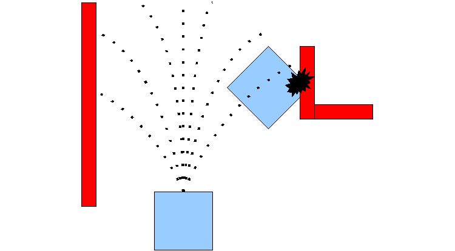
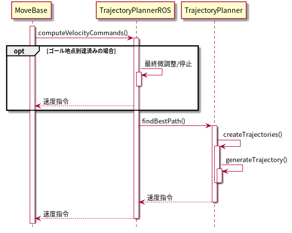

base_local_planner
==================

目次

| 　1. :ref:`概要<Summary_BaseLocalPlanner>`
| 　2. :ref:`パッケージの構成<PackageComponent_BaseLocalPlanner>`
| 　3. :ref:`アルゴリズム<Overview_BaseLocalPlanner>`
| 　　3.1 :ref:`目的<Purpose_BaseLocalPlanner>`
| 　　3.2 :ref:`ローカルプランニングの処理概要<Procesure_BaseLocalPlanner>`
| 　　3.3 :ref:`速度空間のサンプリング<VelocitySampling_BaseLocalPlanner>`
| 　　  3.3.1 :ref:`DWA, Trajectory Rollout の速度<DWAVel_BaseLocalPlanner>`
| 　　  3.3.2 :ref:`前進＋ストラフの速度<MoveForwardAndStrefeVel_BaseLocalPlanner>`
| 　　  3.3.3 :ref:`その場回転の速度<RotateInPlaceVel_BaseLocalPlanner>`
| 　　  3.3.4 :ref:`ストラフ速度<StrefeVel_BaseLocalPlanner>`
| 　　  3.3.5 :ref:`脱出の速度<EscapeVel_BaseLocalPlanner>`
| 　　3.4 :ref:`軌道の計算<TrajectorySimulation_BaseLocalPlanner>`
| 　　3.5 :ref:`障害物コスト<LocalCostMap_Grid_BaseLocalPlanner>`
| 　　3.6 :ref:`マップグリッドコスト<Map_Grid_BaseLocalPlanner>`
| 　　3.7 :ref:`軌道の評価<EvalTrajectory_BaseLocalPlanner>`
| 　　3.8 :ref:`その場回転の軌道の追加評価<RotateInPlaceCost_BaseLocalPlanner>`
| 　　3.9 :ref:`振動抑制<Oscillation_Suppression_BaseLocalPlanner>`
| 　4. :ref:`ローカルプランナークラス TrajectoryPlannerROS<TrajectoryPlannerROS_BaseLocalPlanner>`
| 　　4.1 :ref:`Subscribe トピック<Subscribed_Topics_BaseLocalPlanner>`
| 　　4.2 :ref:`Publish トピック<Published_Topics_BaseLocalPlanner>`
| 　　4.3 :ref:`パラメーター<Parameters_BaseLocalPlanner>`
| 　　　4.3.1 :ref:`ロボット構成パラメーター<Robot_Configuration_Parameters_BaseLocalPlanner>`
| 　　　4.3.2 :ref:`目標地点許容誤差パラメーター<Goal_Tolerance_Parameters_BaseLocalPlanner>`
| 　　　4.3.3 :ref:`フォワードシミュレーションパラメーター<Forward_Simulation_Parameters_BaseLocalPlanner>`
| 　　　4.3.4 :ref:`軌道スコアリングパラメーター<Trajectory_Scoring_Parameters_BaseLocalPlanner>`
| 　　　4.3.5 :ref:`振動防止パラメーター<Oscillation_Prevention_Parameters_BaseLocalPlanner>`
| 　　　4.3.6 :ref:`グローバルプランパラメーター<Global_Plan_Parameters_BaseLocalPlanner>`
| 　　4.4 :ref:`下位クラス<TrajectoryPlanner_BaseLocalPlanner>`
| 　  　4.4.1 :ref:`トラジェクトリプランナークラス<TrajectoryPlanner_BaseLocalPlanner>`
| 　5. :ref:`内部処理手順<Sequence_BaseLocalPlanner>`
| 　　5.1 :ref:`メソッドコールシーケンスの概要<MethodCallSequence_BaseLocalPlanner>`
| 　　5.2 :ref:`各メソッドの処理概要<Method_Frame_BaseLocalPlanner>`
| 　6 :ref:`ライブラリ (一般的なローカルプランニングを行うためのクラス)<Generic_Local_Planning_BaseLocalPlanner>`
| 　　6.1 :ref:`TrajectorySampleGenerator クラス<TrajectorySampleGenerator_BaseLocalPlanner>`
| 　　6.2 :ref:`TrajectoryCostFunction クラス<TrajectoryCostFunction_BaseLocalPlanner>`
| 　　6.3 :ref:`SimpleScoredSamplingPlanner クラス<SimpleScoredSamplingPlanner_BaseLocalPlanner>`
| 　　6.4 :ref:`ヘルパークラス<Helper_classes_BaseLocalPlanner>`
| 　　　6.4.1 :ref:`LocalPlannerUtil クラス<LocalPlannerUtil_BaseLocalPlanner>`
| 　　　6.4.2 :ref:`OdometryHelperRos クラス<OdometryHelperRos_BaseLocalPlanner>`
| 　　　6.4.3 :ref:`LatchedStopRotateController クラス<LatchedStopRotateController_BaseLocalPlanner>`
| 　　6.5 :ref:`コスト関数クラス<Cost_Functions_BaseLocalPlanner>`
| 　　　6.5.1 :ref:`ObstacleCostFunction クラス<ObstacleCostFunction_BaseLocalPlanner>`
| 　　　6.5.2 :ref:`MapGridCostFunction クラス<MapGridCostFunction_BaseLocalPlanner>`
| 　　　6.5.3 :ref:`OscillationCostFunction クラス<OscillationCostFunction_BaseLocalPlanner>`
| 　　　6.5.4 :ref:`PreferForwardCostFunction クラス<PreferForwardCostFunction_BaseLocalPlanner>`
| 　　　6.5.5 :ref:`TwirlingCostFunction クラス<TwirlingCostFunction_BaseLocalPlanner>`
| 　7. :ref:`補足<Additional_Explanation_BaseLocalPlanner>`
| 　　7.1 :ref:`dwa_local_planner パッケージとの比較<VS_DWAPlanner_BaseLocalPlanner>`
| 　　7.2 :ref:`用語<Dic_BaseLocalPlanner>`

|

.. _Summary_BaseLocalPlanner:

1　概要
--------
このパッケージは、平面上のローカルロボットナビゲーションを行うもので、Trajectory Rollout および Dynamic Window Approach の方式で実装しています。 従うべきグローバルプランとコストマップが与えられると、コントローラーは速度ベースのコマンドを生成してモバイルベースに送信します。 このパッケージは、ホロノミックロボットと非ホロノミックロボットの両方、凸多角形または円として表現できる任意のロボット footprint (接触範囲)をサポートします。設定項目はROSパラメーターとして公開されており、起動ファイルで設定できます。 このパッケージのROSラッパーは、`nav_core <http://wiki.ros.org/nav_core>`__ パッケージで指定されたBaseLocalPlannerインターフェースに準拠しています。

* 管理状態：管理済み 
* 管理者：Michael Ferguson <mfergs7 AT gmail DOT com>, David V. Lu!! <davidvlu AT gmail DOT com>, Aaron Hoy <ahoy AT fetchrobotics DOT com>
* 著者： Eitan Marder-Eppstein, Eric Perko, contradict@gmail.com
* ライセンス： BSD
* ソース： git https://github.com/ros-planning/navigation.git （ブランチ：melodic-devel） 

|

.. _PackageComponent_BaseLocalPlanner:

2 パッケージの構成
------------------

このパッケージは、move_base に組み込まれるローカルプランナー部分(TrajectoryPlannerROS)と、カスタムのローカルプランナーをつくるためのライブラリ部分に分かれます。
ライブラリ部分は主に :ref:`dwa_local_planner<Summary_DWALocalPlanner>` パッケージから使われており、TrajectoryPlannerROS からは一部しか使われていません。
このようになっているのは、ローカルプランナー部分が最初にあり、それをリファクタリングして、dwa_local_plannerとライブラリ部分を作ったためです。

.. image:: images/base_local_planner_component.png
   :width: 100%
   :align: center

コンポーネント図

|

.. _Overview_BaseLocalPlanner:

3　アルゴリズム
----------------

.. _Purpose_BaseLocalPlanner:

3.1 目的
~~~~~~~~~~

base\_local\_plannerパッケージは、モバイルベースを平面上で運転するコントローラーを提供します。
このコントローラーは、パスプランナーとロボットを接続します。
プランナーはマップを使い、ロボットがスタートからゴール位置に到達するまでの運動の軌道を作成します。
その過程で、プランナーはロボットの周囲にグリッドマップとして表される価値関数を作成します。
この価値関数は、グリッドセルを通過するコストを表現します。
コントローラーの仕事は、この価値関数を使用して、ロボットに送信する速度 (X軸直線速度, Y軸直線速度, Z軸回転速度) を決定することです。

出典: http://wiki.ros.org/base_local_planner

|

.. _Procesure_BaseLocalPlanner:

3.2 ローカルプランニングの処理概要
~~~~~~~~~~~~~~~~~~~~~~~~~~~~~~~~~~

Trajectory Rollout と Dynamic Window Approach (DWA) アルゴリズムの基本的な考え方は次のとおりです。

   #. ロボットの速度空間 (X軸直線速度, Y軸直線速度, Z軸回転速度) を離散的にサンプリングします。

   #. サンプリング速度ごとに、ロボットの現在の状態からフォワードシミュレーションを実行して、サンプリング速度を一定（短い）時間適用した場合にどう動くかを予測します。(軌道の予測)
   #. フォワードシミュレーションから得られた各軌道を評価（スコア）します。評価には、障害物への近さ、目標地点への近さ、グローバルパスへの近さ、速度などの特性をとりこんだ距離空間を使用します。 不正な軌道（障害物と衝突する軌道）は破棄します。
   #. 最高得点の軌道を選んでその速度をロボットに送信します。
   #. 以上の手順を繰り返します。

DWAと Trajectory Rollout とでは、ロボットの速度空間のサンプリング方法が異なります。 
Trajectory Rollout では、フォワードシミュレーションの全期間でロボットの加速度制限から到達可能な速度セットをサンプリングするのに対し、
DWAでは、1シミュレーション周期のみの間でロボットの加速度制限から到達可能な速度セットをサンプリングします。
つまり、DWAはより小さなスペースをサンプリングするため、より効率的なアルゴリズムですが、加速度制限が低いロボットでは Trajectory Rollout の方が性能がよくなるかもしれません。なぜならDWAは一定加速度をフォワードシミュレートしないためです。 ただし、我々の実際のすべてのテストでは、DWAと Trajectory Rollout は同等の性能を発揮しており、性能効率からみてDWAの使用を推奨します。

便利なリファレンス：

* `Brian P. Gerkey and Kurt Konolige. "Planning and Control in Unstructured Terrain" <https://pdfs.semanticscholar.org/dabd/bb636f02d3cff3d546bd1bdae96a058ba4bc.pdf?_ga=2.75374935.412017123.1520536154-80785446.1520536154>`__. LAGRロボットで使用される Trajectory Rollout アルゴリズムの説明。 

* `D. Fox, W. Burgard, and S. Thrun. "The dynamic window approach to collision avoidance" <https://pdfs.semanticscholar.org/dabd/bb636f02d3cff3d546bd1bdae96a058ba4bc.pdf?_ga=2.75374935.412017123.1520536154-80785446.1520536154>`__. ローカルコントロールへの Dynamic Window Approach。 

* `Alonzo Kelly. "An Intelligent Predictive Controller for Autonomous Vehicles" <http://www.ri.cmu.edu/pub_files/pub1/kelly_alonzo_1994_7/kelly_alonzo_1994_7.pdf>`__. 過去の同様のアプローチで制御するシステム。 

|

.. _VelocitySampling_BaseLocalPlanner:

3.3　速度空間のサンプリング
~~~~~~~~~~~~~~~~~~~~~~~~~~~~

ロボットの速度空間 (X軸直線速度, Y軸直線速度, Z軸回転速度) のサンプリングを次の各アルゴリズムで行います。

|

.. _DWAVel_BaseLocalPlanner:

3.3.1　DWA, Trajectory Rollout の速度
^^^^^^^^^^^^^^^^^^^^^^^^^^^^^^^^^^^^^^^^^^^^^^^^

ロボットの速度空間（X軸直線速度、Z軸回転速度）を離散的にサンプリングします。
まずサンプリングする範囲を求めます。DWAの場合、

* X軸直線速度のサンプリング上限速度 = 現在のX軸直線速度 + :ref:`X軸直線加速度の上限<Robot_Configuration_Parameters_BaseLocalPlanner>` + 1シミュレーション周期

* X軸直線速度のサンプリング下限速度 = 現在のX軸直線速度 - :ref:`X軸直線加速度の上限<Robot_Configuration_Parameters_BaseLocalPlanner>` + 1シミュレーション周期

* Z軸回転速度のサンプリング上限速度 = 現在のZ軸回転速度 + :ref:`Z軸回転加速度の上限<Robot_Configuration_Parameters_BaseLocalPlanner>` + 1シミュレーション周期

* Z軸回転速度のサンプリング下限速度 = 現在のZ軸回転速度 - :ref:`Z軸回転加速度の上限<Robot_Configuration_Parameters_BaseLocalPlanner>` + 1シミュレーション周期

    (1シミュレーション周期は、:ref:`controller_frequency<Forward_Simulation_Parameters_BaseLocalPlanner>` パラメーターの逆数であり、既定値は 0.05s です)

Trajectory Rollout の場合、

* X軸直線速度のサンプリング上限速度 = 現在のX軸直線速度 + :ref:`X軸直線加速度の上限<Robot_Configuration_Parameters_BaseLocalPlanner>` + フォワードシミュレーション時間

* X軸直線速度のサンプリング下限速度 = 現在のX軸直線速度 - :ref:`X軸直線加速度の上限<Robot_Configuration_Parameters_BaseLocalPlanner>` + フォワードシミュレーション時間

* Z軸回転速度のサンプリング上限速度 = 現在のZ軸回転速度 + :ref:`Z軸回転加速度の上限<Robot_Configuration_Parameters_BaseLocalPlanner>` + フォワードシミュレーション時間

* Z軸回転速度のサンプリング下限速度 = 現在のZ軸回転速度 - :ref:`Z軸回転加速度の上限<Robot_Configuration_Parameters_BaseLocalPlanner>` + フォワードシミュレーション時間

    (フォワードシミュレーション時間は、:ref:`sim_time<Forward_Simulation_Parameters_BaseLocalPlanner>` パラメーターであり、既定値は 1s です)

です。
この範囲制限のため、フォワードシミュレーションの際、 DWA は、1シミュレーション周期を超えて加速しませんが、Trajectory Rollout はフォワードシミュレーションの期間にわたって加速します。

求めたサンプリング範囲を等分割し、":ref:`サンプリング数<Forward_Simulation_Parameters_BaseLocalPlanner>` "個のサンプル値を抽出します。
なおY軸直線速度は0です。

|

.. _MoveForwardAndStrefeVel_BaseLocalPlanner:

3.3.2　前進＋ストラフの速度
^^^^^^^^^^^^^^^^^^^^^^^^^^^^^^^^

ホロノミックロボットの場合、向きを保ったまま左斜め前方 or 右斜め前方への移動を試みます。速度は x方向0.1, y方向±0.1(m/s)の固定値です。

|

.. _RotateInPlaceVel_BaseLocalPlanner:

3.3.3　その場回転の速度
^^^^^^^^^^^^^^^^^^^^^^^^

X軸直線速度を0固定にして、Z軸回転速度のバリエーション（その場での回転）

:ref:`その場回転のコスト評価<RotateInPlaceCost_BaseLocalPlanner>` も参照。

|

.. _StrefeVel_BaseLocalPlanner:

3.3.4　ストラフ速度
^^^^^^^^^^^^^^^^^^^^^^^^

上記3点で有効な組み合わせがない＆ホロノミックロボットの場合、横移動を試みます。Y軸直線速度のバリエーションは、:ref:`y_vels<Robot_Configuration_Parameters_BaseLocalPlanner>` のリストです。X軸直線速度、Z軸回転速度のサンプリング値は0とします。

|

.. _EscapeVel_BaseLocalPlanner:

3.3.5　脱出の速度
^^^^^^^^^^^^^^^^^^^^
上記のサンプリング速度に有効な組み合わせがなかった場合は、少しの後退を試みます。
脱出時の速度には、:ref:`escape_vel<Robot_Configuration_Parameters_BaseLocalPlanner>` を使用します。

.. ソース：TrajectoryPlanner::createTrajectories()

|

.. _TrajectorySimulation_BaseLocalPlanner:

3.4 軌道の計算
~~~~~~~~~~~~~~~~

サンプリング速度ごとに、ロボットの現在の状態からフォワードシミュレーションを実行して、サンプリング速度を一定（短い）時間適用した場合にどう動くかを予測します。

フォワードシミュレーションでは、次のサイクルを繰り返します。

  #. 現在ステップでのロボットの位置・向きを軌道に追加します

  #. ロボットの次ステップの速度を計算します。

     サンプリング速度に近づくように現在速度を毎ステップ加速・減速します。(ただしDWAの場合はすぐに上限速度に達します。)

  #. ロボットの次ステップの位置・向きを、次ステップの速度から計算します。

  #. 現在ステップを1つ進めます。

|

フォワードシミュレーション時間は、:ref:`sim_time<Forward_Simulation_Parameters_BaseLocalPlanner>` パラメータで設定されます。

フォワードシミュレーションの1ステップの時間は、:ref:`速度サンプリング<DWAVel_BaseLocalPlanner>` で出てくるシミュレーション周期とは少し異なり、「フォワードシミュレーション時間 / ステップ数」です。
ステップ数は、

「 サンプリング速度のxy合成値 * フォワードシミュレーション時間 / :ref:`距離ステップサイズ(sim_granularity)<Forward_Simulation_Parameters_BaseLocalPlanner>` 」 

または 

「サンプリングZ軸回転速度の絶対値 / :ref:`角度ステップサイズ(angular_sim_granularity)<Forward_Simulation_Parameters_BaseLocalPlanner>`  」  (注：フォワードシミュレーション時間は掛けません)

のどちらか大きい方で決まりますが、
ロボットの経路への向きに基づくスコアリングを行う場合(:ref:`heading_scoring<Trajectory_Scoring_Parameters_BaseLocalPlanner>` が trueの場合)は

「フォワードシミュレーション時間/ :ref:`距離ステップサイズ(sim_granularity)<Forward_Simulation_Parameters_BaseLocalPlanner>` 」 (注：式はソースのママ)

となります。

|

.. _LocalCostMap_Grid_BaseLocalPlanner:

3.5　障害物コスト
~~~~~~~~~~~~~~~~~~~~~~~~~~

ローカルコストマップは、2D平面上の障害物のコスト分布を表したマップです。これを用いて、次のように軌道をスコアリングします。

ローカルコストマップにロボットを当てはめて、ロボットの footprint を形成する線が含まれているセルの中で、コストが最大のものを採用し、これを footprint cost と呼びます。
footprint形成線 が障害物セル(254のセル)にかかる軌道は footprint costを-1.0とします。

occ_cost は、footprint cost とロボットの中心点が含まれるセルのコストで、大きい方を採用します。

.. ソース：TrajectoryPlanner::generateTrajectories()

.. image:: images/occ_cost.png
   :width: 30%
   :align: center

図の例では、occ_cost は128となります。

|

.. _Map_Grid_BaseLocalPlanner:

3.6　マップグリッドコスト
~~~~~~~~~~~~~~~~~~~~~~~~~~~~~~~~~~~~

軌道を効率的にスコアリングするために、マップグリッドを使用します。 制御サイクルごとに、ロボットの周りにグリッド（ローカルコストマップと同サイズ）を作成し、
各セルに path_dist と goal_distの2種類の評価値(コスト)を付与します。

マップグリッドは次の手順で構築します。

  #. まず、グローバルパスをグリッドの領域にマッピングします。 

  #. 次に、path_distの指標については、グローバルパスの通るセルを経路点までの距離0でマークし、また goal_dist の指標についてはローカルゴールのセルをゴールまでの距離0でマークします。

  #. そして伝播アルゴリズムによって、他のすべてのセルを、ゼロでマークされた最も近い点までのマンハッタン距離で効率的にマークします。

このマップグリッドを使って、軌道をスコアリングします。

グローバルパスの目標地点は、多くの場合、map_gridでカバーされる小さな領域の外側にあります。目標地点への近さで軌道をスコアリングする場合、考えるのは「ローカルゴール」となります。それは、領域外へ続いている経路上の領域外縁の点です。領域のサイズはmove_baseによって決定されます。

|

.. list-table::
  :widths: 10 10
  :header-rows: 0

  * - .. image:: images/path_dist.png
         :width: 100%
    - .. image:: images/goal_dist.png
         :width: 100%
  * - path_dist
        経路上のセルをコスト0として、経路からどれだけ離れているかをコストとして表したもの
    - goal_dist
        ローカルゴールをコスト0として、ゴールからどれだけ離れているかをコストとして表したもの

|

|

.. _EvalTrajectory_BaseLocalPlanner:

3.7　軌道の評価
~~~~~~~~~~~~~~~~~~~~

軌道のコストには次のものがあります。

.. csv-table:: 
   :header: "コスト名", "内容", "説明", "重みパラメーター"
   :widths: 5, 10, 30, 5

   "occ_cost", "障害物コスト", "フォワードシミュレーション時間中で、最大の occ_cost を使います。", ":ref:`occdist_scale<Trajectory_Scoring_Parameters_BaseLocalPlanner>` "
   "path_dist", "グローバルパスからの距離", "フォワードシミュレーション軌道の最終地点の path_dist を使います。", ":ref:`pdist_scale<Trajectory_Scoring_Parameters_BaseLocalPlanner>` "
   "goal_dist", "ローカルゴールからの距離", "フォワードシミュレーション軌道の最終地点の goal_dist を使います。", ":ref:`gdist_scale<Trajectory_Scoring_Parameters_BaseLocalPlanner>` "
   "heading_diff", "ロボットの経路への向きのスコア(option)", "シミュレーション時間内のある瞬間（パラメータ :ref:`heading_scoring_timestep<Trajectory_Scoring_Parameters_BaseLocalPlanner>` 秒後）のロボットの向きと、狭域経路上で直線で到達できる最遠の地点までとの向きを比較して、角度の差をコストとして採用するものです。heading_diffを使用する場合は、path_distとgoal_distも、最終地点でなくその瞬間のものが採用されます。", "0.3"

|

3つの（または4つ）コストを、所定の重み付け（カスタマイズ可能）を掛け合わせて合算し、与えられた軌道のコストとします。
各軌道ごとにコストを算出し、最も低コストの軌道を結果の軌道とします。

軌道上のいずれかの点で、occ_costが負値になる(衝突する)場合や、impossible_costのセルに入る場合は、その軌道を破棄します。

|

.. image:: images/base_local_planner_EvalTrajectory.png
   :width: 100%
   :align: center

出典: http://wiki.ros.org/base_local_planner の画像を加工

|
|

.. _RotateInPlaceCost_BaseLocalPlanner:

3.8　その場回転の軌道の追加評価
~~~~~~~~~~~~~~~~~~~~~~~~~~~~~~~~

その場での回転は、X軸直線速度を0固定とし、Z軸回転速度のバリエーションで評価します。

その際、その場回転ではロボットの位置は変わらないため、左右どちらのどのような速度の回転でも、path_distおよびgoal_distには差異が生じません。

occ_costについては、ロボットが障害物に近い位置にいる場合は、footprintの変化により差が出る可能性がありますが、開けた場所であれば差が生じません。

そのため、その場回転同士の比較には、追加の評価軸が用いられます。
回転後に、ロボットがその方向に少し前進（:ref:`heading_lookahead パラメータ<Trajectory_Scoring_Parameters_BaseLocalPlanner>` ）したと仮定して、前進後の位置のgoal_distがより小さい方を採用します。下図の場合は、右回転より左回転の方が有利となります。

ただし、ロボットが既にその場回転を始めていた場合は、現在の回転方向が優先されます。（ロボットが首を左右に振り続けてスタックするような挙動を回避するため。）

.. image:: images/goal_dist_roll.png
   :width: 50%
   :align: center

|

.. _Oscillation_Suppression_BaseLocalPlanner:

3.9　振動抑制
~~~~~~~~~~~~~~~~~~~~

振動は、(x, y, z軸回転) のいずれかの次元で正と負の値が連続して選択されたときに発生します。 振動を防ぐため、ロボットがある方向に移動すると、次のサイクルでは反対方向への移動を不正と設定し、それをフラグが設定された位置から特定の距離を超えてロボットが移動するまで続けます。

|

.. _TrajectoryPlannerROS_BaseLocalPlanner:

4.　ローカルプランナークラス TrajectoryPlannerROS
----------------------------------------------------

base\_local\_planner::TrajectoryPlannerROS  オブジェクトは、base\_local\_planner::TrajectoryPlanner  オブジェクトの機能を公開する `C++ ROSラッパー <http://wiki.ros.org/navigation/ROS_Wrappers>`__ です。 このオブジェクトは、初期化時に指定されたROS名前空間（以降、\ *name*\ と仮表記）で動作します。 このオブジェクトは、`nav\_core <http://wiki.ros.org/nav_core>`__ パッケージにある nav\_core::BaseLocalPlanner インターフェースに準拠しています。

base\_local\_planner::TrajectoryPlannerROS オブジェクトの作成例::

   1 #include <tf/transform_listener.h>
   2 #include <costmap_2d/costmap_2d_ros.h>
   3 #include <base_local_planner/trajectory_planner_ros.h>
   4 
   5 ...
   6 
   7 tf::TransformListener tf(ros::Duration(10));
   8 costmap_2d::Costmap2DROS costmap("my_costmap", tf);
   9 
  10 base_local_planner::TrajectoryPlannerROS tp;
  11 tp.initialize("my_trajectory_planner", &tf, &costmap);

|

.. _Subscribed_Topics_BaseLocalPlanner:

4.1 Subscribe トピック
~~~~~~~~~~~~~~~~~~~~~~~

.. csv-table:: 
   :header: "トピック名", "型", "内容"
   :widths: 5, 10, 30

   "odom", "`nav_msgs/Odometry <http://docs.ros.org/api/nav_msgs/html/msg/Odometry.html>`__", "ローカルプランナーにロボットの現在の速度を与える走行距離情報。 このメッセージの速度情報は、 TrajectoryPlannerROSオブジェクトに含まれるコストマップのrobot_base_frameと同じ座標フレームにあると想定されます 。 robot_base_frameパラメーターについては、 `costmap_2d <http://wiki.ros.org/costmap_2d>`__ パッケージを参照してください。 "

|

.. _Published_Topics_BaseLocalPlanner:

4.2　Publish トピック
~~~~~~~~~~~~~~~~~~~~~~~~

.. csv-table:: 
   :header: "トピック名", "型", "内容"
   :widths: 5, 10, 30

   "<name>/global_plan", "`nav_msgs/Path <http://docs.ros.org/api/nav_msgs/html/msg/Path.html>`__", "ローカルプランナーが現在従おうとしているグローバルプランの一部。 主に視覚化の目的で使用されます。"
   "<name>/local_plan", "`nav_msgs/Path <http://docs.ros.org/api/nav_msgs/html/msg/Path.html>`__", "最後のサイクルで最高得点を獲得したローカルプランまたは軌道。 主に視覚化の目的で使用されます。"
   "<name>/cost_cloud", "`sensor_msgs/PointCloud2 <http://docs.ros.org/api/nav_msgs/html/msg/Path.html>`__", "計画に使用されるコストグリッド。 視覚化の目的で使用されます。 この視覚化の有効化/無効化については、 :ref:`publish_cost_grid_pc<Trajectory_Scoring_Parameters_BaseLocalPlanner>` パラメーターを参照してください。 **Navigation 1.4.0の新機能**"

|

.. _Parameters_BaseLocalPlanner:

4.3　パラメーター
~~~~~~~~~~~~~~~~~~~~

base\_local\_planner::TrajectoryPlannerROS ラッパーの動作をカスタマイズするために設定できる多数のROS  `パラメーター <http://wiki.ros.org/Parameters>`__ があります。 これらのパラメーターは、ロボット構成、目標許容誤差、フォワードシミュレーション、軌道スコアリング、振動防止、グローバルプランなど、いくつかのカテゴリに分類されます。

|

.. _Robot_Configuration_Parameters_BaseLocalPlanner:

4.3.1　ロボット構成パラメーター
^^^^^^^^^^^^^^^^^^^^^^^^^^^^^^^^^^

.. csv-table:: 
   :header: "パラメーター名", "内容", "型", "単位", "デフォルト"
   :widths: 5, 50, 5, 5, 8

   "<name>/acc_lim_x", "ロボットのX軸直線加速度の上限", "double", "m/s^2", "2.5"
   "<name>/acc_lim_y", "ロボットのY軸直線加速度の上限", "double", "m/s^2", "2.5"
   "<name>/acc_lim_theta",  "ロボットのZ軸回転加速度の上限", "double", "rad/s^2", "3.2"
   "<name>/max_vel_x",  "ロボットのX軸直線速度の上限", "double", "m/s", "0.5"
   "<name>/min_vel_x",  "ロボットのX軸直線速度の下限。これは、ロボットに摩擦を克服できるほど十分高い速度を指令するのに便利です。", "double", "m/s", "0.1"
   "<name>/max_vel_theta",  "ロボットのZ軸回転速度の上限 (左回転は正の値)", "double", "rad/s", "1.0"
   "<name>/min_vel_theta",  "ロボットのZ軸回転速度の下限 (右回転は負の値)", "double", "rad/s", "-1.0"
   "<name>/min_in_place_vel_theta",  "その場回転時の、ロボットのZ軸回転速度の下限", "double", "rad/s", "0.4"
   "<name>/backup_vel",  "**DEPRECATED (escape_velを使用してください)**: 脱出中のバックに使用される速度。 ロボットが実際に反転するためには、負の速度を設定しなければならないことに注意してください。 正の速度を使用すると、ロボットは脱出しようとして前進します。", "double",  "m/s", "-0.1"
   "<name>/escape_vel",  "脱出中の走行に使用される速度。 ロボットが実際に反転するためには、負の速度を設定しなければならないことに注意してください。 正の速度を使用すると、ロボットは脱出しようとして前進します。 **Navigation 1.3.1の新機能**", "double", "m/s", "-0.1"
   "<name>/holonomic_robot",  "速度コマンドをホロノミックまたは非ホロノミックロボットのどちらに対して発行するかを決定します。 ホロノミックロボットの場合は、ロボットにストラフ速度コマンドが発行されるかもしれません。 非ホロノミックロボットの場合、ストラフ速度コマンドは発行されません。", "bool", "\-", "true"
   "<name>/y_vels",  "ホロノミックロボットがとるべきストラフ速度のリスト。このパラメーターは、 holonomic_robotがtrueに設定されている場合にのみ使用されます:", "list[double]", "m/s",  "[-0.3, -0.1, 0.1, 0.3]"

|

.. _Goal_Tolerance_Parameters_BaseLocalPlanner:

4.3.2　目標地点許容誤差パラメーター
^^^^^^^^^^^^^^^^^^^^^^^^^^^^^^^^^^^^^^^^

.. csv-table:: 
   :header: "パラメーター名", "内容", "型", "単位", "デフォルト"
   :widths: 5, 50, 5, 5, 8

   "<name>/yaw_goal_tolerance",  "目標地点に到達したときの、コントローラーの Yaw回転角許容誤差", "double", "rad", "0.05"
   "<name>/xy_goal_tolerance",  "目標地点に到達したときの、コントローラーの x-y 平面上距離の許容誤差", "double", "m", "0.10"
   "<name>/latch_xy_goal_tolerance",  "目標地点許容誤差がラッチされている場合、ロボットが目標xy位置に到達すると、後はその場回転のみ行います。回転の間に目標地点許容誤差の範囲外になることもあります。(falseの場合は、範囲外に出たら通常の動作に戻ります。) **Navigation 1.3.1の新機能**", "bool", "\-", "false"

|

.. _Forward_Simulation_Parameters_BaseLocalPlanner:

4.3.3　フォワードシミュレーションパラメーター
^^^^^^^^^^^^^^^^^^^^^^^^^^^^^^^^^^^^^^^^^^^^^^^^^^

.. csv-table:: 
   :header: "パラメーター名", "内容", "型", "単位", "デフォルト"
   :widths: 5, 50, 5, 5, 8

   "<name>/sim_time",  "軌道をフォワードシミュレーションする時間", "double", "s", "1.0"
   "<name>/sim_granularity",  "与えられた軌道上の点間のステップサイズ", "double", "m", "0.025"
   "<name>/angular_sim_granularity",  "与えられた軌道上の角度サンプル間のステップサイズ  **Navigation 1.3.1の新機能**", "double", "rad", "<name>/sim_granularity"
   "<name>/vx_samples",  "X軸直線速度空間を探索するときに使用するサンプルの数 ", "integer", "\-", "3"
   "<name>/vtheta_samples",  "Z軸回転速度空間を探索するときに使用するサンプルの数 ", "integer", "\-", "20"
   "<name>/controller_frequency",  このコントローラーが呼び出される頻度。 コントローラーの名前空間に設定されていない場合、searchParamを使用して親の名前空間からパラメーターを読み取ります。 すなわち、move_base とともに使用する場合は move_base の "controller_frequency"パラメーターを設定するだけでよく 、このパラメーターを未設定のままにしておけます。  **Navigation 1.3.1の新機能**, "double", "Hz", "20.0"

|

.. _Trajectory_Scoring_Parameters_BaseLocalPlanner:

4.3.4　軌道スコアリングパラメーター
^^^^^^^^^^^^^^^^^^^^^^^^^^^^^^^^^^^
各軌道のスコアリングに使用されるコスト関数は、次の形式です。::

   cost = 
   pdist_scale * (軌道終端からパスへの距離。単位は マップセル か m のどちらか。meter_scoring パラメーターによる) 
   + gdist_scale * (軌道終端から局所目標地点への距離。単位は マップセル か m のどちらか。meter_scoring パラメーターによる) 
   + occdist_scale * (軌道中の最大障害物コスト。単位は障害物コスト (0-254))
   + 0.3 * (ロボットの経路への向きのスコア)

|

.. csv-table:: 
   :header: "パラメーター名", "内容", "型", "単位", "デフォルト"
   :widths: 5, 50, 5, 5, 8

   "<name>/meter_scoring",  "gdist_scaleおよびpdist_scaleパラメーターが使われる際、 goal_distanceおよびpath_distanceがメートルの単位で表されると解釈するかどうか。falseの場合、単位はセルとなります。 デフォルト値はセルに設定されています。 **Navigation 1.3.1の新機能**", "bool", "\-", "false"
   "<name>/pdist_scale",  "コントローラーが与えられたパスにどれだけ近づいておこうとするかの重み。最大値は5.0です。 ", "double", "\-", "0.6"
   "<name>/gdist_scale",  "コントローラーがローカルの目標にどれだけ到達しようとするかの重み。速度も制御します。可能な最大値は5.0です。", "double", "\-", "0.8"
   "<name>/occdist_scale",  "コントローラーが障害物をどれだけ回避しようとするかの重み。 ", "double", "\-", "0.01"
   "<name>/heading_lookahead",  "その場回転の異なる軌道をスコアリングする際に、どれだけ前方を見るか。(dwa_local_planner の :ref:`forward_point_distance<Trajectory_Scoring_Parameters_DWALocalPlanner>` に相当) ", "double", "m", "0.325"
   "<name>/heading_scoring",  "ロボットの経路への向きに基づいてスコアリングするかどうか。", "bool", "\-", "false"
   "<name>/heading_scoring_timestep",  "heading_scoring を使用する場合に、シミュレートした軌道に沿ってどれだけ先の時点で評価するか。パスへの距離と局所目標地点への距離も、軌道終端でなくその瞬間のものが採用されます。", "double", "s", "0.8"
   "<name>/dwa",  "Dynamic Window Approach (DWA) を使用するか、Trajectory Rollout を使用するか（注：私たちの経験では、DWAは Trajectory Rollout と同様に機能し、計算コストが低くなります。ロボットの加速性能が非常に低い場合は Trajectory Rollout で動かすとよいかもしれません。ただし、最初にDWAを試すことをお勧めします。）", "bool", "\-", "true"
   "<name>/publish_cost_grid_pc",  "プランナーが計画時に使用するコストグリッドを公開するかどうか。 trueの場合、 sensor_msgs/PointCloud2 が~<name>/cost_cloudトピックで利用可能になります。 各点群はコストグリッドを表し、個々のスコアリング関数コンポーネントのフィールドを持ちます。 また、スコアリングパラメーターを考慮に入れた各セルの全体的なコストを持ちます。 **Navigation 1.4.0の新機能**", "bool", "\-", "false"
   "<name>/global_frame_id",  "cost_cloudに設定するフレーム。 ローカルコストマップのグローバルフレームと同じフレームに設定する必要があります。 **Navigation 1.4.0の新機能**", "string", "\-", "odom"

|

.. _Oscillation_Prevention_Parameters_BaseLocalPlanner:

4.3.5　振動防止パラメーター
^^^^^^^^^^^^^^^^^^^^^^^^^^^^^^^^^

.. csv-table:: 
   :header: "パラメーター名", "内容", "型", "単位", "デフォルト"
   :widths: 5, 50, 5, 5, 8

   "<name>/oscillation_reset_dist",  "振動フラグがリセットされるまでにロボットが移動する必要がある距離", "double", "m", "0.05"

|

.. _Global_Plan_Parameters_BaseLocalPlanner:

4.3.6　グローバルプランパラメーター
^^^^^^^^^^^^^^^^^^^^^^^^^^^^^^^^^^^^^^

.. csv-table:: 
   :header: "パラメーター名", "内容", "型", "単位", "デフォルト"
   :widths: 5, 50, 5, 5, 8

   "<name>/prune_plan",  "ロボットがパスに沿って移動するときにプランを消していくかを定義します。 trueに設定されている場合、ロボットが移動すると、1メートル置いていかれた点はプランから外します。", "bool", "\-", "true"

|

.. _InternalClasses_BaseLocalPlanner:

4.4　下位クラス
~~~~~~~~~~~~~~~~~~~~~~~~~~~~~~~~

.. _TrajectoryPlanner_BaseLocalPlanner:

4.4.1　トラジェクトリプランナークラス
^^^^^^^^^^^^^^^^^^^^^^^^^^^^^^^^^^^^^^^^

base\_local\_planner::TrajectoryPlanner は、前述のDWAおよび Trajectory Rollout アルゴリズムの実装を提供します。 ROSで base\_local\_planner::TrajectoryPlanner を使用するには、 :ref:`TrajectoryPlannerROS ラッパー<TrajectoryPlannerROS_BaseLocalPlanner>` を使用してください。 base\_local\_planner::TrajectoryPlanner を単独で使用することは推奨されません。

|

.. _Sequence_BaseLocalPlanner:

5.　内部処理手順
----------------------------------

.. _MethodCallSequence_BaseLocalPlanner:

5.1　メソッドコールシーケンスの概要
~~~~~~~~~~~~~~~~~~~~~~~~~~~~~~~~~~~~

|

.. _Method_Frame_BaseLocalPlanner:

5.2　各メソッドの処理概要
~~~~~~~~~~~~~~~~~~~~~~~~~~~~~~

* TrajectoryPlannerROS::computeVelocityCommands() … 速度命令計算

  * 大域経路をローカルコストマップの範囲で切り取ります。
  * ゴール地点に到達済みかを判定し、到達済みなら最終補正の駆動命令を返します。	

    * ロボットが未停止であれば減速/停止の駆動命令を返却
    * ロボットが停止済みであれば角度を合わせるための回転命令を返却
    * 角度も合っていればゼロ駆動命令を返却

  * ゴール地点に到達していなければ、TrajectoryPlanner::findBestPath()をコールします。

|

* TrajectoryPlanner::findBestPath() … 最良経路検索

  * 経路評価用マップを更新します
  * TrajectoryPlanner::createTrajectories()をコールします

|

* TrajectoryPlanner::createTrajectories() … 軌道作成

  * X軸直線速度、Z軸回転速度のとり得る組み合わせを求め、それぞれの組み合わせに対してTrajectoryPlanner::generateTrajectory()をコールしてコストを計算し、コストが最小となるものを求めます。

    * ①現在速度、②加速／減速の最大値、③速度の最大／最小値、④速度変化の単位から、とりうる全ての組み合わせ
    * ホロノミックロボットの場合、向きを保ったまま左斜め前方 or 右斜め前方に移動。速度は x方向0.1, y方向±0.1(m/s)の固定値。
    * X軸直線速度を0固定にして、Z軸回転速度のバリエーション（その場での回転）
    * 上記3点で有効な組み合わせがない＆ホロノミックロボットの場合、横移動。Y軸直線速度のバリエーションは、:ref:`y_vels<Robot_Configuration_Parameters_BaseLocalPlanner>` パラメータのリストです。X軸直線速度、Z軸回転速度のサンプリング値は0とします。
    * それでも有効な組み合わせがなかった場合は、少しの後退

|

* TrajectoryPlanner::generateTrajectory() … 軌道生成

  * 与えられた、ターゲットとなるX軸直線速度、Z軸回転速度について、path_dist, goal_dist, occ_costの3つの評価軸（オプションでheading_diffを追加可能）で評価を行い、コストを返却します。

|

.. _Generic_Local_Planning_BaseLocalPlanner:

6.　ライブラリ (一般的なローカルプランニングを行うためのクラス)
----------------------------------------------------------------

**navigation 1.10.0の新機能**

ROSのgroovyリリースには、 :doc:`dwa\_local\_planner <dwa_local_planner>` パッケージの新しい実装が含まれています。 実装は、多くのコードを再利用しつつカスタムローカルプランナーを簡単に作成できるように、モジュール化してあります。 base\_local\_plannerのコードベースは、いくつかの新しいヘッダーとクラスで拡張されています。

ローカルプランニングの原理は、制御サイクルごとに適切なローカルプランを検索することです。 そのために、多数の候補軌道が生成されます。 生成された軌道について、障害物と衝突するかどうかがチェックされます。 衝突しなければ、いくつかの軌道を比較して最良のものを選択するために評価値をつけます。

明らかに、ロボットの形状（およびアクチュエータの形状）とドメインに応じて、この原理は様々な異なる方法で実装できます。 軌道を生成するにはいろいろな特殊な方法があり、また軌道の空間から最適な軌道を検索するにも特殊な方法がいろいろあります。

以下のインターフェースとクラスは、いろいろなインスタンス化を可能にする一般的なローカルプランニングの原理を持っています。 dwa\_local\_plannerをテンプレートとして使用し、独自のコスト関数または軌道ジェネレーターを追加するだけで、カスタムのローカルプランナーを作成できるはずです。

注：本節のクラスの大部分は、本パッケージの公開インターフェースクラス TrajectoryPlannerROS からは使われていません。しかし dwa_local_planner の公開インターフェースクラス DWAPlannerROS からは使われています。

|

.. _TrajectorySampleGenerator_BaseLocalPlanner:

6.1　TrajectorySampleGenerator クラス
~~~~~~~~~~~~~~~~~~~~~~~~~~~~~~~~~~~~~~~~

このインターフェースは、軌道のジェネレーターを表します。有限または無限の軌道を生成し、 nextTrajectory() の呼び出しごとに新しい軌道を返します。

SimpleTrajectoryGenerator クラスは、TrajectorySampleGeneratorを継承した実装クラスで、Trajectory Rollout または DWAのいずれかを使用して、:ref:`アルゴリズム<Overview_BaseLocalPlanner>` で説明されている軌道を生成できます。

|

.. _TrajectoryCostFunction_BaseLocalPlanner:

6.2　TrajectoryCostFunction クラス
~~~~~~~~~~~~~~~~~~~~~~~~~~~~~~~~~~~~~~~~

このインターフェースに含まれる最も重要なメソッドは scoreTrajectory(Trajectory &traj) です。これは、軌道を取得してスコアを返します。 負のスコアは、軌道が無効であることを意味します。 正の値の場合、意味としては、コスト関数に従うとスコアの低い軌道がスコアの高い軌道よりも好ましいということです。

各コスト関数は、他のコスト関数との相対的な影響度を変えられるスケールを持ちます。

base_local_planner パッケージにはPR2で使用されるいくつかのコスト関数が付属しています。(後述)

|

.. _SimpleScoredSamplingPlanner_BaseLocalPlanner:

6.3　SimpleScoredSamplingPlanner クラス
~~~~~~~~~~~~~~~~~~~~~~~~~~~~~~~~~~~~~~~~~~~~

これは、軌道探索の簡単な実装で、 TrajectorySampleGenerator と、 TrajectoryCostFunction のリストを持ちます。 ジェネレーターが軌道の生成を停止するまで nextTrajectory()  を呼び出します。 軌道ごとに、コスト関数のリストをループして正の値を足し上げますが、負の値を返すコスト関数がある軌道はスコアリングしません。

各軌道ごとにコスト関数をスケールの重みをつけて和をとり、最良の軌道を結果の軌道とします。

SimpleScoredSamplingPlanner クラスは、軌道探索のインターフェースクラス base_local_planner::TrajectorySearch を継承して実装したものです。

|

.. _Helper_classes_BaseLocalPlanner:

6.4　ヘルパークラス
~~~~~~~~~~~~~~~~~~~~~~~~~~~~~~~~

.. _LocalPlannerUtil_BaseLocalPlanner:

6.4.1　LocalPlannerUtil クラス
^^^^^^^^^^^^^^^^^^^^^^^^^^^^^^^^

このヘルパーインターフェースは、move_baseコンテキストのすべてのローカルプランナーに共通する機能を提供します。 現在のグローバルプラン、現在のモーション制限、および現在のコストマップ（検知された障害物のローカルマップ）を管理します。

|

.. _OdometryHelperRos_BaseLocalPlanner:

6.4.2　OdometryHelperRos クラス
^^^^^^^^^^^^^^^^^^^^^^^^^^^^^^^^

このクラスは、ROSベースのロボットのオドメトリ情報(速度など)を提供します。

.. _LatchedStopRotateController_BaseLocalPlanner:

6.4.3　LatchedStopRotateController クラス
^^^^^^^^^^^^^^^^^^^^^^^^^^^^^^^^^^^^^^^^^^^^

理想的には、ローカルプランナーがロボットを停止すべき場所に正確に停止させます。 ただし、実際には、センサーのノイズとアクチュエータの不確実性により、ロボットが目標地点に近づいても行き過ぎることがあります。 これは、その場で振動するという望ましくないロボットの動作につながってしまいます。

LatchedStopRotateControllerは、ロボットが目標に十分近づくとすぐに使用できるコントローラーです。 コントローラーは、フルストップし、ゴールの方向にその場回転するだけです。フルストップ後、ロボットの位置がゴールの許容範囲外になる場合があります。

|

.. _Cost_Functions_BaseLocalPlanner:

6.5　コスト関数クラス
~~~~~~~~~~~~~~~~~~~~~~~~~~~~~~~~

.. _ObstacleCostFunction_BaseLocalPlanner:

6.5.1　ObstacleCostFunction クラス
^^^^^^^^^^^^^^^^^^^^^^^^^^^^^^^^^^^^

このコスト関数は、知覚された障害物に基づいて軌道を評価します。 軌道が障害物を通過する場合は負のコストを返し、それ以外の場合はゼロを返します。

.. _MapGridCostFunction_BaseLocalPlanner:

6.5.2　MapGridCostFunction クラス
^^^^^^^^^^^^^^^^^^^^^^^^^^^^^^^^^^^^

このコスト関数クラスは、軌道がグローバルパスをどれだけ厳密にたどるか、または目標点に近づくかに基づいて軌道を評価します。 これは、すべての軌道に対してパスまたはゴールポイントまでの距離を事前計算した同一のマップを使用することで、計算速度の最適化をしています。

dwa\_local\_plannerでは、このコスト関数はさまざまな目的のために複数回インスタンス化されます。 軌道をパスに近づけて維持し、ロボットをローカルゴールに向かって前進させ、ロボットの前部（「鼻」）をローカルゴールに向けます。 このコスト関数はヒューリスティック(発見的手法)であり、不適切な結果が得られたり、不適切なパラメーターで失敗したりする可能性があります。

.. _OscillationCostFunction_BaseLocalPlanner:

6.5.3　OscillationCostFunction クラス
^^^^^^^^^^^^^^^^^^^^^^^^^^^^^^^^^^^^^^^^

このコスト関数クラスは、特定の振動を低減するのに役立ちます。前回の運動方向の切り返しが特定の距離以下で発生した場合、切り返しに負のコストを返します。 これにより、このような振動が効果的に防止されますが、不適切なパラメーターを使用するとうまくいかない場合があります。

.. _PreferForwardCostFunction_BaseLocalPlanner:

6.5.4　PreferForwardCostFunction クラス
^^^^^^^^^^^^^^^^^^^^^^^^^^^^^^^^^^^^^^^^

このコスト関数クラスは、PR2のようなロボットを念頭に置いて設計されており、ロボットの前方でのみセンサーカバレッジが良好になります（チルトレーザー）。 コスト関数は、前方への動きを優先し、後方へはペナルティを課して抑制します。 他のロボットまたは他のドメインでは、全くうまく動作しないかもしれません。

.. _TwirlingCostFunction_BaseLocalPlanner:

6.5.5　TwirlingCostFunction クラス
^^^^^^^^^^^^^^^^^^^^^^^^^^^^^^^^^^^^^^^^
このコスト関数クラスは、ロボットのスピンのコストを表し、急カーブの軌道ほどコストが大きくなります。
処理としては軌道のZ軸回転速度の絶対値を返します。

|

.. _Additional_Explanation_BaseLocalPlanner:

7.　補足
------------------------------

.. _VS_DWAPlanner_BaseLocalPlanner:

7.1　dwa_local_planner パッケージとの比較
~~~~~~~~~~~~~~~~~~~~~~~~~~~~~~~~~~~~~~~~~~

base_local_planner と dwa_local_planner パッケージは両方とも DWAを使いますが、次のような違いがあります。( `参考 <https://answers.ros.org/question/10718/dwa_planner-vs-base_local_planner/>`__ )

* dwa_local_plannerはx、y、およびtheta の速度制約をサポートしますが、base_local_plannerはxおよびtheta の速度制約のみをサポートします。 y速度についてユーザーが指令できるのは、事前に指定する有効なy速度リストのみです。 そのため、ホロノミックまたは疑似ホロノミックなロボットには、 dwa_local_plannerの方が速度空間をよりよくサンプリングできるため適しています。 

* dwa_local_planner の方が、ソースコードが整理されています。
 

* 他にも細かな違いがあります。個別のロボットでは base_local_plannerの方が性能を発揮することもあるかもしれませんが、作者の一人はコードが整理されていることなどからまずdwa_local_plannerを使うことを推奨しています。

|

.. _Dic_BaseLocalPlanner:

7.2　用語
~~~~~~~~~~~~~~~~~~~
* モバイルベース mobile base

  ロボットを移動可能にする駆動装置の集合

* ホロノミック/非ホロノミック

  ホロノミック/非ホロノミックは、系の拘束条件の性質を述べた言葉です。
  このパッケージに限って言うと、前進と回転のみ可能なロボットは非ホロノミック、前進と回転に加えて横方向にも移動できるロボットはホロノミックです。(正確な定義ではありません)

* ストラフ, strafe

  特殊な車輪駆動などを使って、ロボットが横移動すること

* PR2

  Willow Garage の開発した全方位移動双腕パーソナルロボット

* フットプリント, footprint

  ロボットの接触範囲. 障害物を避ける軌道の算出に使用します. 実際のロボットの形状よりも大きめにとります.

* X軸直線速度

  ロボットの前進速度

* Y軸直線速度

  ロボットの横方向への移動速度。左方向が正の値です。

* Z軸回転速度

  ロボットが旋回するときの、向きの変化率(rad/s)。左旋回が正の値です。

