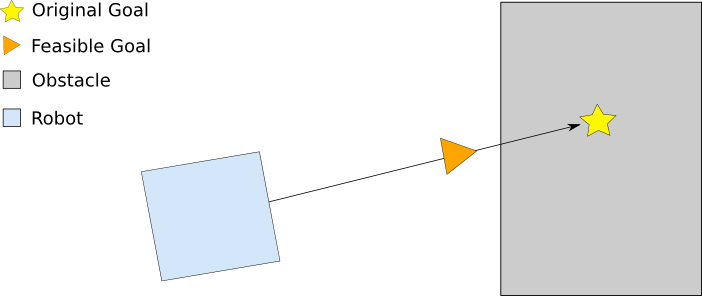

carrot_planner
========================================
目次
    
| 　1. :ref:`概要<carrotplanner_overview>`
| 　2. :ref:`Carrot Planner<carrotplanner_carrotplanner>`
| 　　2.1. :ref:`APIの安定性<carrotplanner_api_stability>`
| 　　2.2. :ref:`ROSパラメータ<carrotplanner_ros_parameters>`
| 　　2.3. :ref:`C++ API<carrotplanner_cpp_api>`
|

.. _carrotplanner_overview:

============================================================
1. 概要
============================================================
このプランナーは、ロボットが従うために”ニンジン”を置くための適切な場所(Feasible Goal)を検索します。これは、ロボット(Robot)と目標位置(Original Goal)の間のベクトルに沿って後退しながら行います。

* 管理状態：管理済み
* 管理者：Aaron Hoy <ahoy AT fetchrobotics DOT com>, David V. Lu!! <davidvlu AT gmail DOT com>、 Michael Ferguson <mfergs7 AT gmail DOT com>
* 著者：Eitan Marder-Eppstein, Sachin Chitta、 contradict@gmail.com
* ライセンス：BSD
* ソース：git `https://github.com/ros-planning/navigation.git <https://github.com/ros-planning/navigation.git>`__ （ブランチ：melodic-devel）

carrot_planner :: CarrotPlannerは、 :doc:`nav_core <nav_core>` パッケージに含まれるnav_core :: BaseGlobalPlannerインターフェイスに準拠したシンプルなグローバルプランナーであり、:doc:`move_base <move_base>` ノードのグローバルプランナー `プラグイン <http://wiki.ros.org/pluginlib>`__ として使用できます。 Carrot Plannerは、現在位置(Robot)と目標位置(Original Goal)を受け取り、その間のベクトル上に障害物があるかどうかを判断します。障害物がある場合は、目標位置(Original Goal)からベクトルに沿って現在位置(Robot)側に後退して判断し、障害物がない地点(Feasible Goal)が見つかるまで繰り返します。この地点を次の目標位置としてローカルプランナーまたはコントローラーに渡します。 このようにして、Carrot Plannerは、ロボットがユーザー指定の目標地点(Original Goal)に可能な限り近づけることができます。

出典：`http://wiki.ros.org/carrot_planner <http://wiki.ros.org/carrot_planner>`__

|

.. _carrotplanner_carrotplanner:

============================================================
2. Carrot Planner
============================================================
carrot_planner :: CarrotPlannerオブジェクトは、その機能を `C ++ ROSラッパー <http://wiki.ros.org/navigation/ROS_Wrappers>`__ として公開します。 これは、初期化時に指定されたROS名前空間（以降、nameとする）内で動作します。 :doc:`nav_core <nav_core>` パッケージにあるnav_core :: BaseGlobalPlannerインターフェイスに準拠しています。

carrot_planner :: CarrotPlannerオブジェクトの作成例::

   1 #include <tf/transform_listener.h>
   2 #include <costmap_2d/costmap_2d_ros.h>
   3 #include <carrot_planner/carrot_planner.h>
   4 
   5 ...
   6 tf::TransformListener tf(ros::Duration(10));
   7 costmap_2d::Costmap2DROS costmap("my_costmap", tf);
   8 
   9 carrot_planner::CarrotPlanner cp;
  10 cp.initialize("my_carrot_planner", &costmap);

|

.. _carrotplanner_api_stability:

2.1. APIの安定性
************************************************************
* ROS APIは安定しています。
* C++ APIは安定しています。

.. _carrotplanner_ros_parameters:

2.2. ROSパラメータ
************************************************************
.. csv-table:: 
   :header: "パラメータ名", "内容", "型", "単位", "デフォルト"
   :widths: 10, 50, 5, 5, 8

   "~<name>/step_size", "ローカルプランナーの適切な場所を見つけようとするときに、ロボットと目標位置の間のベクトルに沿って後退する距離間隔。", "double", "m", "関連するコストマップの解像度"
   "~<name>/min_dist_from_robot", "ローカルプランナーに送信されるロボットから目標地点までの最短距離。", "double", "m", "0.10"

|

.. _carrotplanner_cpp_api:

2.3. C++ API
************************************************************
C ++のcarrot_planner :: CarrotPlannerクラスは、:doc:`nav_core <nav_core>` パッケージにあるnav_core :: BaseGlobalPlannerインターフェイスに準拠しています。 詳細については、`Carrot Plannerのドキュメント <http://www.ros.org/doc/api/carrot_planner/html/classcarrot__planner_1_1CarrotPlanner.html>`__ をご覧ください。
