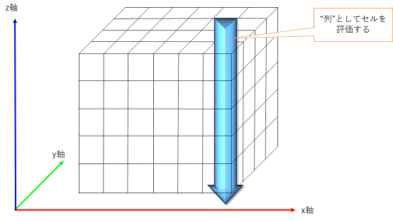
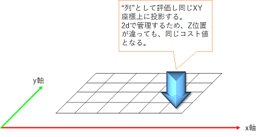
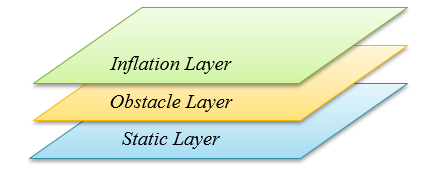

costmap_2d
=======================================
目次
    
| 　1. :ref:`概要<costmap2d_overview>`
| 　2. :ref:`マークとクリア<costmap2d_marking_and_clearing>`
| 　3. :ref:`占有、空き、未知スペース<costmap2d_occupied_free_unknownspace>`
| 　4. :ref:`マップの更新<costmap2d_map_updates>`
| 　5. :ref:`tf<costmap2d_tf>`
| 　6. :ref:`インフレーション<costmap2d_inflation>`
| 　7. :ref:`マップタイプ<costmap2d_map_types>`
| 　8. :ref:`コンポーネントAPI<costmap2d_component_api>`
| 　　8.1. :ref:`Costmap2DROS<costmap2d_costmap2dros>`
| 　　　8.1.1. :ref:`ROS API<costmap2d_ros_api>`
| 　　　8.1.2. :ref:`サブスクライブトピック<costmap2d_subscribed_topics>`
| 　　　8.1.3. :ref:`パブリッシュトピック<costmap2d_published_topics>`
| 　　　8.1.4. :ref:`パラメータ<costmap2d_parameters>`
| 　　　　8.1.4.1. :ref:`Hydro以前のパラメータ<costmap2d_prehydro_parameters>`
| 　　　　8.1.4.2. :ref:`プラグイン<costmap2d_Plugins>`
| 　　　　8.1.4.3. :ref:`座標フレームとtfパラメータ<costmap2d_coordinate_frame_and_tf_parameters>`
| 　　　　8.1.4.4. :ref:`レートパラメータ<costmap2d_rate_parameters>`
| 　　　　8.1.4.5. :ref:`マップ管理パラメータ<costmap2d_map_management_parameters>`
| 　　　8.1.5. :ref:`必要なtf変換<costmap2d_required_tf_transforms>`
| 　　　8.1.6. :ref:`C++ API<costmap2d_cpp_api>`
| 　　8.2. :ref:`レイヤー仕様<costmap2d_layer_specifications>`
| 　　　8.2.1. :ref:`静的マップレイヤー(Static Layer)<costmap2d_static_map_layer>`
| 　　　8.2.2. :ref:`障害物マップレイヤー(Obstacle Layer)<costmap2d_obstacle_map_layer>`
| 　　　8.2.3. :ref:`インフレーションレイヤー(Inflation Layer)<costmap2d_inflation_layer>`
| 　　　8.2.4. :ref:`その他のレイヤー<costmap2d_other_layers>`
|

.. _costmap2d_overview:

============================================================
1. 概要
============================================================
このパッケージは、空間のセンサーデータを取り込む2Dコストマップの実装を提供し、2Dまたは3Dの占有グリッドデータ（ボクセルベースの実装を使用するかどうかに依存）を構築します。そして、占有グリッドとユーザー定義の膨張半径でベースの2Dコストマップのコストをインフレーション（増大）します。 このパッケージは、map_serverベースのコストマップの初期化、ローリングウィンドウベースのコストマップ、およびパラメータベースのセンサートピックのサブスクリプションと設定もサポートしています。

* 管理状態：管理済み
* 管理者：David V. Lu !! <Davidvlu AT gmail DOT com>、Michael Ferguson <mfergs7 AT gmail DOT com>、Aaron Hoy <ahoy AT fetchrobotics DOT com>
* 著者：Eitan Marder-Eppstein、David V. Lu !!、Dave Hershberger、contradict @ gmail.com
* ライセンス：BSD
* ソース：git `https://github.com/ros-planning/navigation.git <https://github.com/ros-planning/navigation.git>`__ （ブランチ：melodic-devel）

.. image:: images/costmap_rviz.png
   :align: center

|

注：上の図では、赤色のセルはコストマップ内の障害物を表し、青色のセルはロボットの内接円半径によってインフレーションした領域を表し、細い赤枠はロボットのfootprint(占有領域)を表します。ロボットが衝突を避けるためには、ロボットのfootprintが赤色のセルと交差せず、且つ、ロボットの中心点が青色のセルと交差してはいけません。

costmap_2dパッケージは、ロボットが占有グリッドの形式で誘導するための管理情報を設定可能な構造体を提供します。コストマップは、静的マップのセンサーデータと情報を使用して、costmap_2d :: Costmap2DROSオブジェクトを介して、空間の障害物に関する情報を保存および更新します。 costmap_2d :: Costmap2DROSオブジェクトは、純粋に2次元のインタフェースをユーザーに提供します。つまり、障害物の判定は"列"単位でのみ行うことができます。

|

たとえば、XY平面で同じ位置にあるがZ位置が異なる"テーブル"と"靴"の場合、costmap_2d :: Costmap2DROSオブジェクトのコストマップの対応するセルのコスト値は同じになります(下図参照)。これは、平面空間での経路探索がしやすいように設計されています。

|

Hydroリリースの時点で、コストマップへのデータの書き込みは、基本的なメソッドを使用して、完全に設定することができます。機能の各ビットはレイヤーに存在します。たとえば、静的マップは1つのレイヤーであり、障害物は別のレイヤーです。デフォルトでは、障害物レイヤーは3次元で情報を保持します（ :doc:`voxel_grid <voxel_grid>` を参照）。 3D障害物データを保持することにより、レイヤーはマークとクリアをよりインテリジェントに処理できます。

主なインタフェースはcostmap_2d :: Costmap2DROSであり、ROS関連の機能の多くを持っています。各レイヤーを追跡するために使用されるcostmap_2d :: LayeredCostmapが含まれています。各レイヤーは、 `pluginlib <http://wiki.ros.org/pluginlib>`__ を使用してCostmap2DROSでインスタンス化され、LayeredCostmapに追加されます。レイヤー自体を個別にコンパイルして、C++インタフェースを介してコストマップに任意の変更を加えることができます。 costmap_2d :: Costmap2Dクラスは、2次元コストマップを保存およびアクセスするための基本的なデータ構造を実装します。

コストマップが占有グリッドを更新する方法についての詳細は、個々のレイヤーがどのように機能するかを説明する別のページへのリンクとともに、以下に説明されています。

.. _costmap2d_marking_and_clearing:

============================================================
2. マークとクリア
============================================================
コストマップは、ROSを介してセンサートピックを自動的にサブスクライブし、それに応じて更新されます。 各センサーは、マーク（障害物情報をコストマップに挿入）、クリア（障害物情報をコストマップから削除）、またはその両方に使用されます。 マーク操作は、セルのコストを変更するための配列への単なるインデックスです。 しかしながら、クリア操作は、レポートされる各観測について、センサーの原点から外側に向かってグリッドを通過するレイトレーシングで構成されます。 3次元構造を使用して障害物情報を保存する場合、各"列"からの障害物情報は、コストマップに配置されるときに2次元に投影されます。

.. _costmap2d_occupied_free_unknownspace:

============================================================
3. 占有、空き、未知スペース
============================================================
コストマップの各セルには255の異なるコスト値のいずれかを持つことができますが（ :ref:`インフレーション <costmap2d_inflation>` のセクションを参照）、使用する基本構造は3つの状態のみを表すことができます。 具体的には、この構造の各セルは、空き、占有、未知のいずれかです。 各ステータスには、コストマップへの投影時に割り当てられる、特別なコスト値があります。 一定数の占有セル（ `mark_threshold <http://wiki.ros.org/costmap_2d/hydro/obstacles#VoxelCostmapPlugin>`__ パラメータを参照）がある"列"にはcostmap_2d :: LETHAL_OBSTACLEコストが割り当てられ、一定数の未知のセル（ `unknown_threshold <http://wiki.ros.org/costmap_2d#Map_type_parameters>`__ パラメータを参照）がある"列"にはcostmap_2d :: NO_INFORMATIONコストが割り当てられ、その他の"列"には costmap_2d :: FREE_SPACEコストが割り当てられます。

.. _costmap2d_map_updates:

============================================================
4. マップの更新
============================================================
コストマップは、 :ref:`update_frequency <costmap2d_rate_parameters>` パラメータで指定されたレートのマップ更新周期で実行します。 周期ごとに、センサーデータが入力され、マークとクリアの操作がコストマップの基本的な占有構造で実行されます。この構造は、 :ref:`上記 <costmap2d_occupied_free_unknownspace>` のように適切なコスト値が割り当てられるコストマップに投影されます。 その後、各セルでcostmap_2d :: LETHAL_OBSTACLEコストで各障害物の膨張が実行されます。 これは、占有されている各セルからユーザー定義の膨張半径までコスト値を外側に伝播することで構成されます。 このインフレーション（膨張）処理の詳細を :ref:`以下 <costmap2d_inflation>` に示します。

.. _costmap2d_tf:

============================================================
5. tf
============================================================
センサーソースからコストマップにデータを挿入するために、costmap_2d :: Costmap2DROSオブジェクトは `tf <http://wiki.ros.org/tf>`__ を広範囲に使用します。 具体的には、 :ref:`global_frame <costmap2d_coordinate_frame_and_tf_parameters>` パラメータで指定された座標フレーム間の全ての変換、 :ref:`robot_base_frame <costmap2d_coordinate_frame_and_tf_parameters>` パラメータ、センサーソースが接続され、最新である想定で使用しています。 :ref:`transform_tolerance <costmap2d_coordinate_frame_and_tf_parameters>` パラメータは、これらの変換間で許容されるレイテンシーの最大量を設定します。 `tf <http://wiki.ros.org/tf>`__ ツリーがこの予想されるレートで更新されない場合、 `NavigationStack <http://wiki.ros.org/navigation>`__ はロボットを停止します。

.. _costmap2d_inflation:

============================================================
6. インフレーション
============================================================
.. image:: images/costmapspec.png
   :align: center

|

インフレーションは、距離とともに減少する占有セルからコスト値を伝播するプロセスです。この目的のために、ロボットに関連するコストマップ値に5つの特定のシンボルを定義します。

* 「致命的」コスト(cost_lethal)とは、セルに実際の（ワークスペース）障害物があることを意味します。そのため、ロボットの中心がそのセルにある場合、ロボットは間違いなく衝突しています。 
* 「内接」コスト(cost_inscribed)とは、セルが実際の障害物からロボットの内接半径よりも小さいことを意味します。したがって、ロボットの中心が内接コスト以上のセル内にある場合、ロボットは確実に障害物と衝突しています。 
* 「おそらく外接」コスト(cost_possibly_circumscribed)は「内接」に似ていますが、ロボットの外接半径を限界距離として使用します。したがって、ロボットの中心がこの値以上のセル内にある場合、障害物と衝突するかどうかはロボットの向きによって決まります。 「おそらく」という言葉を用いるのは、実際には障害物セルではなくユーザー設定値によるセルの可能性があるため、その特定のコスト値をマップに入れます。たとえば、ユーザーがロボットが建物の特定の領域を回避するように表現したい場合、障害物に関係なく、その領域のコストマップに独自のコスト値を挿入する場合があります。上記の図では値が128の例として使用されていますが、正確な値は `このコード <https://github.com/ros-planning/navigation/blob/jade-devel/costmap_2d/include/costmap_2d/inflation_layer.h#L113>`__ で定義されているinscribed_radiusパラメータとexpansion_radiusパラメータの両方の影響を受けることに注意してください。 
* 「空き」コスト(freespace cost)はゼロであると想定されます。これは、ロボットがそこに行くのを妨げるものがないことを意味します。 
* 「未知」コストは、特定のセルに関する情報がないことを意味します。コストマップのユーザーは、適切に解釈することができます。 
* 他のすべてのコストには、「致命的」セルからの距離と、ユーザーが提供する減衰関数に応じて、「空き」と「おそらく外接」の値が割り当てられます。 

これらの定義の背後にある理論的根拠は、正確なfootprintを気にするかどうかはプランナーの実装に任せていますが、オリエンテーションが実際に重要な状況でのみfootprintを追跡するコストが発生するだけの十分な情報を提供することです。

.. _costmap2d_map_types:

============================================================
7. マップタイプ
============================================================
costmap_2d :: Costmap2DROSオブジェクトを初期化するには、主に2つの方法があります。 1つは、ユーザー生成の静的マップを元に初期化する方法です（マップの構築に関するドキュメントについては、:doc:`map_server <map_server>` パッケージを参照してください）。この場合、静的マップによって提供される幅、高さ、障害物の情報に一致するように、コストマップが初期化されます。この構成は通常、 :doc:`amcl <amcl>` などの自己位置推定システムと組み合わせて使用​​され、ロボットがマップフレームに障害物を登録し、環境を通過するときにセンサーデータからコストマップを更新できるようにします。

costmap_2d :: Costmap2DROSオブジェクトを初期化する2番目の方法は、オブジェクトに幅と高さを与え、 :ref:`rolling_window <costmap2d_map_management_parameters>` パラメータをtrueに設定することです。 :ref:`rolling_window <costmap2d_map_management_parameters>` パラメータは、ロボットが空間を移動するときにロボットをコストマップの中心に保ち、ロボットが移動して特定の領域から離れすぎた障害物情報を地図から削除します。このタイプの構成は、ロボットがローカルエリア内の障害物のみを対象とする走行距離座標フレームで最もよく使用されます。

.. _costmap2d_component_api:

============================================================
8. コンポーネントAPI
============================================================

.. _costmap2d_costmap2dros:

8.1. Costmap2DROS
************************************************************
costmap_2d :: Costmap2DROSオブジェクトは、 `C++ ROSラッパー <http://wiki.ros.org/navigation/ROS_Wrappers>`__ として機能を公開するcostmap_2d :: Costmap2Dオブジェクトの `ラッパー <http://wiki.ros.org/navigation/ROS_Wrappers>`__ です。 これは、初期化時に指定されたROS名前空間（以降、nameと仮表記）内で動作します。

my_costmap名前空間を指定するcostmap_2d :: Costmap2DROSオブジェクトの作成例::

  1 #include <tf/transform_listener.h>
  2 #include <costmap_2d/costmap_2d_ros.h>
  3
  4 ...
  5
  6 tf::TransformListener tf(ros::Duration(10));
  7 costmap_2d::Costmap2DROS costmap("my_costmap", tf);

costmap_2dノードを直接rosrunまたはroslaunchすると、costmap名前空間で実行されます。 この場合、以下の名前へのすべての参照はコストマップに変更する必要があります。

より一般的なケースは、move_baseノードを起動して完全なナビゲーションスタックを実行します。 これにより、それぞれ独自の名前空間のlocal_costmapとglobal_costmapの2つのコストマップが作成されます。 コストマップごとに1回、いくつかのパラメータを2回設定が必要となる場合があります。

.. _costmap2d_ros_api:

8.1.1. ROS API
------------------------------------------------------------
Hydroで、C++ APIが変更されました。

.. _costmap2d_subscribed_topics:

8.1.2. サブスクライブトピック
------------------------------------------------------------
.. csv-table:: 
   :header: "トピック名", "型", "内容"
   :widths: 10, 10, 30

   "~<name>/footprint", "`geometry_msgs/Polygon <http://docs.ros.org/api/geometry_msgs/html/msg/Polygon.html>`__", "ロボットfootprintの仕様。 footprintの以前のパラメータ仕様で置き換えます。"

.. _costmap2d_published_topics:

8.1.3. パブリッシュトピック
------------------------------------------------------------
.. csv-table:: 
   :header: "トピック名", "型", "内容"
   :widths: 10, 10, 30

   "~<name>/costmap", "`nav_msgs/OccupancyGrid <http://docs.ros.org/api/nav_msgs/html/msg/OccupancyGrid.html>`__", "コストマップの値"
   "~<name>/costmap_updates", "`map_msgs/OccupancyGridUpdate <http://docs.ros.org/api/map_msgs/html/msg/OccupancyGridUpdate.html>`__", "コストマップの更新された領域の値"
   "~<name>/voxel_grid", "`costmap_2d/VoxelGrid <http://docs.ros.org/api/costmap_2d/html/msg/VoxelGrid.html>`__", "オプションで、基礎となる占有グリッドがボクセルを使用し、ユーザーがボクセルグリッドのパブリッシュを要求したときに通知されます。"
   "~<name>/visualization_marker", "`visualization_msgs/Marker <http://docs.ros.org/api/visualization_msgs/html/msg/Marker.html>`__", "(ROSWiki未掲載)可視化環境用のMarker情報"

|

.. _costmap2d_parameters:

8.1.4. パラメータ
------------------------------------------------------------

.. _costmap2d_prehydro_parameters:

8.1.4.1. Hydro以前のパラメータ
############################################################
Hydro以降のリリースでは、すべてのcostmap_2dレイヤーにpluginsが使用されます。 pluginsパラメータを指定しない場合、初期化コードは、構成がHydro以前であると想定し、デフォルトの名前空間では、pluginsのデフォルト設定をロードします。 パラメータは自動的に新しい名前空間に移動されます。 デフォルトの名前空間は、static_layer、obstacle_layer、inflation_layerです。 一部のチュートリアル（および書籍）では、以前のHydroのパラメータを参照しているので、細心の注意を払ってください。 安全のために、必ずpluginsパラメータを指定してください。

.. _costmap2d_Plugins:

8.1.4.2. プラグイン
############################################################
.. csv-table:: 
   :header: "パラメータ名", "内容", "型", "単位", "デフォルト"
   :widths: 10, 50, 5, 5, 8

   "~<name>/plugins", "レイヤーごとに1つのプラグイン仕様のシーケンス。 各仕様は、名前とタイプのフィールドを持つ辞書です。 この名前は、pluginパラメータの名前空間を定義するために使用されます。 例については、 `チュートリアル <http://wiki.ros.org/costmap_2d/Tutorials/Configuring%20Layered%20Costmaps>`__ を参照してください。", "sequence", "\-", "Hydro以前の動作"

|

.. _costmap2d_coordinate_frame_and_tf_parameters:

8.1.4.3. 座標フレームとtfパラメータ
############################################################
.. csv-table:: 
   :header: "パラメータ名", "内容", "型", "単位", "デフォルト"
   :widths: 10, 50, 5, 5, 8

   "~<name>/global_frame", "操作するコストマップのグローバルフレーム。", "string", "\-", "/map"
   "~<name>/robot_base_frame", "ロボットのベースリンクのフレームの名前。", "string", "\-", "base_link"
   "~<name>/transform_tolerance", "許容できる変換（tf）データの遅延を秒単位で指定します。 このパラメータは、ユーザーがシステム内に存在するのに十分な遅延を許容しながら、tfツリー内のリンクを失うことに対する安全策として機能します。 たとえば、0.2秒古い変換は許容範囲内ですが、8秒古い変換は許容範囲外です。 global_frameパラメータとrobot_base_frameパラメータで指定された座標フレーム間の `tf <http://wiki.ros.org/tf>`__ 変換が、ros :: Time :: now（）よりもtransform_tolerance秒古い場合、 `NavigationStack <http://wiki.ros.org/navigation>`__ はロボットを停止します。", "double", "s", "0.2"

|

.. _costmap2d_rate_parameters:

8.1.4.4. レートパラメータ
############################################################
.. csv-table:: 
   :header: "パラメータ名", "内容", "型", "単位", "デフォルト"
   :widths: 10, 50, 5, 5, 8

   "~<name>/update_frequency", "マップの更新周波数", "double", "Hz", "5.0"
   "~<name>/publish_frequency", "マップの表示情報パブリッシュ周波数", "double", "Hz", "0.0"

|

.. _costmap2d_map_management_parameters:

8.1.4.5. マップ管理パラメータ
############################################################
.. csv-table:: 
   :header: "パラメータ名", "内容", "型", "単位", "デフォルト"
   :widths: 10, 50, 5, 5, 8

   "~<name>/rolling_window", "ローリングウィンドウバージョンのコストマップを使用するかどうか。 static_mapパラメータがtrueに設定されている場合、このパラメータはfalseに設定する必要があります。", "bool", "\-", "false"
   "~<name>/always_send_full_costmap", "trueの場合、更新のたびに完全なコストマップが「〜<name>/costmap」にパブリッシュされます。 falseの場合、変更されたコストマップの部分のみが「〜<name>/costmap_updates」トピックでパブリッシュされます。", "bool", "\-", "false"
   "~<name>/track_unknown_space", "(ROSWiki未掲載)未知スペースの扱い。trueの場合、未知スペースとして扱い、falseの場合、空きとして扱う。", "bool", "\-", "false"

|

次のパラメータは、一部のレイヤー、つまり静的マップレイヤーによって上書きできます。

.. csv-table:: 
   :header: "パラメータ名", "内容", "型", "単位", "デフォルト"
   :widths: 10, 50, 5, 5, 8

   "~<name>/width", "マップの幅", "int", "m", "10"
   "~<name>/height", "マップの高さ", "int", "m", "10"
   "~<name>/resolution", "マップの解像度", "double", "m/cell", "0.05"
   "~<name>/origin_x", "グローバルフレーム内のマップのx原点", "double", "m", "0.0"
   "~<name>/origin_y", "グローバルフレーム内のマップのy原点", "double", "m", "0.0"

|

.. _costmap2d_required_tf_transforms:

8.1.5. 必要なtf変換
------------------------------------------------------------
（global_frameパラメータの値）→（robot_base_frameパラメータの値）

　　通常、 :doc:`amcl <amcl>` などの走行距離測定または自己位置推定を担当するノードによって提供されます。

.. _costmap2d_cpp_api:

8.1.6. C++ API
------------------------------------------------------------
costmap_2d :: Costmap2DROSクラスのC ++レベルAPIドキュメントについては、次のページを参照してください： `Costmap2DROS C++ API <http://ros.org/doc/api/costmap_2d/html/classcostmap__2d_1_1Costmap2DROS.html>`__

.. _costmap2d_layer_specifications:

8.2. レイヤー仕様
************************************************************

|

コストマップは、レイヤードコストマップという仕組みで、下の階層からプラグインを順に呼び出す形で、コストマップにコスト値を埋めていきます。Navigation Stackには、下記の3つのレイヤーがあります。

* Static Layer	地図情報を使って、コスト値254のセルを埋めていくレイヤー。Globalコストマップのみ使用します。
* Obstacle Layer	測距センサで観測した障害物情報を使って、障害物が存在するセルにコスト値254を埋めます。また、障害物がなくなっているセルについては、コスト値0でクリアします。
* Inflation Layer	コスト値254のセルから、ロボット内接円半径内をコスト値253で埋めます。さらに、inflation_radius等の値を使って、コストを塗り広げます。

呼び出すコストマップレイヤーは、パラメータで任意に指定可能です。独自に開発したコストマップレイヤーを間に挟むこともできます。

.. _costmap2d_static_map_layer:

8.2.1. 静的マップレイヤー(Static Layer)
------------------------------------------------------------
`静的マップレイヤー <http://wiki.ros.org/costmap_2d/hydro/staticmap>`__ は、SLAMによって生成されたような、コストマップのほとんど変化しない部分を表します。

.. _costmap2d_obstacle_map_layer:

8.2.2. 障害物マップレイヤー(Obstacle Layer)
------------------------------------------------------------
`障害物マップレイヤー <http://wiki.ros.org/costmap_2d/hydro/obstacles>`__ は、センサーデータによって読み取られた障害物を追跡します。 ObstacleCostmapPluginは障害物を2次元でマークおよびレイトレースしますが、 `VoxelCostmapPlugin <http://wiki.ros.org/costmap_2d/hydro/obstacles#VoxelCostmapPlugin>`__ は3次元で障害物をマークします。

.. _costmap2d_inflation_layer:

8.2.3. インフレーションレイヤー(Inflation Layer)
------------------------------------------------------------
`インフレーションレイヤー <http://wiki.ros.org/costmap_2d/hydro/inflation>`__ は、コストマップがロボットの構成スペースを表すようにするため、致命的な障害物の周りに新しい値を追加（つまり、障害物をインフレーションする）最適化処理です。

.. _costmap2d_other_layers:

8.2.4. その他のレイヤー
------------------------------------------------------------
`pluginlib <http://wiki.ros.org/pluginlib>`__ を介して、コストマップで他のレイヤーを実装および使用できます。
追加のプラグインは、以下にリストされたリンクを指示します。

* `Social Costmap Layer <http://wiki.ros.org/social_navigation_layers>`__
* `Range Sensor Layer <http://wiki.ros.org/range_sensor_layer>`__
