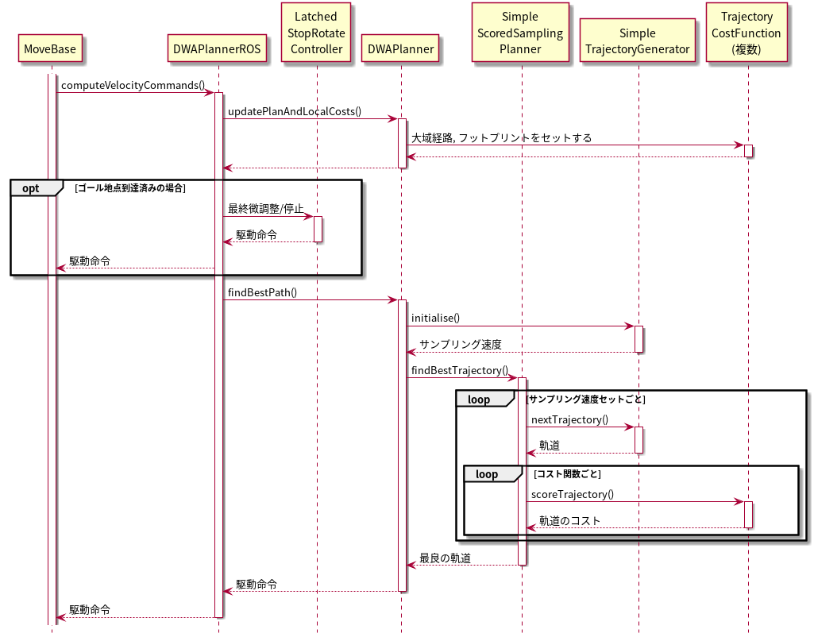

dwa_local_planner
==================

目次

| 　1. :ref:`概要<Summary_DWALocalPlanner>`
| 　2. :ref:`パッケージの構成<PackageComponent_DWALocalPlanner>`
| 　3. :ref:`アルゴリズム<Overview_DWALocalPlanner>`
| 　　3.1 :ref:`目的<Purpose_DWALocalPlanner>`
| 　　3.2 :ref:`ローカルプランニングの処理概要<Procesure_DWALocalPlanner>`
| 　　3.3 :ref:`速度空間のサンプリング<VelocitySampling_DWALocalPlanner>`
| 　　3.4 :ref:`軌道の計算<TrajectorySimulation_DWALocalPlanner>`
| 　　3.5 :ref:`軌道の評価<EvalTrajectory_DWALocalPlanner>`
| 　4. :ref:`ローカルプランナークラス DWAPlannerROS<DWAPlannerROS_DWALocalPlanner>`
| 　　4.1 :ref:`Subscribe トピック<Subscribed_Topics_DWALocalPlanner>`
| 　　4.2 :ref:`Publish トピック<Published_Topics_DWALocalPlanner>`
| 　　4.3 :ref:`パラメーター<Parameters_DWALocalPlanner>`
| 　　　4.3.1 :ref:`ロボット構成パラメーター<Robot_Configuration_Parameters_DWALocalPlanner>`
| 　　　4.3.2 :ref:`目標地点許容誤差パラメーター<Goal_Tolerance_Parameters_DWALocalPlanner>`
| 　　　4.3.3 :ref:`フォワードシミュレーションパラメーター<Forward_Simulation_Parameters_DWALocalPlanner>`
| 　　　4.3.4 :ref:`軌道スコアリングパラメーター<Trajectory_Scoring_Parameters_DWALocalPlanner>`
| 　　　4.3.5 :ref:`振動防止パラメーター<Oscillation_Prevention_Parameters_DWALocalPlanner>`
| 　　　4.3.6 :ref:`グローバルプランパラメーター<Global_Plan_Parameters_DWALocalPlanner>`
| 　　4.4 :ref:`C++ API<CPPAPI_DWALocalPlanner>`
| 　5. :ref:`内部処理手順<Sequence_DWALocalPlanner>`
| 　　5.1 :ref:`メソッドコールシーケンスの概要<MethodCallSequence_DWALocalPlanner>`
| 　　5.2 :ref:`各メソッドの処理概要<Method_Frame_DWALocalPlanner>`
| 　6. :ref:`下位クラス<InternalClasses_DWALocalPlanner>`
| 　  6.1 :ref:`DWAプランナークラス<DWAPlanner_DWALocalPlanner>`
| 　　6.1.1 :ref:`C++ API<CPPAPI-1_DWALocalPlanner>`

|

.. _Summary_DWALocalPlanner:

1　概要
--------
このパッケージは、平面上のローカルロボットナビゲーションを行うもので、ダイナミックウィンドウアプローチの方式で実装しています。 従うべきグローバルプランとコストマップが与えられると、コントローラーは速度ベースのコマンドを生成してロボットに送信します。 このパッケージは、フットプリント(接触範囲)を凸多角形または円として表現できるロボットをサポートします。設定項目はROSパラメーターとして公開されており、起動ファイルで設定できます。またこのプランナーのパラメーターは動的に再設定可能です。 このパッケージのROSラッパーは、`nav_core <http://wiki.ros.org/nav_core>`__ パッケージで指定されたBaseLocalPlannerインターフェースに準拠しています。

* 管理状態：管理済み 
* 管理者：David V. Lu!! <davidvlu AT gmail DOT com>, Michael Ferguson <mfergs7 AT gmail DOT com>, Aaron Hoy <ahoy AT fetchrobotics DOT com>
* 著者： Eitan Marder-Eppstein, contradict@gmail.com
* ライセンス： BSD
* ソース： git https://github.com/ros-planning/navigation.git （ブランチ：melodic-devel） 

|

.. _PackageComponent_DWALocalPlanner:

2 パッケージの構成
------------------

このパッケージは、move_base に組み込まれるローカルプランナー(DWAPlannerROS)と、実装クラス(DWAPlanner)からなっています。
また、下位のアルゴリズムの実装は、base_local_plannerのクラスを使っています。

.. image:: images/base_local_planner_component.png
   :align: center

コンポーネント図

|

.. _Overview_DWALocalPlanner:

2　アルゴリズム
----------------

.. _Purpose_DWALocalPlanner:

3.1 目的
~~~~~~~~~~

dwa\_local\_plannerパッケージは、ロボットを平面上で運転するコントローラーを提供します。
このコントローラーは、パスプランナーとロボットを接続します。
プランナーは、マップを使い、ロボットがスタートからゴール位置に到達するまでの運動の軌道を作成します。
その過程で、プランナーは、ロボットの周囲に、グリッドマップとして表される価値関数を作成します。
この価値関数は、グリッドセルを通過するコストを表現します。
コントローラーの仕事は、この価値関数を使用して、ロボットに送信する速度 （前進速度、横方向速度、回転速度）を決定することです。

.. image:: images/local_plan.png
   :align: center

出典: http://wiki.ros.org/dwa_local_planner

|

.. _Procesure_DWALocalPlanner:

3.2 ローカルプランニングの処理概要
~~~~~~~~~~~~~~~~~~~~~~~~~~~~~~~~~~

ダイナミック ウィンドウ アプローチ（DWA）アルゴリズムの基本的な考え方は次のとおりです。

   #. ロボットの速度空間（前進速度、横方向速度、回転速度）を離散的にサンプリングします。

   #. サンプリングされた速度ごとに、ロボットの現在の状態からフォワードシミュレーションを実行して、サンプリングされた速度を一定（短い）時間適用した場合にどう動くかを予測します。(軌道の予測)
   #. フォワードシミュレーションから得られた各軌道を評価（スコア）します。評価には、障害物への近さ、目標地点への近さ、グローバルパスへの近さ、速度などの特性をとりこんだ距離空間を使用します。 不正な軌道（障害物と衝突する軌道）は破棄します。
   #. 最高得点の軌道を選んでその速度をロボットに送信します。
   #. 以上の手順を繰り返します。

便利なリファレンス：

* `D. Fox, W. Burgard, and S. Thrun. "The dynamic window approach to collision avoidance" <https://pdfs.semanticscholar.org/dabd/bb636f02d3cff3d546bd1bdae96a058ba4bc.pdf?_ga=2.75374935.412017123.1520536154-80785446.1520536154>`__. ローカルコントロールへのダイナミックウィンドウアプローチ。 

* `Alonzo Kelly. "An Intelligent Predictive Controller for Autonomous Vehicles" <http://www.ri.cmu.edu/pub_files/pub1/kelly_alonzo_1994_7/kelly_alonzo_1994_7.pdf>`__. 同様のアプローチで制御する以前のシステム。 

* `Brian P. Gerkey and Kurt Konolige. "Planning and Control in Unstructured Terrain" <https://pdfs.semanticscholar.org/dabd/bb636f02d3cff3d546bd1bdae96a058ba4bc.pdf?_ga=2.75374935.412017123.1520536154-80785446.1520536154>`__. LAGRロボットで使用される軌道ロールアウトアルゴリズムの説明。 

|

.. _VelocitySampling_DWALocalPlanner:

3.3　速度空間のサンプリング
~~~~~~~~~~~~~~~~~~~~~~~~~~~~

ロボットの速度空間（前進速度、横方向速度、回転速度）を離散的にサンプリングします。

サンプリングする範囲は、

* 前進速度のサンプリング上限速度 = 現在の前進速度 + x方向加速度上限 + 1ステップの時間

* 前進速度のサンプリング下限速度 = 現在の前進速度 - x方向加速度上限 + 1ステップの時間

* 横方向速度のサンプリング上限速度 = 現在の横方向速度 + y方向加速度上限 + 1ステップの時間

* 横方向速度のサンプリング下限速度 = 現在の横方向速度 - y方向加速度上限 + 1ステップの時間

* 回転速度のサンプリング上限速度 = 現在の回転速度 + 回転加速度上限 + 1ステップの時間

* 回転速度のサンプリング下限速度 = 現在の回転速度 - 回転加速度上限 + 1ステップの時間

    (1ステップの時間は、controller_frequencyパラメーターの逆数であり、既定値は、0.05s)

です。 上式は DWAの場合ですが、base_local_planner と同様に軌道ロールアウトも選択でき、その場合上式の 「1ステップの時間」は、「フォワードシミュレーション時間」に置き換わります。

サンプリング範囲を等分割し、"サンプリング数"個のサンプル値を抽出します。
サンプリング数は、フォワードシミュレーションパラメーターで指定します。

.. ソース：SimpleTrajectoryGenerator::initialise()

|

.. _TrajectorySimulation_DWALocalPlanner:

3.4 軌道の計算
~~~~~~~~~~~~~~~~

:ref:`base_local_planner参照<TrajectorySimulation_BaseLocalPlanner>` 

|

.. _EvalTrajectory_DWALocalPlanner:

3.4　軌道の評価
~~~~~~~~~~~~~~~~~~~~

軌道のコストには次のものがあります。

.. csv-table:: 
   :header: "コスト名", "内容", "説明", "重みパラメーター", "管理クラス"
   :widths: 5, 20, 30, 5, 5

   "obstacle_costs", "障害物コスト", ":ref:`base_local_planner参照<LocalCostMap_Grid_BaseLocalPlanner>` ", "occdist_scale", "ObstacleCostFunction"
   "path_costs", "グローバルパスからの距離", ":ref:`base_local_planner参照<Map_Grid_BaseLocalPlanner>` ", "path_distance_bias", "MapGridCostFunction"
   "goal_costs", "ローカルゴールからの距離", ":ref:`base_local_planner参照<Map_Grid_BaseLocalPlanner>` ", "goal_distance_bias", "MapGridCostFunction"
   "alignment_costs", "グローバルパスへの向き (ROS Wiki 未記載)", "TODO", "path_distance_bias", "MapGridCostFunction"
   "goal_front_costs", "ローカルゴールへの向き (ROS Wiki 未記載)", "TODO", "goal_distance_bias", "MapGridCostFunction"
   "twirling_costs", "スピンコスト(option) (ROS Wiki 未記載)", "急カーブの軌道ほど大きくなるため、カーブの緩い軌道を選好します。ただしデフォルトの重みは0です", "twirling_scale", "TwirlingCostFunction"
   "oscillation_costs",  "振動コスト (ROS Wiki 未記載)", ":ref:`base_local_planner参照<Oscillation_Suppression_BaseLocalPlanner>` ", "コスト負の軌道は破棄", "OscillationCostFunction"

|

これらのコストを、所定の重み付け（カスタマイズ可能）を掛け合わせて合算し、与えられた軌道のコストとします。
各軌道ごとにコストを算出し、最も低コストの軌道を結果の軌道とします。

|
|

.. _DWAPlannerROS_DWALocalPlanner:

4.　ローカルプランナークラス DWAPlannerROS
--------------------------------------------

dwa\_local\_planner::DWAPlannerROS  オブジェクトは、dwa\_local\_planner::DWAPlanner  オブジェクトの機能を公開する `C++ ROSラッパー <http://wiki.ros.org/navigation/ROS_Wrappers>`__ です。 このオブジェクトは、初期化時に指定されたROS名前空間（以降、\ *name*\ と仮表記）内で動作します。 `nav_core <http://wiki.ros.org/nav_core>`__ パッケージにある nav_core::BaseLocalPlanner インターフェースに準拠しています。

dwa\_local\_planner::DWAPlannerROS オブジェクトの作成例::

   1 #include <tf/transform_listener.h>
   2 #include <costmap_2d/costmap_2d_ros.h>
   3 #include <dwa_local_planner/dwa_planner_ros.h>
   4 
   5 ...
   6 
   7 tf::TransformListener tf(ros::Duration(10));
   8 costmap_2d::Costmap2DROS costmap("my_costmap", tf);
   9 
  10 dwa_local_planner::DWAPlannerROS tp;
  11 tp.initialize("my_dwa_planner", &tf, &costmap);

|

.. _Subscribed_Topics_DWALocalPlanner:

4.1 Subscribe トピック
~~~~~~~~~~~~~~~~~~~~~~~

.. csv-table:: 
   :header: "トピック名", "型", "内容"
   :widths: 5, 10, 30

   "odom", "`nav_msgs/Odometry <http://docs.ros.org/api/nav_msgs/html/msg/Odometry.html>`__", "ローカルプランナーにロボットの現在の速度を与える走行距離情報。 このメッセージの速度情報は、 TrajectoryPlannerROSオブジェクト内に含まれるコストマップのrobot_base_frameと同じ座標フレームにあると想定されます 。 robot_base_frameパラメーターについては、 `costmap_2d <http://wiki.ros.org/costmap_2d>`__ パッケージを参照してください。 "

|

.. _Published_Topics_DWALocalPlanner:

4.2　Publish トピック
~~~~~~~~~~~~~~~~~~~~~~~~

.. csv-table:: 
   :header: "トピック名", "型", "内容"
   :widths: 5, 10, 30

   "<name>/global_plan", "`nav_msgs/Path <http://docs.ros.org/api/nav_msgs/html/msg/Path.html>`__", "ローカルプランナーが現在従おうとしているグローバルプランの一部。 主に視覚化の目的で使用されます。"
   "<name>/local_plan", "`nav_msgs/Path <http://docs.ros.org/api/nav_msgs/html/msg/Path.html>`__", "最後のサイクルで最高得点を獲得したローカルプランまたは軌道。 主に視覚化の目的で使用されます。"

|

.. _Parameters_DWALocalPlanner:

4.3　パラメーター
~~~~~~~~~~~~~~~~~~~~

dwa\_local\_planner::DWAPlannerROS ラッパーの動作をカスタマイズするために設定できる多数のROS  `パラメーター <http://wiki.ros.org/Parameters>`__ があります。 これらのパラメーターは、ロボット構成、目標許容誤差、フォワードシミュレーション、軌道スコアリング、振動防止、グローバルプランなど、いくつかのカテゴリに分類されます。
これらのパラメーターのほとんどは、 `dynamic_reconfigure <http://wiki.ros.org/dynamic_reconfigure>`__ を使用して変更することができ、実行中のシステムでローカルプランナーを用意に調整可能です。

|

.. _Robot_Configuration_Parameters_DWALocalPlanner:

4.3.1　ロボット構成パラメーター
^^^^^^^^^^^^^^^^^^^^^^^^^^^^^^^^^^

.. csv-table:: 
   :header: "パラメーター名", "内容", "型", "単位", "デフォルト"
   :widths: 5, 50, 5, 5, 8

   "<name>/acc_lim_x", "ロボットのx方向加速度上限", "double", "m/s^2", "2.5"
   "<name>/acc_lim_y", "ロボットのy方向加速度上限", "double", "m/s^2", "2.5"
   "<name>/acc_lim_th",  "ロボットの回転加速度上限", "double", "rad/s^2", "3.2"
   "<name>/max_trans_vel",  "ロボットの最大並進速度の絶対値", "double", "m/s", "0.55"
   "<name>/min_trans_vel",  "ロボットの最小並進速度の絶対値", "double", "m/s", "0.1"
   "<name>/max_vel_x",  "ロボットの最大x方向速度", "double", "m/s", "0.55"
   "<name>/min_vel_x",  "ロボットの最小x方向速度。逆方向の動きでは負。", "double", "m/s", "0.0"
   "<name>/max_vel_y",  "ロボットの最大y方向速度", "double", "m/s", "0.1"
   "<name>/min_vel_y",  "ロボットの最小y方向速度", "double", "m/s", "-0.1"
   "<name>/max_rot_vel",  "ロボットの最大回転速度の絶対値", "double", "rad/s", "1.0"
   "<name>/min_rot_vel",  "ロボットの最小回転速度の絶対値", "double", "rad/s", "0.4"

|

.. _Goal_Tolerance_Parameters_DWALocalPlanner:

4.3.2　目標地点許容誤差パラメーター
^^^^^^^^^^^^^^^^^^^^^^^^^^^^^^^^^^^^^^^^

.. csv-table:: 
   :header: "パラメーター名", "内容", "型", "単位", "デフォルト"
   :widths: 5, 50, 5, 5, 8

   "<name>/yaw_goal_tolerance",  "目標地点に到達したときの、コントローラーの Yaw回転角許容誤差", "double", "rad", "0.05"
   "<name>/xy_goal_tolerance",  "目標地点に到達したときの、コントローラーの x-y 平面上距離の許容誤差", "double", "rad", "0.10"
   "<name>/latch_xy_goal_tolerance",  "目標許容値が設定されている場合、ロボットが目標xy位置に到達すると、その場旋回します。(その結果、目標許容値の範囲外になることもあります。)", "bool", "\-", "false"

|

.. _Forward_Simulation_Parameters_DWALocalPlanner:

4.3.3　フォワードシミュレーションパラメーター
^^^^^^^^^^^^^^^^^^^^^^^^^^^^^^^^^^^^^^^^^^^^^^^^^^

.. csv-table:: 
   :header: "パラメーター名", "内容", "型", "単位", "デフォルト"
   :widths: 5, 50, 5, 5, 8

   "<name>/sim_time",  "軌道をフォワードシミュレーションする時間", "double", "s", "1.7"
   "<name>/sim_granularity",  "与えられた軌道上の点間のステップサイズ", "double", "m", "0.025"
   "<name>/vx_samples",  "x速度空間を探索するときに使用するサンプルの数 ", "integer", "\-", "3"
   "<name>/vy_samples",  "y速度空間を探索するときに使用するサンプルの数 ", "integer", "\-", "10"
   "<name>/vth_samples",  "theta 速度空間を探索するときに使用するサンプルの数 ", "integer", "\-", "20"
   "<name>/controller_frequency",  このコントローラーが呼び出される頻度。 コントローラーの名前空間に設定されていない場合、searchParamを使用して親の名前空間からパラメーターを読み取ります。 すなわち、move_base とともに使用する場合は move_base の "controller_frequency"パラメーターを設定するだけでよく 、このパラメーターを未設定のままにしておけます。, "double", "Hz", "20.0"

|

.. _Trajectory_Scoring_Parameters_DWALocalPlanner:

4.3.4　軌道スコアリングパラメーター
^^^^^^^^^^^^^^^^^^^^^^^^^^^^^^^^^^^
各軌道のスコアリングに使用されるコスト関数は、次の形式です。::

   cost = 
   path_distance_bias * (軌道終端からパスへの距離(m)) 
   + goal_distance_bias * (軌道終端から局所目標地点への距離(m)) 
   + occdist_scale * (軌道中の最大障害物コスト。単位は障害物コスト (0-254))

|

.. csv-table:: 
   :header: "パラメーター名", "内容", "型", "単位", "デフォルト"
   :widths: 5, 50, 5, 5, 8

   "<name>/path_distance_bias",  "コントローラーが与えられたパスにどれだけ近くに留まるべきかの重み ", "double", "\-", "32"
   "<name>/goal_distance_bias",  "コントローラーがローカルの目標に到達しようとする程度の重み。速度も制御します。", "double", "\-", "24"
   "<name>/occdist_scale",  "コントローラーが障害物を回避しようとする程度の重み。 ", "double", "\-", "0.01"
   "<name>/forward_point_distance",  "追加のスコアリングポイントを配置するためのロボットの中心点からの距離 ", "double", "m", "0.325"
   "<name>/stop_time_buffer",  "軌道が有効と見なされるために、衝突前にロボットが停止しなければならない時間", "double", "s", "0.2"
   "<name>/scaling_speed",  "ロボットのフットプリントのスケーリングを開始する速度の絶対値 ", "double", "m/s", "0.25"
   "<name>/max_scaling_factor",  "ロボットのフットプリントをスケーリングする最大係数", "double", "\-", "0.2"
   "<name>/publish_cost_grid",  "プランナーが計画時に使用するコストグリッドを公開するかどうか。 trueの場合、 sensor_msgs/PointCloud2 が~<name>/cost_cloudトピックで利用可能になります。 各点群はコストグリッドを表し、個々のスコアリング関数コンポーネントのフィールドを持ちます。 また、スコアリングパラメーターを考慮に入れた各セルの全体的なコストを持ちます。", "bool", "\-", "false"
    "<name>/use_dwa",  "ダイナミックウィンドウアプローチ (DWA) を使用するか、軌道ロールアウトを使用するか(ROS Wikiに記載なし)", "bool", "\-", "true"

|

.. _Oscillation_Prevention_Parameters_DWALocalPlanner:

4.3.5　振動防止パラメーター
^^^^^^^^^^^^^^^^^^^^^^^^^^^^^^^^^

.. csv-table:: 
   :header: "パラメーター名", "内容", "型", "単位", "デフォルト"
   :widths: 5, 50, 5, 5, 8

   "<name>/oscillation_reset_dist",  "振動フラグがリセットされるまでにロボットが移動する必要がある距離", "double", "m", "0.05"

|

.. _Global_Plan_Parameters_DWALocalPlanner:

4.3.6　グローバルプランパラメーター
^^^^^^^^^^^^^^^^^^^^^^^^^^^^^^^^^^^^^^

.. csv-table:: 
   :header: "パラメーター名", "内容", "型", "単位", "デフォルト"
   :widths: 5, 50, 5, 5, 8

   "<name>/prune_plan",  "ロボットがパスに沿って移動するときにプランを消していくかを定義します。 trueに設定されている場合、ロボットが移動すると、1メートル置いていかれた点はプランから外します。", "bool", "\-", "true"

|

.. _CPPAPI_DWALocalPlanner:

4.4　C++ API
~~~~~~~~~~~~~~~~~~~

base\_local\_planner::TrajectoryPlannerROS クラスの C ++レベルのAPIドキュメントについては、次のページを参照してください： `DWAPlannerROS C ++ API <http://www.ros.org/doc/api/dwa_local_planner/html/classdwa__local__planner_1_1DWAPlannerROS.html>`__

|

.. _Sequence_DWALocalPlanner:

5.　内部処理手順
----------------------------------

.. _MethodCallSequence_DWALocalPlanner:

5.1　メソッドコールシーケンスの概要
~~~~~~~~~~~~~~~~~~~~~~~~~~~~~~~~~~~~

|

.. _Method_Frame_DWALocalPlanner:

5.2　各メソッドの処理概要
~~~~~~~~~~~~~~~~~~~~~~~~~~~~~~

* DWAPlannerROS::computeVelocityCommands() 速度命令計算

  * ゴール地点に到達済みかを判定する。	
  * ゴール地点に到達済みなら最終補正の駆動命令を返す LatchedStopRotateController::computeVelocityCommandsStopRotate()

    * ロボットが未停止であれば減速/停止の駆動命令を返却
    * ロボットが停止済みであれば角度を合わせるための回転命令を返却
    * 角度も合っていればゼロ駆動命令を返却

  * ゴール地点に到達していなければ、 DWAPlanner::findBestPath()をコールする。

|

* DWAPlanner::findBestPath() 最良経路検索

    * 各コスト関数に変数設定

      * path_costs_(大域経路からの距離) ← 大域経路を設定
      * goal_costs_(ローカルゴールからの距離) ← 大域経路を設定
      * obstacle_costs_(障害物コスト) ← ロボットのフットプリントを設定
      * goal_front_costs_(ローカルゴールへの向き)   ← 大域経路を設定
      * alignment_costs_(大域経路への向き) ←  大域経路を設定

    * 速度サンプリング base_local_planner::SimpleTrajectoryGenerator::initialise() … とりうる vx, vy, vθの組み合わせリストを作成. 
    * 最良軌道検索 base_local_planner::SimpleScoredSamplingPlanner::findBestTrajectory() をコールする

|

* base_local_planner::SimpleScoredSamplingPlanner::findBestTrajectory() 最良軌道検索 

    * 各コスト関数の更新　 TrajectoryCostFunction::prepare()   ex. 大域経路の切り取り＆伝搬計算
    * 軌道の作成 SimpleTrajectoryGenerator::nextTrajectory()  サンプリングした速度の組み合わせについて、軌道を計算する
    * 軌道のスコアリング TrajectoryCostFunction::scoreTrajectory()   ex.軌道に沿ってコストを足し上げる
    * コストのタイプ(path_costs, goal_costs, etc.)について加重和する
    * 最も低コストの軌道を見つける

|

.. _InternalClasses_DWALocalPlanner:

6.　下位クラス
----------------------------------

.. _DWAPlanner_DWALocalPlanner:

6.1　DWAプランナークラス
~~~~~~~~~~~~~~~~~~~~~~~~~

dwa\_local\_planner::DWAPlanner は、前述のDWAおよび軌道ロールアウトアルゴリズムの実装を提供します。 ROSで dwa\_local\_planner::DWAPlanner を使用するには、 :ref:`DWAPlannerROS ラッパー<DWAPlannerROS_DWALocalPlanner>` を使用してください。 dwa\_local\_planner::DWAPlanner を単独で使用することは推奨されません。

|

.. _CPPAPI-1_DWALocalPlanner:

6.1.1　C++ API
^^^^^^^^^^^^^^^^

dwa\_local\_planner::DWAPlanner クラスの C ++レベルのAPIドキュメントについては、次のページを参照してください： `DWAPlanner C ++ API <http://www.ros.org/doc/api/dwa_local_planner/html/classdwa__local__planner_1_1DWAPlanner.html>`__

.. _Additional_Explanation_DWALocalPlanner:

