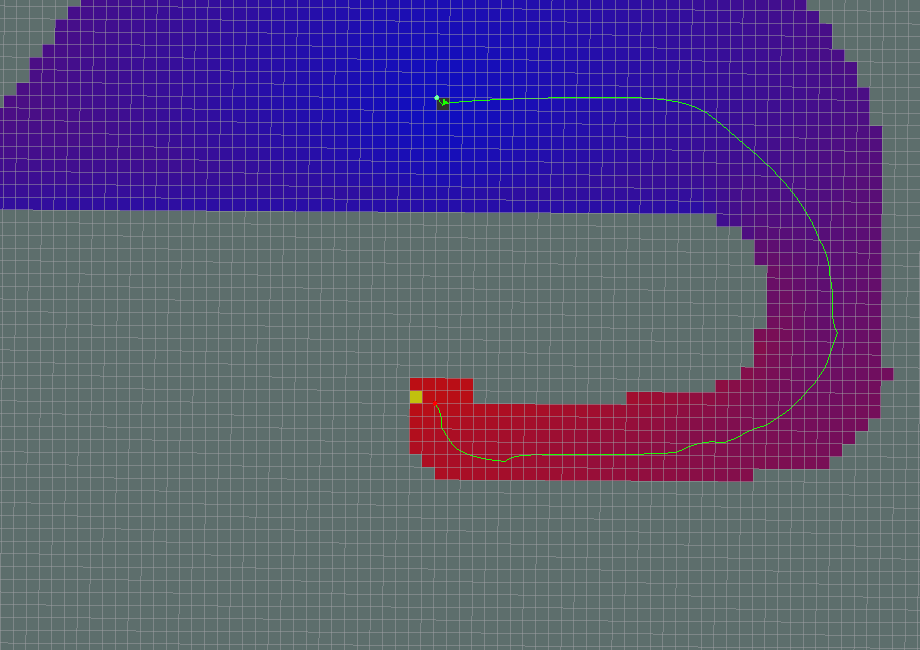
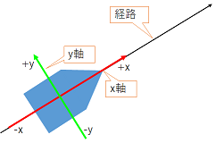

global_planner
================================================

目次
    
| 　1. :ref:`概要<globalplanner_overview>`
| 　2. :ref:`アルゴリズム<globalplanner_algorithm>`
| 　3. :ref:`パラメータの違いによる動作例<globalplanner_examples_of_different_parameterizations>`
| 　　3.1. :ref:`標準動作<globalplanner_standard_behavior>`
| 　　3.2. :ref:`グリッド経路<globalplanner_grid_path>`
| 　　3.3. :ref:`単純加算<globalplanner_simple_potential_calculation>`
| 　　3.4. :ref:`A*経路<globalplanner_a_star_path>`
| 　　　3.4.1. :ref:`ダイクストラ<globalplanner_dijkstra>`
| 　　　3.4.2. :ref:`A*<globalplanner_a_star>`
| 　　3.5. :ref:`古いNavfnの動作<globalplanner_old_navfn_behavior>`
| 　4. :ref:`オリエンテーションフィルター<globalplanner_orientation_filter>`
| 　5. :ref:`ROS API<globalplanner_ros_api>`
| 　　5.1. :ref:`パブリッシュトピック<globalplanner_published_topics>`
| 　　5.2. :ref:`パラメータ<globalplanner_parameters>`
|

.. _globalplanner_overview:

============================================================
1. 概要
============================================================
このパッケージは、ナビゲーション用の高速で補間されたグローバルプランナーの実装を提供します。nav_core :: BaseGlobalPlannerインタフェースに付随するクラスは、 :doc:`nav_core <nav_core>` パッケージに準拠しています。 これは、 `NF1 <http://cs.stanford.edu/group/manips/publications/pdfs/Brock_1999_ICRA.pdf>`__ に基づいた :doc:`navfn <navfn>` パッケージの、より柔軟な代替パッケージとして構築されました。

|

* 管理状態: 管理済み
* 管理者: David V. Lu!! <davidvlu AT gmail DOT com>, Michael Ferguson <mfergs7 AT gmail DOT com>, Aaron Hoy <ahoy AT fetchrobotics DOT com>
* 著者: David Lu!!
* ライセンス: BSD
* ソース: git `https://github.com/ros-planning/navigation.git <https://github.com/ros-planning/navigation.git>`__  (branch: melodic-devel)

|

.. _globalplanner_algorithm:

============================================================
2. アルゴリズム
============================================================
global_plannerは :doc:`navfn <navfn>` を元に構成されているため、基本的な処理の流れは同じです。

global_plannerは、グローバルコストマップおよびグローバルコストマップ上の開始位置、目標位置を入力値として、経路を出力します。経路を出力するまでの過程は、以下のようになっています。

#. ポテンシャル計算を行うセルの探索を行います。探索方式は、 :ref:`use_dijkstraパラメータ <globalplanner_parameters>` で、 :ref:`ダイクストラ <globalplanner_dijkstra>` か :ref:`A* <globalplanner_a_star>` のどちらかを選択できます。

#. 探索されたセルに対して、ポテンシャル計算を行います。ポテンシャル計算法は、 :ref:`use_quadraticパラメータ <globalplanner_parameters>` で、 :ref:`2次方程式 <nav_fn_algorithm_potential_map>` か :ref:`単純加算 <globalplanner_simple_potential_calculation>` のどちらかを選択できます。

#. ポテンシャル計算時に、 :ref:`ニュートラルコスト値 <globalplanner_parameters>` で底上げし、ポテンシャルマップを作成します。ニュートラルコスト値の扱いは、ダイクストラとA*で異なります。それぞれの計算方法は下記の通りです。

    #. ダイクストラ
    
        下記の条件のいずれかの時に、コスト値の底上げを行う。

        * コスト値が  :ref:`致命的コスト値 <globalplanner_parameters>`  - 1 より小さい  

        * :ref:`allow_unknownパラメータ <globalplanner_parameters>` がtrue、且つ、コスト値が255
          
        底上げされたコスト値 = コスト値 × :ref:`cost_factorパラメータ <globalplanner_parameters>` + :ref:`ニュートラルコスト値 <globalplanner_parameters>`
          
        底上げされたコスト値が、 :ref:`致命的コスト値 <globalplanner_parameters>` 以上となった場合は、 :ref:`致命的コスト値 <globalplanner_parameters>`  - 1 を底上げされたコスト値とします。

    #. A*

        底上げされたコスト値 = コスト値 + :ref:`ニュートラルコスト値 <globalplanner_parameters>`

#. 目標位置が到達可能である場合は、ポテンシャルマップ上の開始位置から目標位置まで、経路を生成します。経路生成は、use_grid_pathパラメータで、 :ref:`グリッド経路 <globalplanner_grid_path>` か :ref:`傾斜経路 <nav_fn_algorithm_path>` を選択できます。

#. ポテンシャルマップから生成された経路の最後に、入力値をもとに目標位置を補正します。

#. 後処理として :ref:`orientation_modeパラメータ <globalplanner_parameters>` で、 :ref:`オリエンテーション <globalplanner_orientation_filter>` を追加することができます。

|

.. _globalplanner_examples_of_different_parameterizations:

============================================================
3. パラメータの違いによる動作例
============================================================
パラメータの設定値の違いによる、ポテンシャル計算及び経路の違いを以下に示します。
後出の図は、ポテンシャルマップであり、緑点が目標位置、赤点が開始位置で、それを結ぶ緑線は探索結果の経路です。
青色セルから赤色セルへのグラデーションは、経路探索のためにポテンシャル計算を行ったセルで、青色から赤色になるほどポテンシャル値が高くなります。灰色セルは、障害物又は経路探索の対象とならなかったセルです。経路は、ポテンシャル値の高いところ(開始位置)から低いところ(目標位置)に流れるようなイメージで、ポテンシャルマップ上に生成されます。

.. _globalplanner_standard_behavior:

3.1. 標準動作
************************************************************
すべてのパラメータがデフォルトです。

use_grid_path=False

use_quadratic=True

use_dijkstra=True

old_navfn_behavior=False

.. image:: images/GlobalPlanner.png
   :align: center

出典：`http://wiki.ros.org/global_planner <http://wiki.ros.org/global_planner>`__

|

.. _globalplanner_grid_path:

3.2. グリッド経路
************************************************************
use_grid_path=True

グリッド経路は、現在位置の周囲のセル単位でポテンシャル値を評価し、その中でポテンシャル値が最小のものを経路として選択する動作を、目標位置が出現するまで繰り返します。セル単位での評価であるため、計算量は少なくなりますが、経路の軌跡の滑らかさに欠ける場合があります。

.. image:: images/GridPath.png
   :align: center

出典：`http://wiki.ros.org/global_planner <http://wiki.ros.org/global_planner>`__

経路はグリッド境界（セルの中心）をたどります。

|

.. _globalplanner_simple_potential_calculation:

3.3. 単純加算
************************************************************
use_quadratic=False

単純加算は、上下左右のセルのうちポテンシャル値が低いものを選択し、コスト値を加算します。2次方程式より計算量は少なくなりますが、斜め方向の評価が行われません。

.. image:: images/Nonquad.png
   :align: center

出典：`http://wiki.ros.org/global_planner <http://wiki.ros.org/global_planner>`__

navfnの元のポテンシャル計算は2次方程式であることに注意してください。 2次方程式の計算については、 :doc:`navfn <navfn>` を参照してください。

|

.. _globalplanner_a_star_path:

3.4. A*経路
************************************************************
use_dijkstra=False

出典：`http://wiki.ros.org/global_planner <http://wiki.ros.org/global_planner>`__

ポテンシャル計算されたセルがはるかに少ないことに注目してください（色付きの領域で示されています）。これは、ダイクストラを使用するよりも確かに高速ですが、必ずしも同じ経路を生成するわけではありません。もう1つ注意すべき点は、A*の実装は、経路探索時は上下左右に隣接する4つのグリッドに対して計算し展開していきますが、目標位置発見時の開始位置までのトレース時には、上下左右と斜めを含む隣接する8つのグリッドを評価し、経路を生成します。
したがって、A*で探索された経路は、必ずしも最短距離とならない場合があります。
（A*の一般的な実装は、経路探索時にポテンシャル計算を行わなかったグリッドは不要なグリッドと判断し、目標位置発見時のトレースの対象になりません。）
ダイクストラの動作とA*の動作の違いを確認するには、後述の例を参考にしてください。

..
  A*の実装では、ポテンシャル値は4連結グリッド正方形を使用して計算されるのに対し、目標位置から開始位置までのポテンシャルのベクトルをトレースすることで見つかった経路は、8連結方式で同じグリッドを使用します。
  したがって、見つかった実際の経路は、8接続探索では完全に最適ではない可能性があります。
  （また、より一般的なA*実装のように、ポテンシャルの計算中に「訪問済み状態セットなし」が追跡されます。これは、4接続グリッドでは不要なためです）。

|

.. _globalplanner_dijkstra:

3.4.1. ダイクストラ
------------------------------------------------------------
目標位置のセルから上下左右のセルに対してポテンシャル計算を行い対象となるセルを広げていき、各セルで同様にポテンシャル計算を順次行います。開始位置のセルが出現したら、探索を終了します。

..
 ダイクストラの概要は、下記の通りです。

  ”ダイクストラ法はグラフ上の2頂点間の最短経路を求めるアルゴリズムで、1959年エドガー・ダイクストラによって考案された。 応用範囲は広くOSPFなどのインターネットルーティングプロトコルや、カーナビの経路探索や鉄道の経路案内においても利用されている。 なお最短経路長の推定値を事前に知っているときは、ダイクストラ法の改良版であるA*アルゴリズムを用いて、より効率的に最短経路を求めることができる。”

 出典： `https://ja.wikipedia.org/wiki/ダイクストラ法 <https://ja.wikipedia.org/wiki/ダイクストラ法>`__

.. image:: images/Dijkstra.png
   :align: center

出典：`http://wiki.ros.org/global_planner <http://wiki.ros.org/global_planner>`__

|

.. _globalplanner_a_star:

3.4.2. A*
------------------------------------------------------------
開始位置のセルから上下左右のセルに対してヒューリスティック関数による推定値を加味したポテンシャル計算を行い探索対象となるセルを展開し、その中でコスト値の小さいものからポテンシャル計算を行います。目標位置が出現したら、探索を終了します。グローバルプランナーに実装されているヒューリスティック関数は、下記のとおりです。

　　ヒューリスティック関数 h(n) = 現在位置X座標と目標位置X座標の距離 + 現在位置Y座標と目標位置Y座標の距離

..
 A*の概要は、下記の通りです。

  A* アルゴリズムは、「グラフ上でスタートからゴールまでの道を見つける」というグラフ探索問題において、 ヒューリスティック関数 h(n) という探索の道標となる関数を用いて探索を行うアルゴリズムである。hは各頂点nからゴールまでの距離のある妥当な推定値を返す関数で、解くグラフ探索問題の種類に応じてさまざまなhを設計することが出来る。
  
 出典： `https://https://ja.wikipedia.org/wiki/A* <https://https://ja.wikipedia.org/wiki/A*>`__

.. image:: images/AStar2.png
   :align: center

出典：`http://wiki.ros.org/global_planner <http://wiki.ros.org/global_planner>`__

|

.. _globalplanner_old_navfn_behavior:

3.5. 古いNavfnの動作
************************************************************
old_navfn_behavior=True　 :doc:`NavFn <navfn>` と同じように経路を再現します。

old_navfn_behavior=Trueが設定された際の動作の差異は以下の通りです。

* 経路の開始点の計算を正確に行いません。
* 座標計算時にオフセットを使用しません。
* 目標位置周辺の未計算セルのポテンシャル計算を行いません。
* ポテンシャルマップからの経路生成の最後に、入力値の目標位置情報を追加します。

.. image:: images/OldNavFn.png
   :align: center

出典：`http://wiki.ros.org/global_planner <http://wiki.ros.org/global_planner>`__

|

注意：

* 経路の開始点が実際の開始位置と一致しません。
* 経路の最後がグリッド線に沿って移動します。
* すべての座標がグリッドセルの半分だけわずかにずれます。

.. _globalplanner_orientation_filter:

============================================================
4. オリエンテーションフィルター
============================================================
後処理ステップとして、方向を経路上の通過点に追加できます。 ~orientation_modeパラメータ（動的再構成）を使用すると、次の方向モードを設定できます。

* None=0 （目標位置の向き以外の向きは追加されません）
* Forward=1 （目標位置の向きを除き、通過点での向きは経路に沿って正のx軸方向）
* Interpolate=2 （方向は開始姿勢と目標姿勢の線形混合です）
* ForwardThenInterpolate=3 （最後の直進まで順方向、その後目標姿勢まで線形混合）
* Backward=4 （目標位置の向きを除き、通過点での向きは経路に沿って負のx軸方向）
* Leftward=5 （目標位置の向きを除き、通過点での向きは経路に沿って正のy軸方向）
* Rightward=6 （目標位置の向きを除き、通過点での向きは経路に沿って負のy軸方向）

経路に沿った、進行方向を前向きは正のx軸方向、進行方向に向かって左向きは正のy軸方向とし、それぞれ後ろ向きは負のx軸方向、右向きは負のy軸方向とします。

経路のi番目の通過点の方向は、\`i - orientation_window_size\`番目の通過点の座標と \`i + orientation_window_size\` 番目の通過点の座標を使用して計算されます。 ウィンドウのサイズは方向の計算で、なめらかになるように変更できます。

`Global planner ROS - Orientation filter <https://www.youtube.com/watch?v=NQ2z90i5V2I>`__

|

.. _globalplanner_ros_api:

============================================================
5. ROS API
============================================================

.. _globalplanner_published_topics:

5.1. パブリッシュトピック
************************************************************
.. csv-table:: 
   :header: "トピック名", "型", "内容"
   :widths: 10, 10, 30

   "~<name>/plan", "`nav_msgs/Path <http://docs.ros.org/api/nav_msgs/html/msg/Path.html>`__", "最後に計算された計画。プランナーが経路を計算するたびにパブリッシュされ、主に視覚化の目的で使用されます。"

|

.. _globalplanner_parameters:

5.2. パラメータ
************************************************************
.. csv-table:: 
   :header: "パラメータ名", "内容", "型", "単位", "デフォルト"
   :widths: 10, 50, 5, 5, 8

   "~<name>/allow_unknown", "プランナーが未知スペースを横断する計画を作成できるようにするかどうかを指定します。注： `ボクセルまたは障害物レイヤー <http://wiki.ros.org/costmap_2d/hydro/obstacles>`__ でレイヤー化されたcostmap_2dコストマップを使用している場合、そのレイヤーのtrack_unknown_spaceパラメータもtrueに設定する必要があります。そうしないと、未知スペースがすべて空きに変換されます）。", "bool", "\-", "true"
   "~<name>/default_tolerance", "プランナーの目標位置の許容値。プランナーは、指定された目標にできるだけ近いがdefault_toleranceを超えない計画を作成しようとします。", "double", "\-", "0.0"
   "~<name>/visualize_potential", "PointCloud2を介して計算されたポテンシャルエリアを視覚化するかどうかを指定します。", "bool", "\-", "false"
   "~<name>/use_dijkstra", "trueの場合、ダイクストラのアルゴリズムを使用します。それ以外の場合、A*を使用します。", "bool", "\-", "true"
   "~<name>/use_quadratic", "trueの場合、ポテンシャルの2次方程式を使用します。それ以外の場合は、単純加算を使用します。", "bool", "\-", "true"
   "~<name>/use_grid_path", "trueの場合、グリッドの境界をたどる経路を作成します。それ以外の場合は、勾配降下法を使用します。", "bool", "\-", "false"
   "~<name>/old_navfn_behavior", "何らかの理由でglobal_plannerに :doc:`navfn <navfn>` の動作を正確に反映させたい場合は、これをtrueに設定します（他のbool型パラメータはデフォルト値を設定します）", "bool", "\-", "false"
   "~<name>/lethal_cost", "致命的コスト値（動的再構成）", "int", "\-", "253"
   "~<name>/neutral_cost", "ニュートラルコスト値（動的再構成）", "int", "\-", "50"
   "~<name>/cost_factor", "コストマップの各コストに掛ける係数（動的再構成）", "double", "\-", "3."
   "~<name>/publish_potential", "trueの場合、ポテンシャル計算後のポテンシャルマップをパブリッシュします。（動的再構成）", "bool", "\-", "true"
   "~<name>/orientation_mode", "各ポイントの方向を設定する方法（None=0、Forward=1、Interpolate=2、ForwardThenInterpolate=3、Backward=4、Leftward=5、Rightward=6）（動的再構成）", "int", "\-", "0"
   "~<name>/orientation_window_size", "orientation_modeに基づいて方向を決定するためのオリエンテーション計算時に使用するウィンドウ範囲（動的再構成）", "int", "\-", "1"
   "~<name>/planner_window_x", "(ROSWiki未掲載)未使用", "double", "\-", "0.0"
   "~<name>/planner_window_y", "(ROSWiki未掲載)未使用", "double", "\-", "0.0"
   "~<name>/publish_scale", "(ROSWiki未掲載)パブリッシュのスケール", "int", "\-", "100"

|
