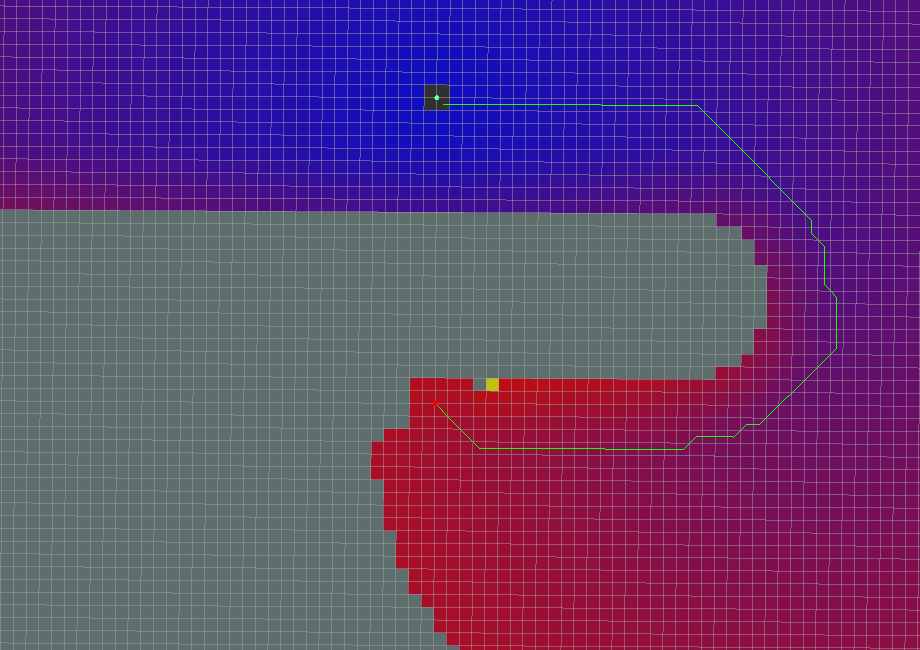
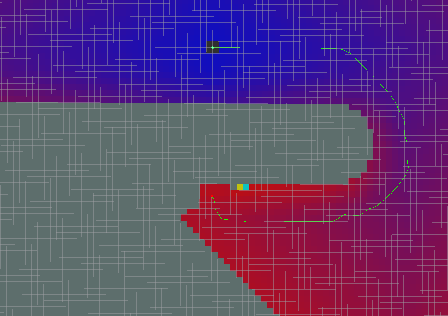
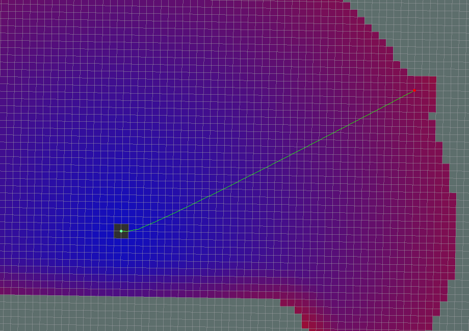
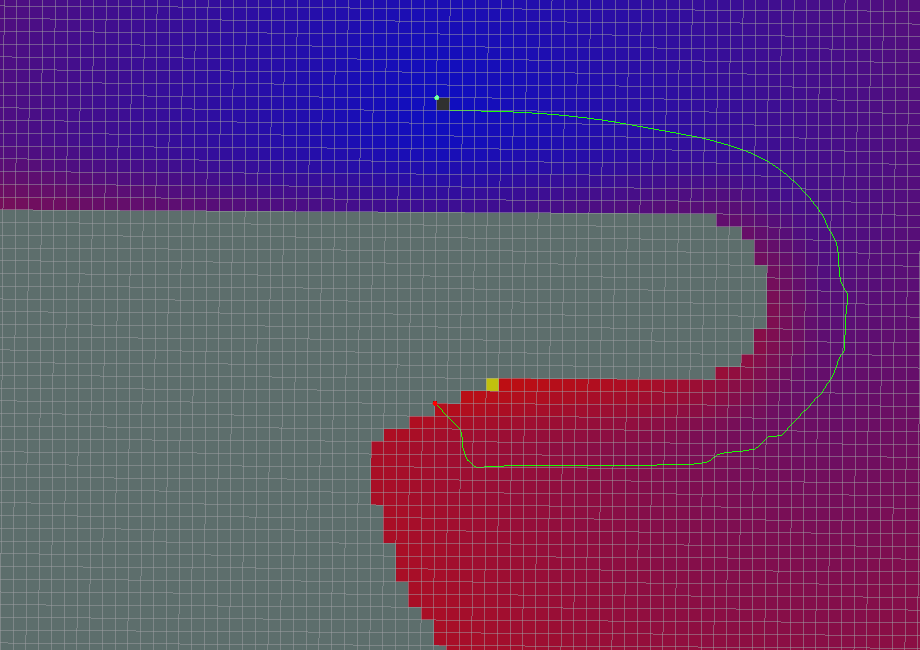

global_planner
================================================

目次
    
| 　1. :ref:`概要<globalplanner_overview>`
| 　2. :ref:`アルゴリズム<globalplanner_algorithm>`
| 　3. :ref:`パラメータの違いによる動作例<globalplanner_examples_of_different_parameterizations>`
| 　　3.1. :ref:`標準動作<globalplanner_standard_behavior>`
| 　　3.2. :ref:`グリッド経路<globalplanner_grid_path>`
| 　　3.3. :ref:`単純なポテンシャル計算<globalplanner_simple_potential_calculation>`
| 　　3.4. :ref:`A*経路<globalplanner_a_star_path>`
| 　　　3.4.1. :ref:`ダイクストラ<globalplanner_dijkstra>`
| 　　　3.4.2. :ref:`A*<globalplanner_a_star>`
| 　　3.5. :ref:`古いNavfnの動作<globalplanner_old_navfn_behavior>`
| 　4. :ref:`オリエンテーションフィルター<globalplanner_orientation_filter>`
| 　5. :ref:`ROS API<globalplanner_ros_api>`
| 　　5.1. :ref:`パブリッシュトピック<globalplanner_published_topics>`
| 　　5.2. :ref:`パラメータ<globalplanner_parameters>`
|

.. _globalplanner_overview:

============================================================
1. 概要
============================================================
経路プランナーライブラリとノード。

|

* 管理状態: 管理済み
* 管理者: David V. Lu!! <davidvlu AT gmail DOT com>, Michael Ferguson <mfergs7 AT gmail DOT com>, Aaron Hoy <ahoy AT fetchrobotics DOT com>
* 著者: David Lu!!
* ライセンス: BSD
* ソース: git `https://github.com/ros-planning/navigation.git <https://github.com/ros-planning/navigation.git>`__  (branch: melodic-devel)

|

このパッケージは、ナビゲーション用の高速で補間されたグローバルプランナーの実装を提供します。nav_core :: BaseGlobalPlannerインタフェースに付随するクラスは、 :doc:`nav_core <nav_core>` パッケージに準拠しています。 これは、 `NF1 <http://cs.stanford.edu/group/manips/publications/pdfs/Brock_1999_ICRA.pdf>`__ をベースに :doc:`navfn <navfn>` の、より柔軟な代替パッケージとして構築されました。

.. _globalplanner_algorithm:

============================================================
2. アルゴリズム
============================================================
global_plannerは :doc:`navfn <navfn>` を元に構成されているため、基本的な処理の流れは同じです。

#. global_plannerは、グローバルコストマップおよびグローバルコストマップ上のスタート座標、ゴール座標を入力値として、経路を出力します。経路を出力するまでの過程は、以下のようになっています。

#. ポテンシャル計算を行います。ポテンシャル計算を行うセルは、use_dijkstraパラメータで、 :ref:`ダイクストラ <globalplanner_dijkstra>` か :ref:`A* <globalplanner_a_star>` のどちらかを選択できます。また、ポテンシャル計算法は、use_quadraticパラメータで、 :ref:`２次近似 <nav_fn_algorithm_potential_map>` か :ref:`単純足し <globalplanner_simple_potential_calculation>` のどちらかを選択できます。

#. ポテンシャル計算時に、ニュートラル値を底上げし、ポテンシャルマップを作成します。

#. コスト値の底上げを行ったコストマップから、ポテンシャルマップを生成します。

#. ゴール座標が到達可能である場合は、ポテンシャルマップ上のスタート座標からゴール座標まで、経路を生成します。経路生成は、use_grid_pathパラメータで、 :ref:`グリッド経路 <globalplanner_grid_path>` か :ref:`傾斜経路 <nav_fn_algorithm_path>` を選択できます。

#. 後処理としてorientation_modeパラメーターで、 :ref:`オリエンテーション <globalplanner_orientation_filter>` を追加することができます。

|

.. _globalplanner_examples_of_different_parameterizations:

============================================================
3. パラメータの違いによる動作例
============================================================
パラメータの設定値の違いによる、ポテンシャル計算及び経路の違いを以下に示します。
後出の図は、ポテンシャルマップであり、緑点が目標位置、赤点が開始位置で、それを結ぶ緑線は探索結果の経路です。
青色セルから赤色セルへのグラデーションは、経路探索のためにポテンシャル計算を行ったセルで、青色から赤色になるほどポテンシャル値が高くなります。灰色セルは、障害物又は経路探索の対象とならなかったセルです。経路は、ポテンシャル値の高いところ(開始位置)から低いところ(目標位置)に流れるようなイメージで、ポテンシャルマップ上に生成されます。

.. _globalplanner_standard_behavior:

3.1. 標準動作
************************************************************
すべてのパラメーターがデフォルトです。

use_grid_path=False

use_quadratic=True

use_dijkstra=True

old_navfn_behavior=False

.. image:: images/GlobalPlanner.png
   :align: center

|

.. _globalplanner_grid_path:

3.2. グリッド経路
************************************************************
use_grid_path=True

経路はグリッド境界をたどります。

|

.. _globalplanner_simple_potential_calculation:

3.3. 単純足し
************************************************************
use_quadratic=False

単純足しは、上下左右のセルのうちポテンシャル値が低いものを選択し、コスト値を加算します。

navfnの元のポテンシャル計算は2次近似であることに注意してください。 2次近似の計算については、 :doc:`navfn <navfn>` を参照してください。

|

.. _globalplanner_a_star_path:

3.4. A*経路
************************************************************
use_dijkstra=False

.. image:: images/AStar.png
   :align: center

ポテンシャル計算されたセルがはるかに少ないことに注目してください（色付きの領域で示されています）。これは、ダイクストラを使用するよりも確かに高速ですが、必ずしも同じ経路を生成するわけではありません。もう1つ注意すべき点は、A*の実装では、ポテンシャル値は4連結グリッド正方形を使用して計算されるのに対し、目標位置から開始位置までのポテンシャルのベクトルをトレースすることで見つかった経路は、8連結方式で同じグリッドを使用します。したがって、見つかった実際の経路は、8接続探索では完全に最適ではない可能性があります。（また、より一般的なA*実装のように、ポテンシャルの計算中に「訪問済み状態セットなし」が追跡されます。これは、4接続グリッドでは不要なためです）。ダイクストラの動作とA*の動作の違いを確認するには、後述の例を参考にしてください。

|

.. _globalplanner_dijkstra:

3.4.1. ダイクストラ
------------------------------------------------------------

ダイクストラの概要は、下記の通りです。

  ”ダイクストラ法はグラフ上の2頂点間の最短経路を求めるアルゴリズムで、1959年エドガー・ダイクストラによって考案された。 応用範囲は広くOSPFなどのインターネットルーティングプロトコルや、カーナビの経路探索や鉄道の経路案内においても利用されている。 なお最短経路長の推定値を事前に知っているときは、ダイクストラ法の改良版であるA*アルゴリズムを用いて、より効率的に最短経路を求めることができる。”

出典： `https://ja.wikipedia.org/wiki/ダイクストラ法 <https://ja.wikipedia.org/wiki/ダイクストラ法>`__

|

.. _globalplanner_a_star:

3.4.2. A*
------------------------------------------------------------

A*の概要は、下記の通りです。

  A* アルゴリズムは、「グラフ上でスタートからゴールまでの道を見つける」というグラフ探索問題において、 ヒューリスティック関数 h(n) という探索の道標となる関数を用いて探索を行うアルゴリズムである。hは各頂点nからゴールまでの距離のある妥当な推定値を返す関数で、解くグラフ探索問題の種類に応じてさまざまなhを設計することが出来る。
  
出典： `https://https://ja.wikipedia.org/wiki/A* <https://https://ja.wikipedia.org/wiki/A*>`__

.. image:: images/AStar2.png
   :align: center

|

.. _globalplanner_old_navfn_behavior:

3.5. 古いNavfnの動作
************************************************************
old_navfn_behavior=True　 :doc:`NavFn <navfn>` と同じように経路を再現します。

|

注意：

* 経路の開始点が実際の開始位置と一致しません。
* 経路の最後がグリッド線に沿って移動します。
* すべての座標がグリッドセルの半分だけわずかにずれます。

.. _globalplanner_orientation_filter:

============================================================
4. オリエンテーションフィルター
============================================================
後処理ステップとして、方向を経路上のポイントに追加できます。 ~orientation_modeパラメーター（動的再構成）を使用すると、次の方向モードを設定できます。

* None=0 （目標位置の向き以外の向きは追加されません）
* Forward=1 （目標位置の向きを除き、経路に沿って正のx軸方向のポイント）
* Interpolate=2 （方向は開始姿勢と目標姿勢の線形混合です）
* ForwardThenInterpolate=3 （最後の直進まで順方向、その後目標姿勢まで線形混合）
* Backward=4 （目標位置の向きを除き、経路に沿って負のx軸方向のポイント）
* Leftward=5 （目標位置の向きを除き、経路に沿って正のy軸方向のポイント）
* Rightward=6 （目標位置の向きを除き、経路に沿って負のy軸方向のポイント）

ポイントiの方向は、\`i - orientation_window_size\`と \`i + orientation_window_size\` の位置を使用して計算されます。 ウィンドウのサイズを変更して、方向の計算をスムーズにすることができます。

`Global planner ROS - Orientation filter <https://www.youtube.com/watch?v=NQ2z90i5V2I>`__

|

.. _globalplanner_ros_api:

============================================================
5. ROS API
============================================================

.. _globalplanner_published_topics:

5.1. パブリッシュトピック
************************************************************
.. csv-table:: 
   :header: "トピック名", "型", "内容"
   :widths: 10, 10, 30

   "~<name>/plan", "`nav_msgs/Path <http://docs.ros.org/api/nav_msgs/html/msg/Path.html>`__", "最後に計算された計画。プランナーが経路を計算するたびにパブリッシュされ、主に視覚化の目的で使用されます。"

|

.. _globalplanner_parameters:

5.2. パラメータ
************************************************************
.. csv-table:: 
   :header: "パラメータ名", "内容", "型", "単位", "デフォルト"
   :widths: 10, 50, 5, 5, 8

   "~<name>/allow_unknown", "プランナーが未知スペースを横断する計画を作成できるようにするかどうかを指定します。注： `ボクセルまたは障害物レイヤー <http://wiki.ros.org/costmap_2d/hydro/obstacles>`__ でレイヤー化されたcostmap_2dコストマップを使用している場合、そのレイヤーのtrack_unknown_spaceパラメーターもtrueに設定する必要があります。そうしないと、未知スペースがすべて空きに変換されます）。", "bool", "\-", "true"
   "~<name>/default_tolerance", "プランナーの目標位置の許容値。プランナーは、指定された目標にできるだけ近いがdefault_toleranceを超えない計画を作成しようとします。", "double", "\-", "0.0"
   "~<name>/visualize_potential", "PointCloud2を介して計算されたポテンシャルエリアを視覚化するかどうかを指定します。", "bool", "\-", "false"
   "~<name>/use_dijkstra", "trueの場合、ダイクストラのアルゴリズムを使用します。それ以外の場合、A*を使用します。", "bool", "\-", "true"
   "~<name>/use_quadratic", "trueの場合、ポテンシャルの2次近似を使用します。それ以外の場合は、より単純な計算を使用します。", "bool", "\-", "true"
   "~<name>/use_grid_path", "trueの場合、グリッドの境界をたどる経路を作成します。それ以外の場合は、勾配降下法を使用します。", "bool", "\-", "false"
   "~<name>/old_navfn_behavior", "何らかの理由でglobal_plannerに :doc:`navfn <navfn>` の動作を正確に反映させたい場合は、これをtrueに設定します（他のbool型パラメーターはデフォルト値を設定します）", "bool", "\-", "false"
   "~<name>/lethal_cost", "致命的コスト値（動的再構成）", "int", "\-", "253"
   "~<name>/neutral_cost", "ニュートラルコスト値（動的再構成）", "int", "\-", "50"
   "~<name>/cost_factor", "コストマップの各コストに掛ける係数（動的再構成）", "double", "\-", "3."
   "~<name>/publish_potential", "ポテンシャルコストマップの公開（動的再構成）", "bool", "\-", "true"
   "~<name>/orientation_mode", "各ポイントの方向を設定する方法（None=0、Forward=1、Interpolate=2、ForwardThenInterpolate=3、Backward=4、Leftward=5、Rightward=6）（動的再構成）", "int", "\-", "0"
   "~<name>/orientation_window_size", "方向モードで指定された位置導関数に基づいて方向を決定するために使用するウィンドウ範囲（動的再構成）", "int", "\-", "1"
   "~<name>/planner_window_x", "(ROSWiki未掲載)未使用", "double", "\-", "0.0"
   "~<name>/planner_window_y", "(ROSWiki未掲載)未使用", "double", "\-", "0.0"
   "~<name>/publish_scale", "(ROSWiki未掲載)パブリッシュのスケール", "int", "\-", "100"

|
