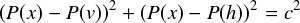
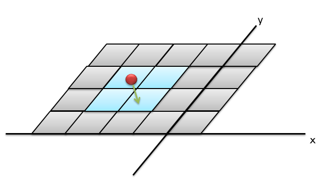

nav_fn
================================================

目次
    
| 　1. :ref:`概要<nav_fn_overview>`
| 　2. :ref:`アルゴリズム<nav_fn_algorithm>`
| 　　2.1. :ref:`ポテンシャルマップの生成<nav_fn_algorithm_potential_map>`
| 　　2.2. :ref:`ポテンシャルマップ上での経路生成<nav_fn_algorithm_path>`
| 　3. :ref:`NavfnROS<nav_fn_navfnros>`
| 　　3.1. :ref:`APIの安定性<nav_fn_ros_api_stability>`
| 　　3.2. :ref:`ROS API<nav_fn_ros_api>`
| 　　　2.2.1. :ref:`パブリッシュトピック<nav_fn_published_topics>`
| 　　　2.2.2. :ref:`パラメータ<nav_fn_parameters>`
| 　　3.3. :ref:`C++ API<nav_fn_ros_cpp_api>`
| 　4. :ref:`NavFN<nav_fn_navfn>`
| 　　4.1. :ref:`APIの安定性<nav_fn_api_stability>`
| 　　4.2. :ref:`C++ API<nav_fn_cpp_api>`
|

.. _nav_fn_overview:

============================================================
1. 概要
============================================================
navfnは、移動体の経路生成に使用可能な、高速で、補間されたナビゲーションを行う機能を、navfn::NavFnクラスで提供しています。
このプランナーは、移動体として円形のロボットを想定しており、コストマップ上で、グリッド内の開始点から終了点を結ぶ最も低コストな経路を探索するための処理を行います。
このナビゲーション機能は、ダイクストラ法を使用して経路計算を行っていますが、将来的にA*ヒューリスティクスが追加されるかもしれません。
また、navfn::NavFnクラスのROSラッパーであるnavfn::NavfnROSオブジェクトも提供しています。navfn::NavfnROSオブジェクトは、 :doc:`nav_core <nav_core>`パッケージで定義されるnav_core :: BaseGlobalPlannerインターフェイスに準拠しており、move_baseノードからグローバルプランナープラグインとしても使用されています。

|

* 管理状態: 管理済み
* 管理者: David V. Lu!! <davidvlu AT gmail DOT com>, Michael Ferguson <mfergs7 AT gmail DOT com>, Aaron Hoy <ahoy AT fetchrobotics DOT com>
* 著者: Kurt Konolige, Eitan Marder-Eppstein, contradict@gmail.com
* ライセンス: BSD
* ソース: git https://github.com/ros-planning/navigation.git (branch: melodic-devel)

|

.. _nav_fn_algorithm:

============================================================
1. アルゴリズム
============================================================
navfnは、グローバルコストマップおよびグローバルコストマップ上のスタート座標、ゴール座標を入力値として、経路を出力します。経路を出力するまでの過程は、以下のようになっています。

   #. ポテンシャル計算のために、グローバルコストマップのコストニュートラル値（何もないセルのコスト値）を底上げします。具体的には、0～254のコスト値を、50～253に変換します。（いずれも253以上は進入不可のセル）

   #. コスト値の底上げを行ったコストマップから、ポテンシャルマップを生成します。

   #. ポテンシャルマップ上で、default_toleranceに従ったゴール座標の補正を行います。ゴール座標が進入不可のセル内にある場合は、default_toleranceの範囲内で、進入可能なセル内の最も近い座標に補正されます。

   #. ゴール座標が到達可能である場合は、ポテンシャルマップ上のスタート座標からゴール座標まで、経路を生成します。

|

.. _nav_fn_algorithm_potential_map:

2.1. ポテンシャルマップの生成
************************************************************
ポテンシャルマップとは、ゴール位置のセルが最も低く、スタート位置のセルが最も高い（進入不可のセルを除く）地形図のようなものを表現したグリッド地図で、スタート位置にボールを置いて、地形の傾斜に沿ってボールが転がり、最後にゴール位置に到達するというようなイメージで、ポテンシャルマップ上に経路が生成されます。

.. image:: images/OldNavFn.png
   :align: center

|

ポテンシャルマップの生成は、以下のように行われます。

   #. グローバルコストマップと同じサイズのグリッド地図を生成し、最初に、全てのセルをPOT_HIGH（ポテンシャル値未設定）で埋めます。

   #. ゴール位置のセルにポテンシャル値0を設定し、その上下左右の4つのセルを、ポテンシャル値の計算の対象セルに加えます。

   #. 対象セルのポテンシャル値（P(x)とします）の計算は、対象セルに対して、上下のセルの小さいほうのポテンシャル値（P(v)とします）、左右のセルの小さいほうのポテンシャル値（P(h)とします）および自セルのコスト値(cとします）を使って計算します。

      * P(v)がPOT_HIGHである場合は、P(h)にcを足し合わせて、P(x)とします。P(h)がPOT_HIGHである場合は、その逆です。

      * P(v)、P(h)ともに有効なポテンシャル値である場合は、下記の数式を満足するようなP(x)を求めます。ただし、P(v)とP(h)の差がc以上の場合は、下記を満足する解がないため、P(v)とP(h)の小さいほうにcを足し合わせてP(x)とします。

            |math_quadratic|

   #. 対象セルのポテンシャル値を計算したら、その上下左右のセルのうち、まだPOT_HIGHとなっているセルを、次の計算対象に加えます。この時、追加元のセルのポテンシャル値がより低いものを、次に優先的に計算します。

   #. このように、ゴール位置のセルからポテンシャル値計算を広げていき、スタート位置のセルに到達したら、ポテンシャルマップ生成完了とします。

なお、上述の2次方程式は、実際には下記のような近似計算を行っています。::

   1 float d = fabs(P(v) - P(h)) / c;
   2 float v = -0.2301*d*d + 0.5307*d + 0.7040;
   3 P(x) = min(P(v), P(h)) + (c * v);

このような2次方程式を使わずに、単純に、P(v)とP(h)の小さい方をcに足していけばよいようにも見えますが、単純な足し算だと、あるセルに対して、直線で2つ向こう側にあるセルと斜めにあるセルとで、ポテンシャル値が同等になってしまいます。（実際には、斜めにあるセルの方が近いにも関わらず。）

斜めにあるセルのポテンシャル値を、より適切な値にするために、上述の2次方程式が使用されています。

|

.. _nav_fn_algorithm_path:

2.2. ポテンシャルマップ上での経路生成
************************************************************
ポテンシャルマップ上で、スタート位置にボールを置いて、地形の傾斜に沿ってボールが転がり、最後にゴール位置に到達するというようなイメージで、ポテンシャルマップ上に経路を生成します。

経路の生成は、以下のように行われます。

   #. スタート座標を最初の現在位置として、経路に追加します。

   #. ポテンシャルマップ上で、スタート座標が含まれるセルと、その右隣り、下、右下の4枚のセルを取り出します。

            |CalcPath|

   #. それぞれのセルについて、x軸方向の傾きとy軸方向の傾きを求めます。セルの傾きは、対象セルの左右のセルとのポテンシャル値の差からx軸方向の傾きを求め、対象セルの上下のセルとのポテンシャル値の差からy軸方向の傾きを求めます。（ポテンシャル値がより小さいほうに傾けます。）

   #. 4枚のセルの傾きから、x軸方向、y軸方向それぞれの加重平均を求めます。加重平均の重みは、現在座標がセル上のどの位置にいるかで決まります。

      セル上で、現在位置がより右側にある場合は、右隣りおよび右下のセルの重みが大きくなります。また、現在位置がより下側にある場合は、下および右下のセルの重みが大きくなります

   #. 求めた傾きの加重平均の分、現在位置をポテンシャルマップ上で移動させ、この座標を経路に追加します。

   #. 移動後の現在位置に対して、同じ傾き計算および座標移動、経路への追加を繰り返します。現在座標がゴール位置のセルに入るかまたは近接したら、最後にゴール座標を経路に追加します。

|

.. _nav_fn_navfnros:

============================================================
3. NavfnROS
============================================================
navfn::NavfnROSオブジェクトは、その機能を `C ++ ROSラッパー <http://wiki.ros.org/navigation/ROS_Wrappers>`__ として公開します。 これは、初期化時に指定されたROS名前空間（以降、nameとする）内で動作します。 :doc:`nav_core <nav_core>` パッケージにあるnav_core :: BaseGlobalPlannerインターフェイスに準拠しています。

navfn::NavfnROSオブジェクトの作成例::

   1 #include <tf/transform_listener.h>
   2 #include <costmap_2d/costmap_2d_ros.h>
   3 #include <navfn/navfn_ros.h>
   4 
   5 ...
   6 
   7 tf::TransformListener tf(ros::Duration(10));
   8 costmap_2d::Costmap2DROS costmap("my_costmap", tf);
   9 
  10 navfn::NavfnROS navfn;
  11 navfn.initialize("my_navfn_planner", &costmap);

|

.. _nav_fn_ros_api_stability:

3.1. APIの安定性
************************************************************
* ROS APIは安定しています。
* C++ APIは安定しています。

.. _nav_fn_ros_api:

3.2. ROS API
************************************************************

.. _nav_fn_published_topics:

3.2.1. パブリッシュトピック
------------------------------------------------------------
.. csv-table:: 
   :header: "トピック名", "型", "内容"
   :widths: 10, 10, 30

   "~<name>/plan", "`nav_msgs/Path <http://docs.ros.org/api/nav_msgs/html/msg/Path.html>`__", "最後に計算された計画。プランナーが経路を計算するたびにパブリッシュされ、主に視覚化の目的で使用されます。"

|

.. _nav_fn_parameters:

3.2.2. パラメータ
------------------------------------------------------------
.. csv-table:: 
   :header: "パラメータ名", "内容", "型", "単位", "デフォルト"
   :widths: 10, 50, 5, 5, 8

   "~<name>/allow_unknown", "プランナが不明スペースを横断する計画を作成できるようにするかどうかを指定します。注： `ボクセルまたは障害物レイヤー <http://wiki.ros.org/costmap_2d/hydro/obstacles>`__ でレイヤー化されたcostmap_2dコストマップを使用している場合、そのレイヤーのtrack_unknown_spaceパラメーターもtrueに設定する必要があります。そうしないと、不明スペースがすべて空きスペースに変換されます）。", "bool", "\-", "true"
   "~<name>/planner_window_x ", "プランナーの探索範囲を限定するためのパラメータとして定義されていますが、現状は参照されていません。。", "double", "\-", "0.0"
   "~<name>/planner_window_y ", "プランナーの探索範囲を限定するためのパラメータとして定義されていますが、現状は参照されていません。。", "double", "\-", "0.0"
   "~<name>/default_tolerance", "プランナーの目標位置の許容値。プランナーは、指定された目標にできるだけ近いがdefault_toleranceを超えない計画を作成しようとします。", "double", "\-", "0.0"
   "~<name>/visualize_potential", "PointCloud2を介して計算されたポテンシャルエリアを視覚化するかどうかを指定します。", "bool", "\-", "false"

|

.. _nav_fn_ros_cpp_api:

3.3. C++ API
************************************************************
navfn::NavfnROSは、:doc:`nav_core <nav_core>` パッケージにあるnav_core :: BaseGlobalPlannerインターフェイスに準拠しています。 詳細については、`NavfnROS C++のドキュメント <http://www.ros.org/doc/api/navfn/html/classnavfn_1_1NavfnROS.html>`__ をご覧ください。

|

.. _nav_fn_navfn:

============================================================
4. NavFN
============================================================
navfn::NavFnオブジェクトは、上述のナビゲーション機能の実装を提供します。自由に利用して構いませんが、APIの安定性が保証されないことに留意してください。

|

.. _nav_fn_api_stability:

4.1. APIの安定性
************************************************************
* C++ APIは安定していません。いつでも変更の可能性があります。

|

.. _nav_fn_cpp_api:

4.2. C++ API
************************************************************
詳細については、`navfn::NavFnクラスの C++ APIドキュメント <http://www.ros.org/doc/api/navfn/html/classnavfn_1_1NavFn.html>`__ をご覧ください。

